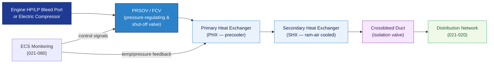

# ATLAS 020-029 · 02.021 — Air Conditioning and Pressurization · 021-010 Compression

## 1. Purpose

Defines the **compression source architecture and interfaces** for the *Air Conditioning and Pressurization* subsystem (ATA 21-10-00) within the Q+ATLANTIDE programme. Covers the supply of compressed air from bleed-air off-takes or electric compressors, precooling/pre-treatment, and the interface with downstream ECS distribution (021-020).

## 2. Scope

- Covers the *Compression* section (`021-010`, ATA SNS 21-10-00) of subsection `021` *Air Conditioning and Pressurization*.
- Inherits Q-Division authority and ORB support from the parent row in [`../../README.md` §3](../../README.md#3-architecture-table)[^archtable].
- Concepts in scope:
  - **Bleed-air off-take** — engine high-pressure and low-pressure port selection, precooler heat-exchanger interface, and pressure-regulating/shut-off valve (PRSOV) control logic.
  - **Electric compression** (programme variant) — motor-driven compressor architecture, power draw limits, and thermal management interface for more-electric aircraft (MEA) configurations.
  - **Precooling** — primary heat exchanger (PHX) and secondary heat exchanger (SHX) function; ram-air duct interface; high-limit temperature switch logic.
  - **Crossbleed and isolation** — crossbleed duct, isolation valve positions, and engine-failure / ground-air-supply modes.
  - **Control interfaces** — PRSOV and flow-control valve (FCV) modulation; integration with ECS monitoring (021-080).
- Out of scope: air distribution routing (021-020), pressurisation differential control (021-030), heating packs (021-040), cooling packs (021-050).

## 3. Diagram — Compression Source Flow

Bleed or electric compression sources supply precooled air to the ECS distribution network.

## 4. Footprint

| Metric | Value |
|---|---|
| Architecture | `ATLAS` — Aircraft Top Level Architecture Schema/System (controlled term) |
| Master range | `000–099` |
| Code range | `020-029` |
| Section | `02` — Sistemas Core de Aeronave |
| Subsection | `021` — Air Conditioning and Pressurization |
| Local section code | `021-010` — Compression |
| ATA chapter | 21 |
| ATA SNS | 21-10-00 |
| Primary Q-Division | Q-AIR[^qdiv] |
| Support Q-Divisions | Q-MECHANICS, Q-DATAGOV, Q-GREENTECH |
| ORB support | ORB-PMO, ORB-LEG |
| Governance class | `baseline`[^gov] |
| Folder path | `Q+ATLANTIDE/000-099_ATLAS/020-029_Sistemas-Core-de-Aeronave/021_Air-Conditioning-and-Pressurization/` |
| Document | `021-010-Compression.md` (this file) |
| Parent subsection | [`README.md`](./README.md) · [`021-000-General.md`](./021-000-General.md) |
| Parent architecture | [`../../README.md`](../../README.md) |
| Parent baseline | [`organization/Q+ATLANTIDE.md`](../../../../organization/Q+ATLANTIDE.md) |

## 5. References & Citations

[^baseline]: **Q+ATLANTIDE controlled baseline (v1.0.0)** — [`organization/Q+ATLANTIDE.md`](../../../../organization/Q+ATLANTIDE.md).

[^archtable]: **ATLAS §3 Architecture Table** — [`../../README.md` §3](../../README.md#3-architecture-table).

[^qdiv]: **Q-Division authority** — Q-Divisions provide technical authority over an architecture row (Q+ATLANTIDE Note N-002). See [`organization/Q+ATLANTIDE.md` §4](../../../../organization/Q+ATLANTIDE.md#4-notes).

[^gov]: **Governance class** — `baseline` denotes documents under controlled change management within the Q+ATLANTIDE baseline.

[^cs25]: **EASA CS-25** — CS 25.831 and AMC covering bleed-air source requirements and precooler performance.

[^ata2200]: **ATA iSpec 2200** — Section 21-10 naming and data-module scope for compression subsystems.

### Applicable standards

- EASA CS-25[^cs25]
- ATA iSpec 2200[^ata2200]
