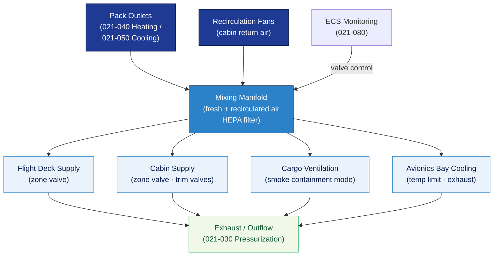

# ATLAS 020-029 · 02.021 — Air Conditioning and Pressurization · 021-020 Distribution

## 1. Purpose

Defines the **air distribution network** for the *Air Conditioning and Pressurization* subsystem (ATA 21-20-00) within the Q+ATLANTIDE programme. Covers the routing of conditioned air from the compression/pack outlets to aircraft zones (flight deck, cabin, cargo, avionics bay), including duct layout, mixing manifolds, zone-supply valves, and recirculation interfaces.

## 2. Scope

- Covers the *Distribution* section (`021-020`, ATA SNS 21-20-00) of subsection `021` *Air Conditioning and Pressurization*.
- Inherits Q-Division authority and ORB support from the parent row in [`../../README.md` §3](../../README.md#3-architecture-table)[^archtable].
- Concepts in scope:
  - **Duct layout** — primary ducts from pack outlets, mixing manifold architecture, zone-supply duct routing, and structural penetration interfaces (cross-reference ATA 53).
  - **Zone supply valves** — individual zone isolation valves, flow-control trim valves, and their actuation/monitoring interfaces with ECS controllers (021-080).
  - **Mixing manifold** — fresh-air and recirculated-air mixing ratio; recirculation fan integration and HEPA filter interfaces.
  - **Avionics cooling** — dedicated conditioned-air supply to avionics bays; rack-inlet temperature limits; exhaust routing.
  - **Cargo ventilation** — cargo compartment air supply and smoke-containment modes.
  - **Duct leakage and pressure drop** — design limits, test criteria, and in-service inspection interfaces (cross-reference ATA 20 standard practices / subsection 020).
- Out of scope: compression source (021-010), pressurisation differential control (021-030), heating (021-040), cooling (021-050).

## 3. Diagram — Distribution Network

Conditioned air from packs is mixed and routed to aircraft zones via zone-supply valves; recirculated air supplements fresh supply.

## 4. Footprint

| Metric | Value |
|---|---|
| Architecture | `ATLAS` — Aircraft Top Level Architecture Schema/System (controlled term) |
| Master range | `000–099` |
| Code range | `020-029` |
| Section | `02` — Sistemas Core de Aeronave |
| Subsection | `021` — Air Conditioning and Pressurization |
| Local section code | `021-020` — Distribution |
| ATA chapter | 21 |
| ATA SNS | 21-20-00 |
| Primary Q-Division | Q-AIR[^qdiv] |
| Support Q-Divisions | Q-MECHANICS, Q-DATAGOV, Q-GREENTECH |
| ORB support | ORB-PMO, ORB-LEG |
| Governance class | `baseline`[^gov] |
| Folder path | `Q+ATLANTIDE/000-099_ATLAS/020-029_Sistemas-Core-de-Aeronave/021_Air-Conditioning-and-Pressurization/` |
| Document | `021-020-Distribution.md` (this file) |
| Parent subsection | [`README.md`](./README.md) · [`021-000-General.md`](./021-000-General.md) |
| Parent architecture | [`../../README.md`](../../README.md) |
| Parent baseline | [`organization/Q+ATLANTIDE.md`](../../../../organization/Q+ATLANTIDE.md) |

## 5. References & Citations

[^baseline]: **Q+ATLANTIDE controlled baseline (v1.0.0)** — [`organization/Q+ATLANTIDE.md`](../../../../organization/Q+ATLANTIDE.md).

[^archtable]: **ATLAS §3 Architecture Table** — [`../../README.md` §3](../../README.md#3-architecture-table).

[^qdiv]: **Q-Division authority** — Q-Divisions provide technical authority over an architecture row (Q+ATLANTIDE Note N-002). See [`organization/Q+ATLANTIDE.md` §4](../../../../organization/Q+ATLANTIDE.md#4-notes).

[^gov]: **Governance class** — `baseline` denotes documents under controlled change management within the Q+ATLANTIDE baseline.

[^cs25]: **EASA CS-25** — CS 25.831 (Ventilation) and CS 25.855 (Cargo compartment fire protection — smoke containment) applicable to distribution design.

[^ata2200]: **ATA iSpec 2200** — Section 21-20 naming and data-module scope for distribution subsystems.

### Applicable standards

- EASA CS-25[^cs25]
- ATA iSpec 2200[^ata2200]
