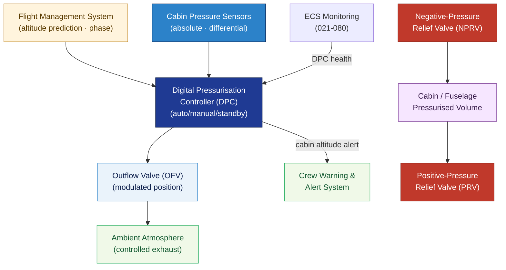

# ATLAS 020-029 · 02.021 — Air Conditioning and Pressurization · 021-030 Pressurization Control

## 1. Purpose

Defines the **pressurization control system architecture** for the *Air Conditioning and Pressurization* subsystem (ATA 21-30-00) within the Q+ATLANTIDE programme. Covers cabin altitude scheduling, differential pressure limits, outflow valve control, safety/relief valve interfaces, and pressurisation controller logic to maintain a safe and comfortable cabin environment throughout the flight envelope.

## 2. Scope

- Covers the *Pressurization Control* section (`021-030`, ATA SNS 21-30-00) of subsection `021` *Air Conditioning and Pressurization*.
- Inherits Q-Division authority and ORB support from the parent row in [`../../README.md` §3](../../README.md#3-architecture-table)[^archtable].
- Concepts in scope:
  - **Cabin altitude schedule** — the controlled relationship between aircraft altitude and cabin altitude; climb/cruise/descent profiles; maximum cabin altitude limit (typically 8 000 ft / 2 438 m per EASA CS-25[^cs25]).
  - **Differential pressure limits** — maximum positive differential pressure (maximum ΔP design limit); maximum negative differential pressure; relief valve set-points.
  - **Outflow valve (OFV) control** — automatic and manual OFV modulation; controller modes (auto/manual/standby); ground-safety mode (full-open on ground).
  - **Safety/relief valves** — positive-pressure relief valve (PRV) and negative-pressure relief valve (NPRV) architecture, set-points, and testing intervals.
  - **Pressurization controller** — digital pressurisation controller (DPC) logic, redundancy architecture, cabin-pressure sensor inputs, and interface with flight management system (FMS) for altitude prediction.
  - **Depressurisation modes** — emergency descent mode, rapid depressurisation detection, and crew alerting per CS 25.841[^cs25].
- Out of scope: compression source (021-010), air distribution (021-020), heating (021-040), cooling (021-050), moisture control (021-070).

## 3. Diagram — Pressurization Control Loop

The pressurisation controller compares cabin altitude target with actual cabin altitude and modulates the outflow valve to maintain the schedule; safety valves provide independent overpressure/underpressure protection.

## 4. Footprint

| Metric | Value |
|---|---|
| Architecture | `ATLAS` — Aircraft Top Level Architecture Schema/System (controlled term) |
| Master range | `000–099` |
| Code range | `020-029` |
| Section | `02` — Sistemas Core de Aeronave |
| Subsection | `021` — Air Conditioning and Pressurization |
| Local section code | `021-030` — Pressurization Control |
| ATA chapter | 21 |
| ATA SNS | 21-30-00 |
| Primary Q-Division | Q-AIR[^qdiv] |
| Support Q-Divisions | Q-MECHANICS, Q-DATAGOV, Q-GREENTECH |
| ORB support | ORB-PMO, ORB-LEG |
| Governance class | `baseline`[^gov] |
| Folder path | `Q+ATLANTIDE/000-099_ATLAS/020-029_Sistemas-Core-de-Aeronave/021_Air-Conditioning-and-Pressurization/` |
| Document | `021-030-Pressurization-Control.md` (this file) |
| Parent subsection | [`README.md`](./README.md) · [`021-000-General.md`](./021-000-General.md) |
| Parent architecture | [`../../README.md`](../../README.md) |
| Parent baseline | [`organization/Q+ATLANTIDE.md`](../../../../organization/Q+ATLANTIDE.md) |

## 5. References & Citations

[^baseline]: **Q+ATLANTIDE controlled baseline (v1.0.0)** — [`organization/Q+ATLANTIDE.md`](../../../../organization/Q+ATLANTIDE.md).

[^archtable]: **ATLAS §3 Architecture Table** — [`../../README.md` §3](../../README.md#3-architecture-table).

[^qdiv]: **Q-Division authority** — Q-Divisions provide technical authority over an architecture row (Q+ATLANTIDE Note N-002). See [`organization/Q+ATLANTIDE.md` §4](../../../../organization/Q+ATLANTIDE.md#4-notes).

[^gov]: **Governance class** — `baseline` denotes documents under controlled change management within the Q+ATLANTIDE baseline.

[^cs25]: **EASA CS-25** — CS 25.841 (Pressurized cabins) and CS 25.843 (Tests for pressurised compartments); FAR 25.841 equivalent.

[^ata2200]: **ATA iSpec 2200** — Section 21-30 naming and data-module scope for pressurisation control subsystems.

### Applicable standards

- EASA CS-25[^cs25]
- ATA iSpec 2200[^ata2200]
