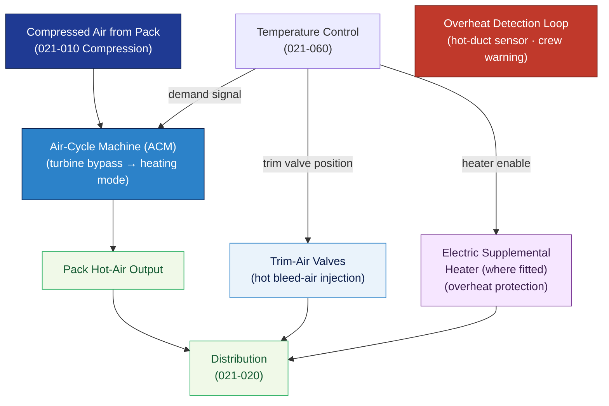

# ATLAS 020-029 · 02.021 — Air Conditioning and Pressurization · 021-040 Heating

## 1. Purpose

Defines the **heating system architecture** for the *Air Conditioning and Pressurization* subsystem (ATA 21-40-00) within the Q+ATLANTIDE programme. Covers the air-cycle machine (ACM) or heat-exchanger-based heating function, electric supplemental heating, trim-air systems, and interfaces with the temperature control loop (021-060).

## 2. Scope

- Covers the *Heating* section (`021-040`, ATA SNS 21-40-00) of subsection `021` *Air Conditioning and Pressurization*.
- Inherits Q-Division authority and ORB support from the parent row in [`../../README.md` §3](../../README.md#3-architecture-table)[^archtable].
- Concepts in scope:
  - **Air-cycle machine (ACM) heating mode** — turbine bypass for heating; heat exchanger configuration in cold-weather / high-altitude descent conditions where hot-air bypass provides heating without excessive cooling.
  - **Trim-air system** — hot bleed-air trim valves injecting additional heat downstream of the pack for zone fine-temperature trimming; interface with zone temperature controllers (021-060).
  - **Electric supplemental heating** — electric heater elements (where fitted) for ground pre-conditioning or more-electric aircraft configurations; overheat protection and cutout logic.
  - **Hot-air duct insulation and fire detection** — hot-duct thermal protection interfaces; overheat detection loops and crew warning.
  - **Ground heating mode** — ground high-pressure air cart or GPU-sourced heating; pre-departure conditioning logic.
- Out of scope: compression source (021-010), distribution routing (021-020), pressurisation (021-030), cooling (021-050); temperature control feedback loop is covered in 021-060.

## 3. Diagram — Heating Architecture

Heating is provided by ACM bypass or trim-air injection; electric supplemental heating supplements pack output; temperature control (021-060) governs the heating demand.

## 4. Footprint

| Metric | Value |
|---|---|
| Architecture | `ATLAS` — Aircraft Top Level Architecture Schema/System (controlled term) |
| Master range | `000–099` |
| Code range | `020-029` |
| Section | `02` — Sistemas Core de Aeronave |
| Subsection | `021` — Air Conditioning and Pressurization |
| Local section code | `021-040` — Heating |
| ATA chapter | 21 |
| ATA SNS | 21-40-00 |
| Primary Q-Division | Q-AIR[^qdiv] |
| Support Q-Divisions | Q-MECHANICS, Q-DATAGOV, Q-GREENTECH |
| ORB support | ORB-PMO, ORB-LEG |
| Governance class | `baseline`[^gov] |
| Folder path | `Q+ATLANTIDE/000-099_ATLAS/020-029_Sistemas-Core-de-Aeronave/021_Air-Conditioning-and-Pressurization/` |
| Document | `021-040-Heating.md` (this file) |
| Parent subsection | [`README.md`](./README.md) · [`021-000-General.md`](./021-000-General.md) |
| Parent architecture | [`../../README.md`](../../README.md) |
| Parent baseline | [`organization/Q+ATLANTIDE.md`](../../../../organization/Q+ATLANTIDE.md) |

## 5. References & Citations

[^baseline]: **Q+ATLANTIDE controlled baseline (v1.0.0)** — [`organization/Q+ATLANTIDE.md`](../../../../organization/Q+ATLANTIDE.md).

[^archtable]: **ATLAS §3 Architecture Table** — [`../../README.md` §3](../../README.md#3-architecture-table).

[^qdiv]: **Q-Division authority** — Q-Divisions provide technical authority over an architecture row (Q+ATLANTIDE Note N-002). See [`organization/Q+ATLANTIDE.md` §4](../../../../organization/Q+ATLANTIDE.md#4-notes).

[^gov]: **Governance class** — `baseline` denotes documents under controlled change management within the Q+ATLANTIDE baseline.

[^cs25]: **EASA CS-25** — CS 25.831 (Ventilation, temperature comfort limits) and AMC for heating-system design criteria.

[^ata2200]: **ATA iSpec 2200** — Section 21-40 naming and data-module scope for heating subsystems.

### Applicable standards

- EASA CS-25[^cs25]
- ATA iSpec 2200[^ata2200]
