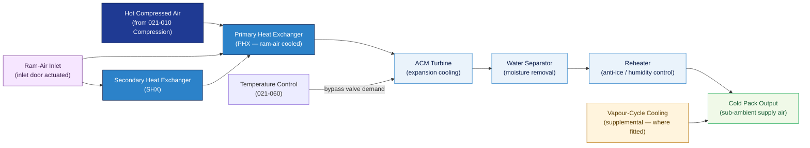

# ATLAS 020-029 · 02.021 — Air Conditioning and Pressurization · 021-050 Cooling

## 1. Purpose

Defines the **cooling system architecture** for the *Air Conditioning and Pressurization* subsystem (ATA 21-50-00) within the Q+ATLANTIDE programme. Covers the air-cycle machine (ACM) cooling cycle, bootstrap and vapour-cycle cooling systems, ram-air heat-exchanger cooling, and interfaces with the temperature control loop (021-060).

## 2. Scope

- Covers the *Cooling* section (`021-050`, ATA SNS 21-50-00) of subsection `021` *Air Conditioning and Pressurization*.
- Inherits Q-Division authority and ORB support from the parent row in [`../../README.md` §3](../../README.md#3-architecture-table)[^archtable].
- Concepts in scope:
  - **Air-cycle machine (ACM) cooling** — bootstrap refrigeration cycle; turbine expansion providing sub-ambient supply-air temperature; water separator function; reheater and condenser interfaces.
  - **Ram-air heat exchangers** — primary and secondary heat exchangers cooled by ram-air flow through ram-air inlet doors; inlet door actuation and control logic.
  - **Vapour-cycle cooling (where fitted)** — supplemental vapour-cycle refrigeration for high-heat-load or ground operations; compressor, condenser, expansion valve, and evaporator interfaces.
  - **Ground cooling** — GPU-supplied cooling or cooling from ground air-conditioning units; pre-departure thermal pre-conditioning.
  - **Avionics cooling interface** — dedicated cooling supply temperature and flow-rate limits for avionics bays (cross-reference distribution 021-020).
  - **Anti-ice protection on pack** — water separator and heat-exchanger anti-ice modes preventing ice formation in the pack at low inlet temperatures.
- Out of scope: compression source (021-010), distribution routing (021-020), pressurisation (021-030), heating (021-040); temperature control feedback is in 021-060.

## 3. Diagram — Cooling Cycle

Hot compressed air is cooled through the ram-air heat exchangers and expanded through the ACM turbine to deliver sub-ambient conditioned air; temperature control governs the cycle.

## 4. Footprint

| Metric | Value |
|---|---|
| Architecture | `ATLAS` — Aircraft Top Level Architecture Schema/System (controlled term) |
| Master range | `000–099` |
| Code range | `020-029` |
| Section | `02` — Sistemas Core de Aeronave |
| Subsection | `021` — Air Conditioning and Pressurization |
| Local section code | `021-050` — Cooling |
| ATA chapter | 21 |
| ATA SNS | 21-50-00 |
| Primary Q-Division | Q-AIR[^qdiv] |
| Support Q-Divisions | Q-MECHANICS, Q-DATAGOV, Q-GREENTECH |
| ORB support | ORB-PMO, ORB-LEG |
| Governance class | `baseline`[^gov] |
| Folder path | `Q+ATLANTIDE/000-099_ATLAS/020-029_Sistemas-Core-de-Aeronave/021_Air-Conditioning-and-Pressurization/` |
| Document | `021-050-Cooling.md` (this file) |
| Parent subsection | [`README.md`](./README.md) · [`021-000-General.md`](./021-000-General.md) |
| Parent architecture | [`../../README.md`](../../README.md) |
| Parent baseline | [`organization/Q+ATLANTIDE.md`](../../../../organization/Q+ATLANTIDE.md) |

## 5. References & Citations

[^baseline]: **Q+ATLANTIDE controlled baseline (v1.0.0)** — [`organization/Q+ATLANTIDE.md`](../../../../organization/Q+ATLANTIDE.md).

[^archtable]: **ATLAS §3 Architecture Table** — [`../../README.md` §3](../../README.md#3-architecture-table).

[^qdiv]: **Q-Division authority** — Q-Divisions provide technical authority over an architecture row (Q+ATLANTIDE Note N-002). See [`organization/Q+ATLANTIDE.md` §4](../../../../organization/Q+ATLANTIDE.md#4-notes).

[^gov]: **Governance class** — `baseline` denotes documents under controlled change management within the Q+ATLANTIDE baseline.

[^cs25]: **EASA CS-25** — CS 25.831 and AMC covering cooling performance requirements and avionics cooling supply limits.

[^as8040]: **SAE AS8040** — Air conditioning system performance standard; cooling capacity and temperature control margins.

[^ata2200]: **ATA iSpec 2200** — Section 21-50 naming and data-module scope for cooling subsystems.

### Applicable standards

- EASA CS-25[^cs25]
- SAE AS8040[^as8040]
- ATA iSpec 2200[^ata2200]
