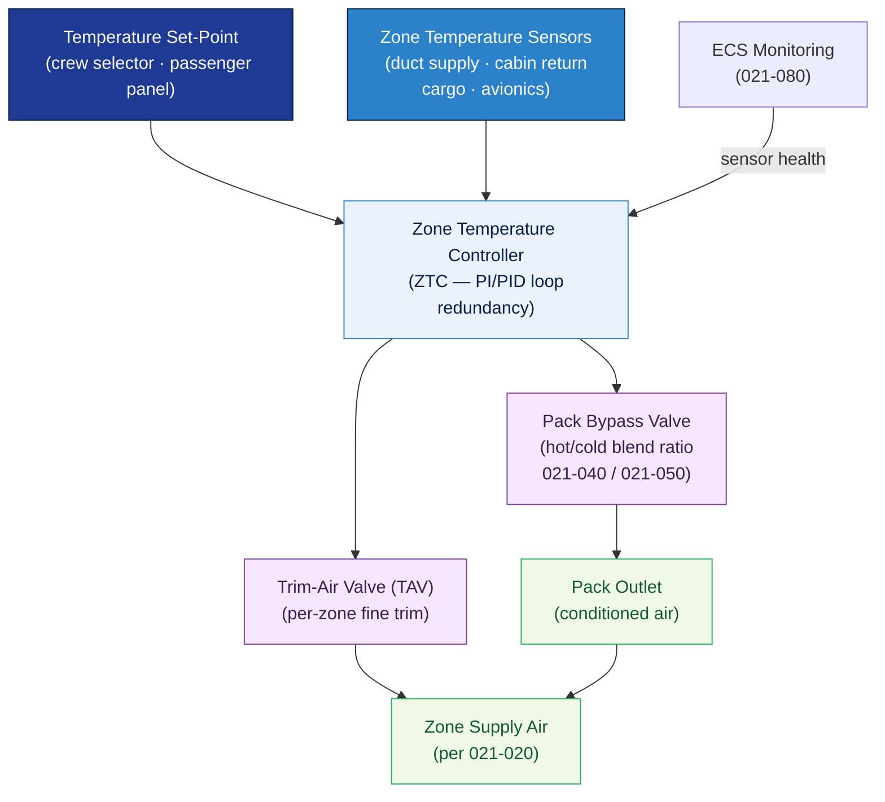

# ATLAS 020-029 · 02.021 — Air Conditioning and Pressurization · 021-060 Temperature Control

## 1. Purpose

Defines the **zone and cabin temperature control architecture** for the *Air Conditioning and Pressurization* subsystem (ATA 21-60-00) within the Q+ATLANTIDE programme. Covers the zone temperature controller, crew and passenger temperature set-point selection, trim-air modulation, pack temperature regulation, and sensor/feedback loops that maintain comfortable and compliant cabin temperatures throughout all flight phases.

## 2. Scope

- Covers the *Temperature Control* section (`021-060`, ATA SNS 21-60-00) of subsection `021` *Air Conditioning and Pressurization*.
- Inherits Q-Division authority and ORB support from the parent row in [`../../README.md` §3](../../README.md#3-architecture-table)[^archtable].
- Concepts in scope:
  - **Zone temperature controller (ZTC)** — digital zone temperature controller logic; zone partitioning (flight deck, forward cabin, aft cabin, cargo); control loop (PI/PID); redundancy.
  - **Temperature set-point selection** — crew and flight-attendant temperature selector inputs; automatic and manual modes; comfort range limits (typically 18–30 °C per CS-25[^cs25]).
  - **Pack temperature regulation** — pack outlet temperature sensor; bypass valve position modulation to blend hot and cold ACM outputs (interaction with 021-040 and 021-050).
  - **Trim-air modulation** — trim-air valve (TAV) position commanded by ZTC to fine-tune individual zone temperatures; trim-air duct temperature limits.
  - **Duct and zone temperature sensors** — supply duct temperature, cabin zone air-return temperature, and skin temperature sensors; sensor failure detection and fallback modes.
  - **Cargo/avionics temperature monitoring** — cargo compartment temperature limits; avionics supply temperature limits (cross-reference 021-020 distribution).
- Out of scope: compression (021-010), distribution (021-020), pressurisation (021-030); heating and cooling hardware are covered in 021-040 and 021-050 respectively; moisture control is in 021-070.

## 3. Diagram — Temperature Control Loop

Zone temperature controllers compare set-points with actual zone temperatures and command pack bypass valves and trim-air valves to maintain the target.

## 4. Footprint

| Metric | Value |
|---|---|
| Architecture | `ATLAS` — Aircraft Top Level Architecture Schema/System (controlled term) |
| Master range | `000–099` |
| Code range | `020-029` |
| Section | `02` — Sistemas Core de Aeronave |
| Subsection | `021` — Air Conditioning and Pressurization |
| Local section code | `021-060` — Temperature Control |
| ATA chapter | 21 |
| ATA SNS | 21-60-00 |
| Primary Q-Division | Q-AIR[^qdiv] |
| Support Q-Divisions | Q-MECHANICS, Q-DATAGOV, Q-GREENTECH |
| ORB support | ORB-PMO, ORB-LEG |
| Governance class | `baseline`[^gov] |
| Folder path | `Q+ATLANTIDE/000-099_ATLAS/020-029_Sistemas-Core-de-Aeronave/021_Air-Conditioning-and-Pressurization/` |
| Document | `021-060-Temperature-Control.md` (this file) |
| Parent subsection | [`README.md`](./README.md) · [`021-000-General.md`](./021-000-General.md) |
| Parent architecture | [`../../README.md`](../../README.md) |
| Parent baseline | [`organization/Q+ATLANTIDE.md`](../../../../organization/Q+ATLANTIDE.md) |

## 5. References & Citations

[^baseline]: **Q+ATLANTIDE controlled baseline (v1.0.0)** — [`organization/Q+ATLANTIDE.md`](../../../../organization/Q+ATLANTIDE.md).

[^archtable]: **ATLAS §3 Architecture Table** — [`../../README.md` §3](../../README.md#3-architecture-table).

[^qdiv]: **Q-Division authority** — Q-Divisions provide technical authority over an architecture row (Q+ATLANTIDE Note N-002). See [`organization/Q+ATLANTIDE.md` §4](../../../../organization/Q+ATLANTIDE.md#4-notes).

[^gov]: **Governance class** — `baseline` denotes documents under controlled change management within the Q+ATLANTIDE baseline.

[^cs25]: **EASA CS-25** — CS 25.831 (Ventilation) comfort temperature limits and sensor requirements for zone temperature control.

[^as8040]: **SAE AS8040** — Temperature control performance requirements and set-point accuracy for airborne air conditioning systems.

[^ata2200]: **ATA iSpec 2200** — Section 21-60 naming and data-module scope for temperature control subsystems.

### Applicable standards

- EASA CS-25[^cs25]
- SAE AS8040[^as8040]
- ATA iSpec 2200[^ata2200]
