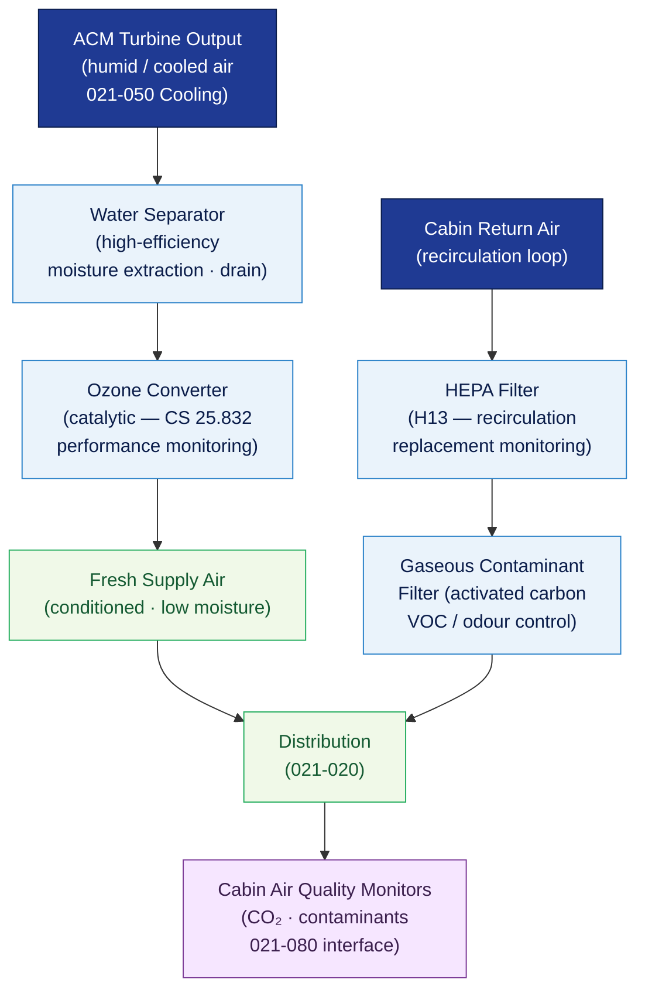

# ATLAS 020-029 · 02.021 — Air Conditioning and Pressurization · 021-070 Moisture and Air Contaminant Control

## 1. Purpose

Defines the **moisture removal and air contaminant control architecture** for the *Air Conditioning and Pressurization* subsystem (ATA 21-70-00) within the Q+ATLANTIDE programme. Covers water separator design, humidity control, HEPA filtration, ozone converter interfaces, and cabin air quality monitoring to ensure cabin air meets airworthiness and occupational health standards.

## 2. Scope

- Covers the *Moisture and Air Contaminant Control* section (`021-070`, ATA SNS 21-70-00) of subsection `021` *Air Conditioning and Pressurization*.
- Inherits Q-Division authority and ORB support from the parent row in [`../../README.md` §3](../../README.md#3-architecture-table)[^archtable].
- Concepts in scope:
  - **Water separator** — high-efficiency water separator downstream of the ACM turbine (cross-reference 021-050 Cooling); moisture extraction capacity, design limits, and drain/outlet interfaces.
  - **Humidity control** — cabin relative humidity range management; humidifier system (where fitted); fogging/condensation prevention protocols.
  - **HEPA filtration** — high-efficiency particulate air (HEPA) filter in recirculation loop; filter efficiency class (minimum HEPA H13 per EN 1822[^en1822]); replacement intervals and in-service monitoring.
  - **Ozone converter** — catalytic ozone converter on bleed-air supply path; ozone concentration limit compliance per FAR/CS 25.832[^cs25]; converter performance monitoring.
  - **Gaseous contaminant control** — activated-carbon filters for gaseous contaminants; scope of detectable species (ozone, VOCs); replacement criteria.
  - **Cabin air quality monitoring** — CO₂ and contaminant sensor integration with ECS monitoring (021-080); crew alerting on air quality degradation.
- Out of scope: primary compression and cooling (021-010, 021-050), distribution routing (021-020), pressurisation (021-030), temperature control (021-060).

## 3. Diagram — Moisture and Contaminant Control Flow

Water separation, ozone conversion, recirculation HEPA filtration, and gaseous contaminant control combine to deliver conditioned, clean cabin air.

## 4. Footprint

| Metric | Value |
|---|---|
| Architecture | `ATLAS` — Aircraft Top Level Architecture Schema/System (controlled term) |
| Master range | `000–099` |
| Code range | `020-029` |
| Section | `02` — Sistemas Core de Aeronave |
| Subsection | `021` — Air Conditioning and Pressurization |
| Local section code | `021-070` — Moisture and Air Contaminant Control |
| ATA chapter | 21 |
| ATA SNS | 21-70-00 |
| Primary Q-Division | Q-AIR[^qdiv] |
| Support Q-Divisions | Q-MECHANICS, Q-DATAGOV, Q-GREENTECH |
| ORB support | ORB-PMO, ORB-LEG |
| Governance class | `baseline`[^gov] |
| Folder path | `Q+ATLANTIDE/000-099_ATLAS/020-029_Sistemas-Core-de-Aeronave/021_Air-Conditioning-and-Pressurization/` |
| Document | `021-070-Moisture-and-Air-Contaminant-Control.md` (this file) |
| Parent subsection | [`README.md`](./README.md) · [`021-000-General.md`](./021-000-General.md) |
| Parent architecture | [`../../README.md`](../../README.md) |
| Parent baseline | [`organization/Q+ATLANTIDE.md`](../../../../organization/Q+ATLANTIDE.md) |

## 5. References & Citations

[^baseline]: **Q+ATLANTIDE controlled baseline (v1.0.0)** — [`organization/Q+ATLANTIDE.md`](../../../../organization/Q+ATLANTIDE.md).

[^archtable]: **ATLAS §3 Architecture Table** — [`../../README.md` §3](../../README.md#3-architecture-table).

[^qdiv]: **Q-Division authority** — Q-Divisions provide technical authority over an architecture row (Q+ATLANTIDE Note N-002). See [`organization/Q+ATLANTIDE.md` §4](../../../../organization/Q+ATLANTIDE.md#4-notes).

[^gov]: **Governance class** — `baseline` denotes documents under controlled change management within the Q+ATLANTIDE baseline.

[^cs25]: **EASA CS-25** — CS 25.831 (Ventilation — cabin air quality), CS 25.832 (Ozone concentration limits), and CS 25.854 (Smoke penetration tests).

[^en1822]: **EN 1822 — High-Efficiency Air Filters (EPA, HEPA and ULPA)** — European standard defining HEPA filter efficiency classes and test methods; H13 is the minimum class specified for cabin recirculation applications.

[^ata2200]: **ATA iSpec 2200** — Section 21-70 naming and data-module scope for moisture and air contaminant control subsystems.

### Applicable standards

- EASA CS-25[^cs25]
- EN 1822 — High-Efficiency Air Filters[^en1822]
- ATA iSpec 2200[^ata2200]
