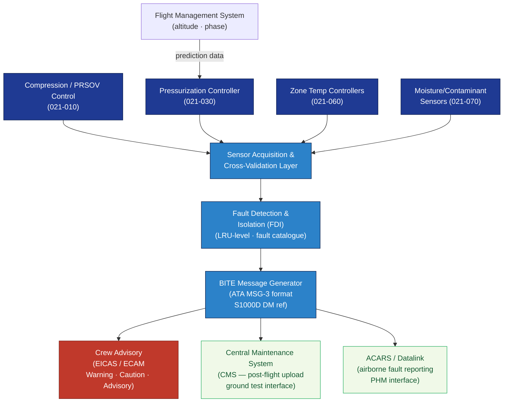

# ATLAS 020-029 · 02.021 — Air Conditioning and Pressurization · 021-080 ECS Monitoring, Diagnostics and Control Interfaces

> **Programme-controlled extension** — Section `021-080` (ATA SNS 21-80-00) is a Q+ATLANTIDE programme extension beyond the core ATA 21-00 to 21-70 chapter structure. It provides the centralised ECS monitoring, BITE diagnostics, and cross-system control interface layer.

## 1. Purpose

Defines the **ECS monitoring, Built-In Test Equipment (BITE) diagnostics, and cross-system control interface architecture** for the *Air Conditioning and Pressurization* subsystem within the Q+ATLANTIDE programme. Consolidates sensor acquisition, fault detection and isolation (FDI), BITE message generation, crew advisory logic, and the interface bus architecture that connects all ECS subsections (021-010 through 021-070) to the aircraft central maintenance system (CMS) and ACARS/datalink reporting.

## 2. Scope

- Covers the *ECS Monitoring, Diagnostics and Control Interfaces* section (`021-080`, ATA SNS 21-80-00) of subsection `021` *Air Conditioning and Pressurization* as a **programme-controlled extension**.
- Inherits Q-Division authority and ORB support from the parent row in [`../../README.md` §3](../../README.md#3-architecture-table)[^archtable].
- Concepts in scope:
  - **ECS controller BITE** — Built-In Test Equipment architecture for all ECS controllers (pressurisation, zone temperature, pack); power-up self-test, continuous monitoring, and fault isolation to LRU level.
  - **Sensor acquisition and validation** — centralised acquisition of temperature, pressure, humidity, flow-rate, and air-quality sensor data; sensor cross-comparison and validity checks; failure flag generation.
  - **Fault detection and isolation (FDI)** — real-time FDI algorithms; fault code catalogue (per ATA MSG-3[^msg3]); maintenance message format compliant with S1000D[^s1000d].
  - **Crew advisory and warning logic** — ECS-related EICAS/ECAM advisory, caution, and warning messages; alert hierarchy (per EASA CS-25[^cs25] AMC 25.1322); crew procedure cross-references.
  - **Central Maintenance System (CMS) interface** — post-flight maintenance message upload; ground test command interface; interface definition with aircraft CMS data-bus.
  - **ACARS/datalink reporting** — airborne ECS performance and fault reporting via ACARS[^acars]; ground-station maintenance data reception; prognostic health management (PHM) interface.
  - **Cross-system control bus** — inter-subsection control signal architecture: pressurisation controller ↔ zone temperature controllers ↔ pack controllers ↔ FMS interface (see 021-030, 021-060).
- Out of scope: S1000D CSDB document-level mapping and traceability (021-090).

## 3. Diagram — ECS Monitoring and Control Interface Architecture

All ECS subsection controllers feed sensor data and BITE messages to the centralised ECS monitoring layer; the monitoring layer interfaces with crew advisory, CMS, and datalink.

## 4. Footprint

| Metric | Value |
|---|---|
| Architecture | `ATLAS` — Aircraft Top Level Architecture Schema/System (controlled term) |
| Master range | `000–099` |
| Code range | `020-029` |
| Section | `02` — Sistemas Core de Aeronave |
| Subsection | `021` — Air Conditioning and Pressurization |
| Local section code | `021-080` — ECS Monitoring, Diagnostics and Control Interfaces |
| ATA chapter | 21 |
| ATA SNS | 21-80-00 |
| Section type | Programme-controlled extension |
| Primary Q-Division | Q-AIR[^qdiv] |
| Support Q-Divisions | Q-MECHANICS, Q-DATAGOV, Q-GREENTECH |
| ORB support | ORB-PMO, ORB-LEG |
| Governance class | `baseline`[^gov] |
| Folder path | `Q+ATLANTIDE/000-099_ATLAS/020-029_Sistemas-Core-de-Aeronave/021_Air-Conditioning-and-Pressurization/` |
| Document | `021-080-ECS-Monitoring-Diagnostics-and-Control-Interfaces.md` (this file) |
| Parent subsection | [`README.md`](./README.md) · [`021-000-General.md`](./021-000-General.md) |
| Parent architecture | [`../../README.md`](../../README.md) |
| Parent baseline | [`organization/Q+ATLANTIDE.md`](../../../../organization/Q+ATLANTIDE.md) |

## 5. References & Citations

[^baseline]: **Q+ATLANTIDE controlled baseline (v1.0.0)** — [`organization/Q+ATLANTIDE.md`](../../../../organization/Q+ATLANTIDE.md).

[^archtable]: **ATLAS §3 Architecture Table** — [`../../README.md` §3](../../README.md#3-architecture-table).

[^qdiv]: **Q-Division authority** — Q-Divisions provide technical authority over an architecture row (Q+ATLANTIDE Note N-002). See [`organization/Q+ATLANTIDE.md` §4](../../../../organization/Q+ATLANTIDE.md#4-notes).

[^gov]: **Governance class** — `baseline` denotes documents under controlled change management within the Q+ATLANTIDE baseline.

[^cs25]: **EASA CS-25** — AMC 25.1322 covering flight crew alerting, EICAS/ECAM advisory hierarchy classification, and crew alert message format requirements.

[^msg3]: **ATA MSG-3 — Operator/Manufacturer Scheduled Maintenance Development** — Defines fault isolation logic, LRU-level BITE message structure, and maintenance task classification for ECS diagnostics.

[^s1000d]: **S1000D Issue 6.0 — International specification for technical publications** — Defines the Data Module Code (DMC) structure and CSDB linkage for fault-maintenance messages generated by the BITE system.

[^acars]: **ARINC 618/620 — ACARS Message Structure and Ground Station Interface** — Standards for airborne fault reporting and PHM data transmission via ACARS.

### Applicable standards

- EASA CS-25[^cs25]
- ATA MSG-3[^msg3]
- S1000D Issue 6.0[^s1000d]
- ARINC 618/620 — ACARS[^acars]
