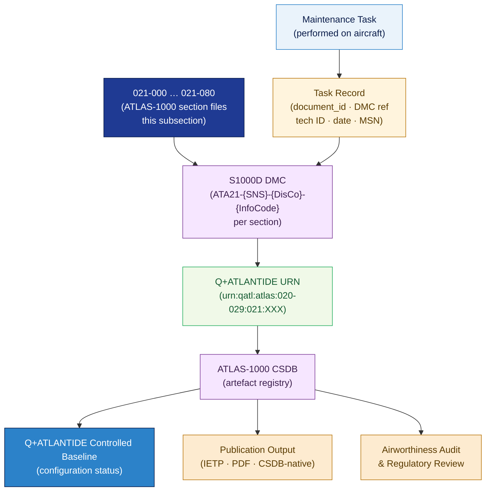

# ATLAS 020-029 · 02.021 — Air Conditioning and Pressurization · 021-090 S1000D CSDB Mapping and Traceability

> **Programme-controlled publication and traceability extension** — Section `021-090` (ATA SNS 21-90-00) is a Q+ATLANTIDE programme extension defining the S1000D Data Module Code (DMC) mapping, CSDB population rules, and end-to-end traceability architecture for all ATA 21 / subsection 021 data modules.

## 1. Purpose

Defines the **S1000D CSDB mapping rules, Data Module Code (DMC) construction conventions, and lifecycle traceability architecture** for all data modules produced under subsection `021` *Air Conditioning and Pressurization* within the Q+ATLANTIDE programme. Establishes the authoritative link between every ATLAS-1000 document in sections `021-000` through `021-080` and its corresponding S1000D DMC, CSDB entry, and Q+ATLANTIDE URN, enabling full reverse traceability from any maintenance task record to the controlled baseline.

## 2. Scope

- Covers the *S1000D CSDB Mapping and Traceability* section (`021-090`, ATA SNS 21-90-00) of subsection `021` *Air Conditioning and Pressurization* as a **programme-controlled publication and traceability extension**.
- Inherits Q-Division authority and ORB support from the parent row in [`../../README.md` §3](../../README.md#3-architecture-table)[^archtable].
- Concepts in scope:
  - **DMC construction** — the S1000D Data Module Code structure applied to ATA 21 data modules: `{ModelIdentCode}-ATA21-{SNS}-{DisCo}-{InfoCode}-{InfoCodeVariant}-{ItemLocation}` mapping to the local 021-XXX codes.
  - **CSDB population rules** — rules for creating, naming, and versioning CSDB entries for each section file in this subsection; applicability coding (aircraft type, MSN effectivity); language/variant conventions.
  - **Q+ATLANTIDE URN scheme** — `urn:qatl:atlas:020-029:021:{section-code}` construction for each ATLAS-1000 document; cross-link to CSDB DMC.
  - **Section-to-DMC mapping table** — the controlled mapping of every `021-XXX-Title.md` document in this subsection to its canonical S1000D DMC, Q+ATLANTIDE URN, and CSDB status.
  - **Lifecycle traceability chain** — the directed link from a physical maintenance event (task performed) → task record (per ATLAS 020 standard practices, subsection 020 `010_`) → ATLAS-1000 data module → CSDB entry → Q+ATLANTIDE URN → controlled baseline; applicable for all ATA 21 tasks.
  - **Publication output types** — Interactive Electronic Technical Publication (IETP), print PDF, and CSDB-native outputs; publishing pipeline configuration for ATA 21 data modules.
- Out of scope: ECS monitoring BITE message content (021-080); all physical ECS subsystem architecture (021-000 through 021-070).

## 3. Diagram — S1000D CSDB Traceability Chain for ATA 21

Each `021-XXX` document maps to a DMC and Q+ATLANTIDE URN; maintenance tasks reference the DMC; the traceability chain links physical events back to the controlled baseline.

## 4. Section-to-DMC Mapping

| Local Code | ATA SNS | Document | DMC Suffix | Q+ATLANTIDE URN |
|---|---|---|---|---|
| 021-000 | 21-00-00 | `021-000-General.md` | `ATA21-000-00A-040A-A` | `urn:qatl:atlas:020-029:021:000` |
| 021-010 | 21-10-00 | `021-010-Compression.md` | `ATA21-010-00A-040A-A` | `urn:qatl:atlas:020-029:021:010` |
| 021-020 | 21-20-00 | `021-020-Distribution.md` | `ATA21-020-00A-040A-A` | `urn:qatl:atlas:020-029:021:020` |
| 021-030 | 21-30-00 | `021-030-Pressurization-Control.md` | `ATA21-030-00A-040A-A` | `urn:qatl:atlas:020-029:021:030` |
| 021-040 | 21-40-00 | `021-040-Heating.md` | `ATA21-040-00A-040A-A` | `urn:qatl:atlas:020-029:021:040` |
| 021-050 | 21-50-00 | `021-050-Cooling.md` | `ATA21-050-00A-040A-A` | `urn:qatl:atlas:020-029:021:050` |
| 021-060 | 21-60-00 | `021-060-Temperature-Control.md` | `ATA21-060-00A-040A-A` | `urn:qatl:atlas:020-029:021:060` |
| 021-070 | 21-70-00 | `021-070-Moisture-and-Air-Contaminant-Control.md` | `ATA21-070-00A-040A-A` | `urn:qatl:atlas:020-029:021:070` |
| 021-080 | 21-80-00 | `021-080-ECS-Monitoring-Diagnostics-and-Control-Interfaces.md` | `ATA21-080-00A-040A-A` | `urn:qatl:atlas:020-029:021:080` |
| 021-090 | 21-90-00 | `021-090-S1000D-CSDB-Mapping-and-Traceability.md` | `ATA21-090-00A-040A-A` | `urn:qatl:atlas:020-029:021:090` |

## 5. Footprint

| Metric | Value |
|---|---|
| Architecture | `ATLAS` — Aircraft Top Level Architecture Schema/System (controlled term) |
| Master range | `000–099` |
| Code range | `020-029` |
| Section | `02` — Sistemas Core de Aeronave |
| Subsection | `021` — Air Conditioning and Pressurization |
| Local section code | `021-090` — S1000D CSDB Mapping and Traceability |
| ATA chapter | 21 |
| ATA SNS | 21-90-00 |
| Section type | Programme-controlled publication and traceability extension |
| Primary Q-Division | Q-AIR[^qdiv] |
| Support Q-Divisions | Q-MECHANICS, Q-DATAGOV, Q-GREENTECH |
| ORB support | ORB-PMO, ORB-LEG |
| Governance class | `baseline`[^gov] |
| Folder path | `Q+ATLANTIDE/000-099_ATLAS/020-029_Sistemas-Core-de-Aeronave/021_Air-Conditioning-and-Pressurization/` |
| Document | `021-090-S1000D-CSDB-Mapping-and-Traceability.md` (this file) |
| Parent subsection | [`README.md`](./README.md) · [`021-000-General.md`](./021-000-General.md) |
| Parent architecture | [`../../README.md`](../../README.md) |
| Parent baseline | [`organization/Q+ATLANTIDE.md`](../../../../organization/Q+ATLANTIDE.md) |

## 6. References & Citations

[^baseline]: **Q+ATLANTIDE controlled baseline (v1.0.0)** — [`organization/Q+ATLANTIDE.md`](../../../../organization/Q+ATLANTIDE.md). Defines the controlled `000-999` architecture-band taxonomy and the ATLAS-1000 register subpart; the ultimate traceability anchor.

[^archtable]: **ATLAS §3 Architecture Table** — [`../../README.md` §3](../../README.md#3-architecture-table).

[^qdiv]: **Q-Division authority** — Q-Divisions provide technical authority over an architecture row (Q+ATLANTIDE Note N-002). See [`organization/Q+ATLANTIDE.md` §4](../../../../organization/Q+ATLANTIDE.md#4-notes).

[^gov]: **Governance class** — `baseline` denotes documents under controlled change management within the Q+ATLANTIDE baseline.

[^s1000d]: **S1000D Issue 6.0 — International specification for technical publications** — Defines the Data Module Code (DMC) structure, CSDB population rules, applicability coding, language conventions, and lifecycle record requirements for all Q+ATLANTIDE maintenance artefacts.

[^ata2200]: **ATA iSpec 2200 — Information Standards for Aviation Maintenance** — Governs ATA chapter/SNS numbering conventions and the mapping between ATA section codes and S1000D SNS identifiers.

[^iso15459]: **ISO 15459 — Unique Identification of Transport Units and Unit Loads** — UID standard extended to Q+ATLANTIDE URN construction and CSDB cross-link for digital artefact traceability.

### Applicable standards

- S1000D Issue 6.0[^s1000d]
- ATA iSpec 2200[^ata2200]
- ISO 15459[^iso15459]
