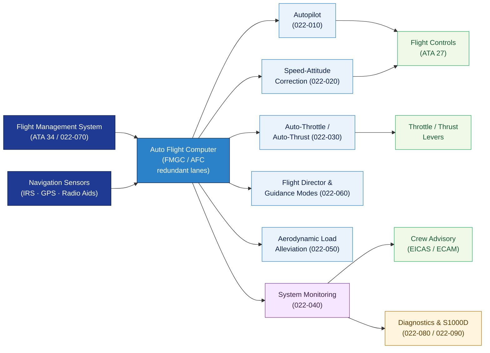

# ATLAS 020-029 · 02.022 — Auto Flight · 022-000 General

## 1. Purpose

General entry-point for the *Auto Flight* subsection (`022`) within ATLAS `020-029` — *Sistemas Core de Aeronave* — aligned to ATA 22-00-00. This section (`022-000`) introduces the Auto Flight system architecture and its purpose within the Q+ATLANTIDE programme, and provides the normative foundation for all downstream sections (`022-010` through `022-090`).

This document is part of the **ATLAS-1000** register within the controlled **Q+ATLANTIDE** baseline[^baseline][^n001].

## 2. Scope

- Covers general principles, purpose, and architecture of the *Auto Flight* system (ATA 22 / SNS 22-00-00) as applied to Q+ATLANTIDE programme aircraft.
- Inherits Q-Division authority and ORB support from the parent row in [`../../README.md` §3](../../README.md#3-architecture-table)[^archtable].
- Concepts in scope:
  - **System overview** — the Auto Flight function: automatic control of the flight path and speed profile through autopilot, flight director, auto-throttle/auto-thrust, and monitoring functions to reduce crew workload and achieve precise navigation.
  - **Architecture** — the auto-flight computer (AFC) or flight management and guidance computer (FMGC) architecture; engagement/disengagement logic; redundancy and voting principles.
  - **System boundaries** — interfaces with FMS (ATA 34/22-070), flight controls (ATA 27), communications (ATA 23), navigation (ATA 34), electrical power (ATA 24), and structural load alleviation; exclusions from auto-flight scope.
  - **Regulatory framework** — applicable regulatory and standards basis: EASA CS-25[^cs25], CS-25 AMC 25.1329[^amc1329], FAR 25[^far25], RTCA DO-178C[^do178c], DO-254[^do254], and ATA iSpec 2200[^ata2200].
  - **Safety classification** — auto-flight is flight-safety critical; any artefact derived from this section requires explicit system effectivity, flight-control authority limits, mode annunciation, human override capability, failure detection and disengagement behaviour.
- Downstream sections: `022-010` Autopilot · `022-020` Speed-Attitude Correction · `022-030` Auto-Throttle/Auto-Thrust · `022-040` System Monitoring · `022-050` Aerodynamic Load Alleviation · `022-060` Flight Director and Guidance Modes · `022-070` FMS Auto-Flight Interfaces · `022-080` Monitoring, Diagnostics and Control Interfaces · `022-090` S1000D/CSDB Mapping and Traceability.

## 3. Diagram — Auto Flight Functional Architecture

The auto-flight computer integrates autopilot, speed control, flight director, and load alleviation functions; all modes are monitored by the system monitor and interfaced with the FMS and flight controls.

## 4. Footprint

| Metric | Value |
|---|---|
| Architecture | `ATLAS` — Aircraft Top Level Architecture Schema/System (controlled term) |
| Master range | `000–099` |
| Code range | `020-029` |
| Section | `02` — Sistemas Core de Aeronave |
| Subsection | `022` — Auto Flight |
| Local section code | `022-000` — General |
| ATA chapter | 22 |
| ATA SNS | 22-00-00 |
| Primary Q-Division | Q-AIR[^qdiv] |
| Support Q-Divisions | Q-DATAGOV, Q-HPC, Q-MECHANICS, Q-GROUND, Q-INDUSTRY |
| ORB support | ORB-PMO, ORB-LEG |
| Governance class | `baseline`[^gov] |
| Folder path | `Q+ATLANTIDE/000-099_ATLAS/020-029_Sistemas-Core-de-Aeronave/022_Auto-Flight/` |
| Document | `022-000-General.md` (this file) |
| Parent subsection | [`README.md`](./README.md) |
| Parent architecture | [`../../README.md`](../../README.md) |
| Parent baseline | [`organization/Q+ATLANTIDE.md`](../../../../organization/Q+ATLANTIDE.md) |

## 5. References & Citations

[^baseline]: **Q+ATLANTIDE controlled baseline (v1.0.0)** — [`organization/Q+ATLANTIDE.md`](../../../../organization/Q+ATLANTIDE.md).

[^archtable]: **ATLAS §3 Architecture Table** — [`../../README.md` §3](../../README.md#3-architecture-table).

[^qdiv]: **Q-Division authority** — Q-Divisions provide technical authority over an architecture row (Q+ATLANTIDE Note N-002). See [`organization/Q+ATLANTIDE.md` §4](../../../../organization/Q+ATLANTIDE.md#4-notes).

[^gov]: **Governance class** — `baseline` denotes documents under controlled change management within the Q+ATLANTIDE baseline.

[^n001]: **Note N-001** — Q+ATLANTIDE (with its ATLAS-1000 register subpart) is a taxonomy and traceability ecosystem, not an organization chart. See [`organization/Q+ATLANTIDE.md` §4](../../../../organization/Q+ATLANTIDE.md#4-notes).

[^cs25]: **EASA CS-25 — Certification Specifications for Large Aeroplanes** — CS 25.1329 (Flight guidance systems) and associated AMC/GM covering auto-flight system design, failure condition classification, and airworthiness compliance.

[^amc1329]: **AMC 25.1329 — Flight Guidance Systems** — Detailed acceptable means of compliance for autopilot, flight director, auto-throttle, and monitoring; defines mode awareness, failure behaviour, and crew alerting requirements.

[^far25]: **FAR Part 25 — Airworthiness Standards: Transport Category Airplanes** — §25.1329 Flight guidance systems.

[^do178c]: **RTCA DO-178C — Software Considerations in Airborne Systems and Equipment Certification** — Software assurance levels and verification requirements for auto-flight computer software.

[^do254]: **RTCA DO-254 — Design Assurance Guidance for Airborne Electronic Hardware** — Hardware design assurance levels for auto-flight computer hardware and FPGA/ASIC components.

[^ata2200]: **ATA iSpec 2200** — ATA chapter 22 naming conventions and data-module scope.

### Applicable standards

- EASA CS-25[^cs25] / AMC 25.1329[^amc1329]
- FAR Part 25[^far25]
- RTCA DO-178C[^do178c]
- RTCA DO-254[^do254]
- ATA iSpec 2200[^ata2200]
