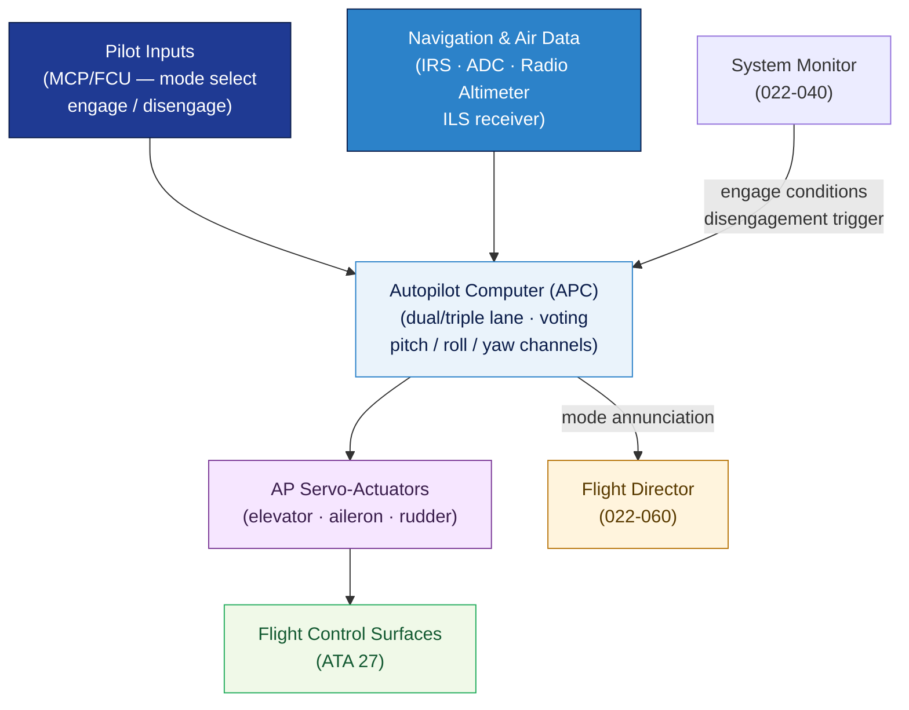

# ATLAS 020-029 · 02.022 — Auto Flight · 022-010 Autopilot

## 1. Purpose

Defines the **autopilot system architecture and functional requirements** for the *Auto Flight* subsystem (ATA 22-10-00) within the Q+ATLANTIDE programme. Covers the autopilot computer lane architecture, engagement/disengagement logic, control-loop functions (pitch, roll, yaw channels), authority limits, and interfaces with flight-control actuators.

## 2. Scope

- Covers the *Autopilot* section (`022-010`, ATA SNS 22-10-00) of subsection `022` *Auto Flight*.
- Inherits Q-Division authority and ORB support from the parent row in [`../../README.md` §3](../../README.md#3-architecture-table)[^archtable].
- Concepts in scope:
  - **Computer architecture** — autopilot computer (APC) or FMGC autopilot lane; dual/triple redundant lanes; cross-monitoring and voting logic; line-replaceable unit (LRU) definition.
  - **Engagement and disengagement** — pilot engagement button/switch; conditions for engagement (airspeed, altitude, systems available); automatic disengagement criteria; tactile and visual crew annunciation.
  - **Control channels** — pitch autopilot channel (elevator/stabiliser); roll autopilot channel (aileron/spoiler); yaw damper/autopilot yaw channel; channel authority limits (surface position and rate).
  - **Control modes** — heading hold, altitude hold, attitude hold, ILS capture/track (localiser and glidepath), VNAV, LNAV; mode transitions and protection.
  - **Override and cutout** — forward stick force override threshold; AP disconnect button; go-around mode; manual reversion.
  - **Actuator interfaces** — AP servo-actuator command and position-feedback interface with flight-control system (ATA 27).
- Out of scope: speed/attitude correction (022-020), auto-throttle (022-030), flight director and guidance modes (022-060).

## 3. Diagram — Autopilot Control Architecture

The autopilot computer commands flight-control actuators via the servo loop; mode logic governs active control channel; the system monitor supervises engagement conditions.

## 4. Footprint

| Metric | Value |
|---|---|
| Architecture | `ATLAS` — Aircraft Top Level Architecture Schema/System (controlled term) |
| Master range | `000–099` |
| Code range | `020-029` |
| Section | `02` — Sistemas Core de Aeronave |
| Subsection | `022` — Auto Flight |
| Local section code | `022-010` — Autopilot |
| ATA chapter | 22 |
| ATA SNS | 22-10-00 |
| Primary Q-Division | Q-AIR[^qdiv] |
| Support Q-Divisions | Q-DATAGOV, Q-HPC, Q-MECHANICS, Q-GROUND, Q-INDUSTRY |
| ORB support | ORB-PMO, ORB-LEG |
| Governance class | `baseline`[^gov] |
| Folder path | `Q+ATLANTIDE/000-099_ATLAS/020-029_Sistemas-Core-de-Aeronave/022_Auto-Flight/` |
| Document | `022-010-Autopilot.md` (this file) |
| Parent subsection | [`README.md`](./README.md) · [`022-000-General.md`](./022-000-General.md) |
| Parent architecture | [`../../README.md`](../../README.md) |
| Parent baseline | [`organization/Q+ATLANTIDE.md`](../../../../organization/Q+ATLANTIDE.md) |

## 5. References & Citations

[^baseline]: **Q+ATLANTIDE controlled baseline (v1.0.0)** — [`organization/Q+ATLANTIDE.md`](../../../../organization/Q+ATLANTIDE.md).

[^archtable]: **ATLAS §3 Architecture Table** — [`../../README.md` §3](../../README.md#3-architecture-table).

[^qdiv]: **Q-Division authority** — Q-Divisions provide technical authority over an architecture row. See [`organization/Q+ATLANTIDE.md` §4](../../../../organization/Q+ATLANTIDE.md#4-notes).

[^gov]: **Governance class** — `baseline` denotes documents under controlled change management within the Q+ATLANTIDE baseline.

[^cs25]: **EASA CS-25** — CS 25.1329 and AMC 25.1329 (autopilot engagement conditions, authority limits, disengagement annunciation, and failure behaviour).

[^do178c]: **RTCA DO-178C** — Software assurance level A/B for autopilot computer software per CS-25 failure classification.

[^ata2200]: **ATA iSpec 2200** — Section 22-10 naming and data-module scope for autopilot subsystems.

### Applicable standards

- EASA CS-25 / AMC 25.1329[^cs25]
- RTCA DO-178C[^do178c]
- ATA iSpec 2200[^ata2200]
