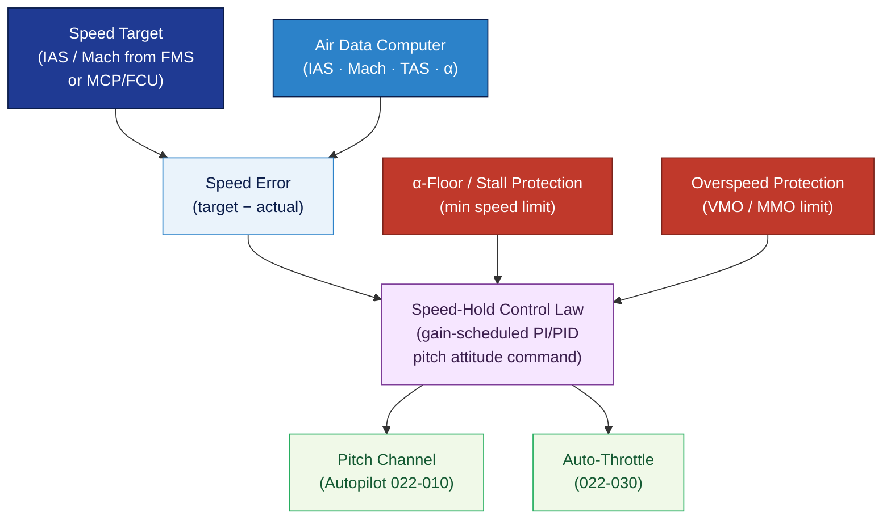

# ATLAS 020-029 · 02.022 — Auto Flight · 022-020 Speed-Attitude Correction

## 1. Purpose

Defines the **speed and attitude correction function** within the *Auto Flight* subsystem (ATA 22-20-00) for the Q+ATLANTIDE programme. Covers the automatic speed error correction applied through elevator (pitch attitude) or through auto-throttle (speed channel), including stall and overspeed protection envelopes, pitch attitude limits, and the speed-hold/Mach-hold control loop architecture.

## 2. Scope

- Covers the *Speed-Attitude Correction* section (`022-020`, ATA SNS 22-20-00) of subsection `022` *Auto Flight*.
- Inherits Q-Division authority and ORB support from the parent row in [`../../README.md` §3](../../README.md#3-architecture-table)[^archtable].
- Concepts in scope:
  - **Speed-hold control loop** — IAS-hold and Mach-hold modes; speed-error to pitch-attitude command law; gain scheduling with altitude and airspeed; pitch channel authority limits.
  - **Stall protection integration** — α-floor and speed-floor limits passed to the pitch correction law; interface with stall warning (ATA 27) and auto-throttle (022-030).
  - **Overspeed protection** — VMO/MMO protection in cruise; nose-up pitch command to reduce speed; transition to speed-brake advisory (ATA 27 interface).
  - **Attitude correction limits** — maximum autopilot-commanded pitch up/down angles; bank-angle limits in speed-correction modes.
  - **Mode transitions** — speed acquisition (deceleration/acceleration), altitude-capture interaction, go-around mode speed target.
  - **Air data system interface** — ADC IAS/Mach input, redundancy, and data validity monitoring.
- Out of scope: autopilot engagement architecture (022-010), auto-throttle hardware (022-030).

## 3. Diagram — Speed-Attitude Correction Control Loop

Speed error (target minus actual) drives a pitch attitude command through the speed-hold law; α-floor and overspeed limits constrain the correction envelope.

## 4. Footprint

| Metric | Value |
|---|---|
| Architecture | `ATLAS` — Aircraft Top Level Architecture Schema/System (controlled term) |
| Master range | `000–099` |
| Code range | `020-029` |
| Section | `02` — Sistemas Core de Aeronave |
| Subsection | `022` — Auto Flight |
| Local section code | `022-020` — Speed-Attitude Correction |
| ATA chapter | 22 |
| ATA SNS | 22-20-00 |
| Primary Q-Division | Q-AIR[^qdiv] |
| Support Q-Divisions | Q-DATAGOV, Q-HPC, Q-MECHANICS, Q-GROUND, Q-INDUSTRY |
| ORB support | ORB-PMO, ORB-LEG |
| Governance class | `baseline`[^gov] |
| Folder path | `Q+ATLANTIDE/000-099_ATLAS/020-029_Sistemas-Core-de-Aeronave/022_Auto-Flight/` |
| Document | `022-020-Speed-Attitude-Correction.md` (this file) |
| Parent subsection | [`README.md`](./README.md) · [`022-000-General.md`](./022-000-General.md) |
| Parent architecture | [`../../README.md`](../../README.md) |
| Parent baseline | [`organization/Q+ATLANTIDE.md`](../../../../organization/Q+ATLANTIDE.md) |

## 5. References & Citations

[^baseline]: **Q+ATLANTIDE controlled baseline (v1.0.0)** — [`organization/Q+ATLANTIDE.md`](../../../../organization/Q+ATLANTIDE.md).

[^archtable]: **ATLAS §3 Architecture Table** — [`../../README.md` §3](../../README.md#3-architecture-table).

[^qdiv]: **Q-Division authority** — See [`organization/Q+ATLANTIDE.md` §4](../../../../organization/Q+ATLANTIDE.md#4-notes).

[^gov]: **Governance class** — `baseline` denotes documents under controlled change management.

[^cs25]: **EASA CS-25** — CS 25.1329 (speed-hold mode), AMC 25.1329 §9–10 (speed envelope protection, attitude limits).

[^ata2200]: **ATA iSpec 2200** — Section 22-20 naming and data-module scope for speed-attitude correction subsystems.

### Applicable standards

- EASA CS-25 / AMC 25.1329[^cs25]
- ATA iSpec 2200[^ata2200]
