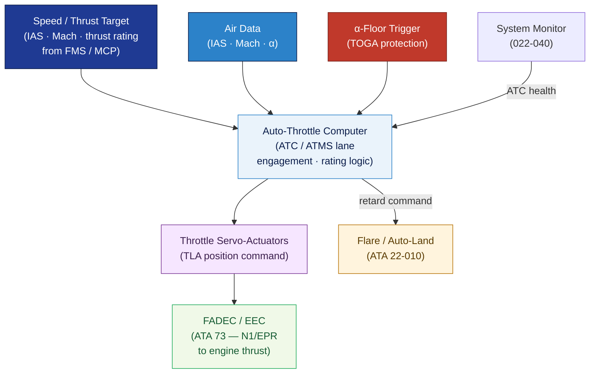

# ATLAS 020-029 · 02.022 — Auto Flight · 022-030 Auto-Throttle / Auto-Thrust

## 1. Purpose

Defines the **auto-throttle and auto-thrust system architecture** for the *Auto Flight* subsystem (ATA 22-30-00) within the Q+ATLANTIDE programme. Covers automatic throttle/thrust lever movement, thrust target computation, engagement/disengagement logic, α-floor protection, thrust-rating management, and interfaces with the engine control system (ATA 73/76) and autopilot speed channel.

## 2. Scope

- Covers the *Auto-Throttle / Auto-Thrust* section (`022-030`, ATA SNS 22-30-00) of subsection `022` *Auto Flight*.
- Inherits Q-Division authority and ORB support from the parent row in [`../../README.md` §3](../../README.md#3-architecture-table)[^archtable].
- Concepts in scope:
  - **Auto-throttle computer (ATC)** — autothrottle computer/ATMS lane; redundancy; engagement conditions and interlock with autopilot.
  - **Speed-hold / Mach-hold mode** — throttle movement to maintain selected IAS or Mach; speed-error to N1/EPR command law; interface with speed-attitude correction (022-020).
  - **Thrust-rating management** — TO, CLB, CRZ, GA thrust limits passed from FADEC interface (ATA 76); auto-rating selection per flight phase.
  - **α-Floor activation** — automatic selection of TOGA thrust on α-floor trigger from protection system (ATA 27/22-020); crew annunciation.
  - **Retard mode** — automatic throttle retard to IDLE at flare initiation in auto-land; flare-mode interface.
  - **Manual override** — pilot force override; ATC disengage; throttle lever angle (TLA) reversion.
  - **Engine control interface** — N1/EPR command to FADEC (ATA 73); thrust feedback; fuel-flow integration.
- Out of scope: autopilot pitch channel (022-010), speed-attitude correction control law (022-020), flight director (022-060).

## 3. Diagram — Auto-Throttle / Auto-Thrust Architecture

The auto-throttle computer commands throttle servos based on speed-hold or thrust-rating demand; α-floor triggers TOGA automatically; FADEC translates N1/EPR commands to engine thrust.

## 4. Footprint

| Metric | Value |
|---|---|
| Architecture | `ATLAS` — Aircraft Top Level Architecture Schema/System (controlled term) |
| Master range | `000–099` |
| Code range | `020-029` |
| Section | `02` — Sistemas Core de Aeronave |
| Subsection | `022` — Auto Flight |
| Local section code | `022-030` — Auto-Throttle / Auto-Thrust |
| ATA chapter | 22 |
| ATA SNS | 22-30-00 |
| Primary Q-Division | Q-AIR[^qdiv] |
| Support Q-Divisions | Q-DATAGOV, Q-HPC, Q-MECHANICS, Q-GROUND, Q-INDUSTRY |
| ORB support | ORB-PMO, ORB-LEG |
| Governance class | `baseline`[^gov] |
| Folder path | `Q+ATLANTIDE/000-099_ATLAS/020-029_Sistemas-Core-de-Aeronave/022_Auto-Flight/` |
| Document | `022-030-Auto-Throttle-Auto-Thrust.md` (this file) |
| Parent subsection | [`README.md`](./README.md) · [`022-000-General.md`](./022-000-General.md) |
| Parent architecture | [`../../README.md`](../../README.md) |
| Parent baseline | [`organization/Q+ATLANTIDE.md`](../../../../organization/Q+ATLANTIDE.md) |

## 5. References & Citations

[^baseline]: **Q+ATLANTIDE controlled baseline (v1.0.0)** — [`organization/Q+ATLANTIDE.md`](../../../../organization/Q+ATLANTIDE.md).

[^archtable]: **ATLAS §3 Architecture Table** — [`../../README.md` §3](../../README.md#3-architecture-table).

[^qdiv]: **Q-Division authority** — See [`organization/Q+ATLANTIDE.md` §4](../../../../organization/Q+ATLANTIDE.md#4-notes).

[^gov]: **Governance class** — `baseline` denotes documents under controlled change management.

[^cs25]: **EASA CS-25** — CS 25.1329 (auto-throttle engagement, speed-hold, α-floor activation, retard mode) and AMC 25.1329 §11–12.

[^ata2200]: **ATA iSpec 2200** — Section 22-30 naming and data-module scope for auto-throttle/auto-thrust subsystems.

### Applicable standards

- EASA CS-25 / AMC 25.1329[^cs25]
- ATA iSpec 2200[^ata2200]
