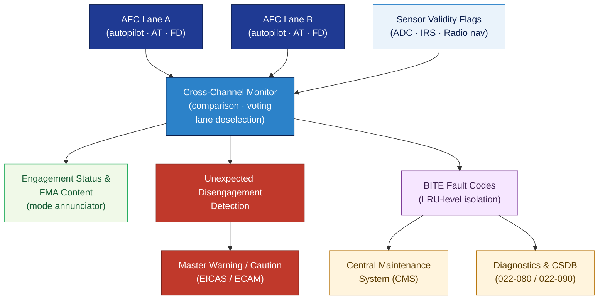

# ATLAS 020-029 · 02.022 — Auto Flight · 022-040 System Monitoring

## 1. Purpose

Defines the **auto-flight system monitoring architecture** for the *Auto Flight* subsystem (ATA 22-40-00) within the Q+ATLANTIDE programme. Covers continuous monitoring of the autopilot, auto-throttle, flight director, and guidance mode status; cross-channel comparison; disengagement detection; crew alerting; and interface with the central maintenance system (CMS).

## 2. Scope

- Covers the *System Monitoring* section (`022-040`, ATA SNS 22-40-00) of subsection `022` *Auto Flight*.
- Inherits Q-Division authority and ORB support from the parent row in [`../../README.md` §3](../../README.md#3-architecture-table)[^archtable].
- Concepts in scope:
  - **Cross-channel monitoring** — real-time comparison of redundant AFC/APC lanes; disagreement detection thresholds; voting logic and lane deselection.
  - **Engagement status monitoring** — autopilot, auto-throttle, and flight director engagement status; mode annunciator (FMA) content and display logic.
  - **Automatic disengagement detection** — detection of unexpected disengagement; master warning activation; crew alerting per AMC 25.1329[^cs25] requirements.
  - **Sensor validity monitoring** — air data, navigation, and radio navigation input validity flags; degraded mode operation.
  - **BITE integration** — built-in test equipment (BITE) continuous monitoring; fault code generation; maintenance message interface with CMS (cross-reference 022-080).
  - **Mode awareness monitoring** — monitoring of flight mode annunciator (FMA) transitions; unexpected mode change detection.
- Out of scope: autopilot servo hardware (022-010), speed-attitude correction (022-020), detailed diagnostics and CSDB traceability (022-080, 022-090).

## 3. Diagram — Auto-Flight System Monitoring Architecture

Cross-channel comparison and sensor validity monitoring feed engagement status and fault alerts to crew advisory and CMS; BITE generates fault codes for maintenance.

## 4. Footprint

| Metric | Value |
|---|---|
| Architecture | `ATLAS` — Aircraft Top Level Architecture Schema/System (controlled term) |
| Master range | `000–099` |
| Code range | `020-029` |
| Section | `02` — Sistemas Core de Aeronave |
| Subsection | `022` — Auto Flight |
| Local section code | `022-040` — System Monitoring |
| ATA chapter | 22 |
| ATA SNS | 22-40-00 |
| Primary Q-Division | Q-AIR[^qdiv] |
| Support Q-Divisions | Q-DATAGOV, Q-HPC, Q-MECHANICS, Q-GROUND, Q-INDUSTRY |
| ORB support | ORB-PMO, ORB-LEG |
| Governance class | `baseline`[^gov] |
| Folder path | `Q+ATLANTIDE/000-099_ATLAS/020-029_Sistemas-Core-de-Aeronave/022_Auto-Flight/` |
| Document | `022-040-System-Monitoring.md` (this file) |
| Parent subsection | [`README.md`](./README.md) · [`022-000-General.md`](./022-000-General.md) |
| Parent architecture | [`../../README.md`](../../README.md) |
| Parent baseline | [`organization/Q+ATLANTIDE.md`](../../../../organization/Q+ATLANTIDE.md) |

## 5. References & Citations

[^baseline]: **Q+ATLANTIDE controlled baseline (v1.0.0)** — [`organization/Q+ATLANTIDE.md`](../../../../organization/Q+ATLANTIDE.md).

[^archtable]: **ATLAS §3 Architecture Table** — [`../../README.md` §3](../../README.md#3-architecture-table).

[^qdiv]: **Q-Division authority** — See [`organization/Q+ATLANTIDE.md` §4](../../../../organization/Q+ATLANTIDE.md#4-notes).

[^gov]: **Governance class** — `baseline` denotes documents under controlled change management.

[^cs25]: **EASA CS-25** — CS 25.1329 and AMC 25.1329 §5–8 covering cross-channel monitoring, unexpected disengagement detection, FMA content, and crew alerting requirements.

[^ata2200]: **ATA iSpec 2200** — Section 22-40 naming and data-module scope for auto-flight system monitoring subsystems.

### Applicable standards

- EASA CS-25 / AMC 25.1329[^cs25]
- ATA iSpec 2200[^ata2200]
