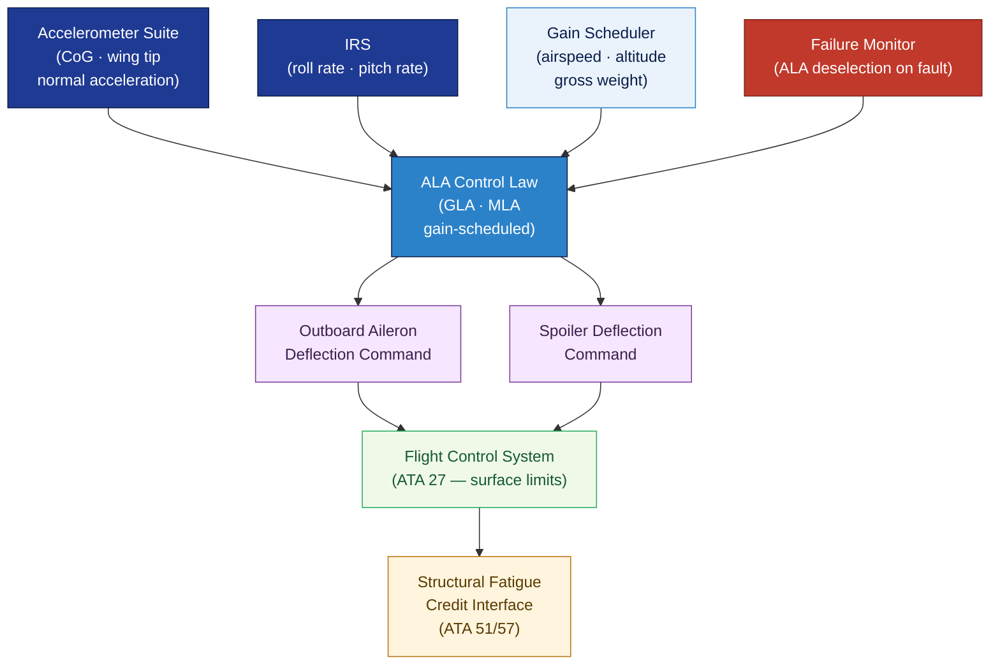

# ATLAS 020-029 · 02.022 — Auto Flight · 022-050 Aerodynamic Load Alleviation

## 1. Purpose

Defines the **aerodynamic load alleviation (ALA) system architecture and functional requirements** for the *Auto Flight* subsystem (ATA 22-50-00) within the Q+ATLANTIDE programme. Covers gust load alleviation (GLA) and manoeuvre load alleviation (MLA) functions that use active control surface deflections to reduce wing-bending moments and structural loads during gusts and manoeuvres, extending structural fatigue life and enabling airframe mass optimisation.

## 2. Scope

- Covers the *Aerodynamic Load Alleviation* section (`022-050`, ATA SNS 22-50-00) of subsection `022` *Auto Flight*.
- Inherits Q-Division authority and ORB support from the parent row in [`../../README.md` §3](../../README.md#3-architecture-table)[^archtable].
- Concepts in scope:
  - **Gust Load Alleviation (GLA)** — accelerometer-based gust detection; aileron and spoiler deflection commands to counteract wing bending from vertical gusts; GLA gain scheduling with airspeed, altitude, and aircraft weight.
  - **Manoeuvre Load Alleviation (MLA)** — reduction of wing-root bending moment during roll manoeuvres; outboard aileron deflection combined with spoiler scheduling; integration with flight-control system (ATA 27).
  - **Sensor architecture** — accelerometer suite (centre of gravity, wing tip) used for GLA; inertial reference system (IRS) interface for roll rate and normal acceleration signals.
  - **Authority and limits** — ALA surface deflection limits; interaction with flight-control surface envelope protection; rate and position limits.
  - **Structural interface** — load-alleviation effectiveness envelope definition; fatigue life credit methodology interface with structures (ATA 51/57); interaction with flutter clearance.
  - **Failure modes** — GLA/MLA failure detection; deselection on failure; structural load monitoring without alleviation fallback.
- Out of scope: autopilot modes (022-010), flight director (022-060), aeroelastic flutter analysis (ATA 57/structures domain).

## 3. Diagram — Aerodynamic Load Alleviation Functional Architecture

Gust and manoeuvre load signals drive surface commands via the ALA law; limits and failure monitoring constrain authority; structural benefits feed fatigue credit.

## 4. Footprint

| Metric | Value |
|---|---|
| Architecture | `ATLAS` — Aircraft Top Level Architecture Schema/System (controlled term) |
| Master range | `000–099` |
| Code range | `020-029` |
| Section | `02` — Sistemas Core de Aeronave |
| Subsection | `022` — Auto Flight |
| Local section code | `022-050` — Aerodynamic Load Alleviation |
| ATA chapter | 22 |
| ATA SNS | 22-50-00 |
| Primary Q-Division | Q-AIR[^qdiv] |
| Support Q-Divisions | Q-DATAGOV, Q-HPC, Q-MECHANICS, Q-GROUND, Q-INDUSTRY |
| ORB support | ORB-PMO, ORB-LEG |
| Governance class | `baseline`[^gov] |
| Folder path | `Q+ATLANTIDE/000-099_ATLAS/020-029_Sistemas-Core-de-Aeronave/022_Auto-Flight/` |
| Document | `022-050-Aerodynamic-Load-Alleviation.md` (this file) |
| Parent subsection | [`README.md`](./README.md) · [`022-000-General.md`](./022-000-General.md) |
| Parent architecture | [`../../README.md`](../../README.md) |
| Parent baseline | [`organization/Q+ATLANTIDE.md`](../../../../organization/Q+ATLANTIDE.md) |

## 5. References & Citations

[^baseline]: **Q+ATLANTIDE controlled baseline (v1.0.0)** — [`organization/Q+ATLANTIDE.md`](../../../../organization/Q+ATLANTIDE.md).

[^archtable]: **ATLAS §3 Architecture Table** — [`../../README.md` §3](../../README.md#3-architecture-table).

[^qdiv]: **Q-Division authority** — See [`organization/Q+ATLANTIDE.md` §4](../../../../organization/Q+ATLANTIDE.md#4-notes).

[^gov]: **Governance class** — `baseline` denotes documents under controlled change management.

[^cs25]: **EASA CS-25** — CS 25.341 (gust and turbulence loads), CS 25.349 (rolling conditions), and AMC covering active load alleviation system design and failure condition classification.

[^ata2200]: **ATA iSpec 2200** — Section 22-50 naming and data-module scope for aerodynamic load alleviation subsystems.

### Applicable standards

- EASA CS-25[^cs25]
- ATA iSpec 2200[^ata2200]
