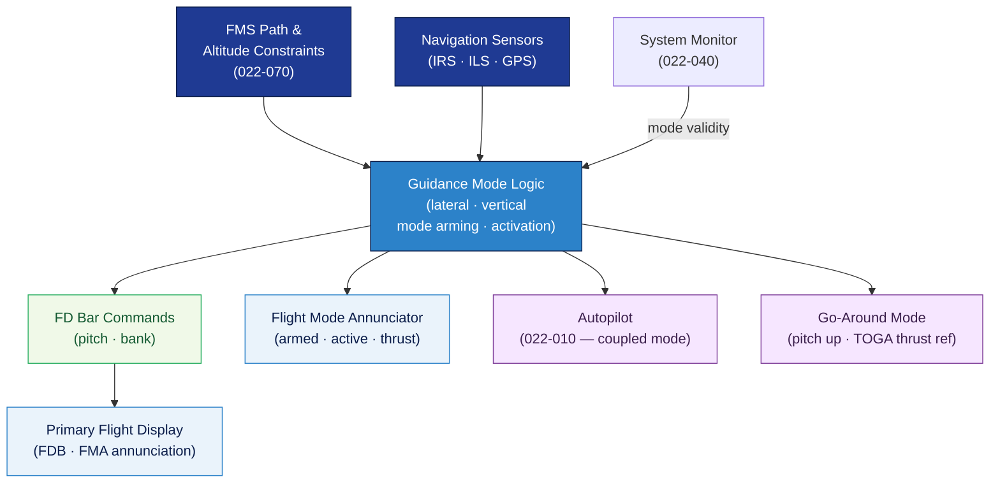

# ATLAS 020-029 · 02.022 — Auto Flight · 022-060 Flight Director and Guidance Modes

> **Programme-controlled extension** — Section `022-060` (ATA SNS 22-60-00) is a Q+ATLANTIDE programme extension covering the flight director and guidance mode architecture, beyond the core ATA 22-00 to 22-50 chapter scope.

## 1. Purpose

Defines the **flight director and guidance mode architecture** for the *Auto Flight* subsystem (ATA 22-60-00) within the Q+ATLANTIDE programme. Covers flight director bar (FDB) command computation, guidance mode logic (lateral and vertical), flight mode annunciator (FMA) content, mode transitions and interlocks, and interfaces with autopilot and FMS.

## 2. Scope

- Covers the *Flight Director and Guidance Modes* section (`022-060`, ATA SNS 22-60-00) of subsection `022` *Auto Flight* as a **programme-controlled extension**.
- Inherits Q-Division authority and ORB support from the parent row in [`../../README.md` §3](../../README.md#3-architecture-table)[^archtable].
- Concepts in scope:
  - **Flight director bar (FDB) computation** — lateral bar (bank angle command) and vertical bar (pitch command) computation; FDB display on primary flight display (PFD); single-cue and cross-pointer formats.
  - **Lateral guidance modes** — HDG SEL, HDG HOLD, NAV (LNAV), LOC capture/track, ROLLOUT; mode activation conditions, transition logic, and authority limits.
  - **Vertical guidance modes** — VS, FPA, ALT, ALT CAP, VNAV, G/S capture/track, FLARE, LAND; mode transition sequencing and protection.
  - **Flight mode annunciator (FMA)** — FMA column content (armed/active lateral · vertical · thrust modes); annunciation timing, boxed mode, and mode reversion alerting per AMC 25.1329[^cs25].
  - **Mode interlocks and protections** — prevention of incompatible mode combinations; automatic mode reversion on ILS signal loss; go-around (GA) mode initiation.
  - **Autopilot coupling** — how flight director guidance commands couple to autopilot servo commands; FD-only versus FD+AP operation.
- Out of scope: autopilot servo hardware (022-010), auto-throttle (022-030), FMS lateral/vertical path computation (022-070).

## 3. Diagram — Flight Director and Guidance Mode Architecture

Guidance mode logic drives FDB commands displayed on the PFD; the FMA annunciates armed and active modes; autopilot couples FD commands to surface actuation.

## 4. Footprint

| Metric | Value |
|---|---|
| Architecture | `ATLAS` — Aircraft Top Level Architecture Schema/System (controlled term) |
| Master range | `000–099` |
| Code range | `020-029` |
| Section | `02` — Sistemas Core de Aeronave |
| Subsection | `022` — Auto Flight |
| Local section code | `022-060` — Flight Director and Guidance Modes |
| ATA chapter | 22 |
| ATA SNS | 22-60-00 |
| Section type | Programme-controlled extension |
| Primary Q-Division | Q-AIR[^qdiv] |
| Support Q-Divisions | Q-DATAGOV, Q-HPC, Q-MECHANICS, Q-GROUND, Q-INDUSTRY |
| ORB support | ORB-PMO, ORB-LEG |
| Governance class | `baseline`[^gov] |
| Folder path | `Q+ATLANTIDE/000-099_ATLAS/020-029_Sistemas-Core-de-Aeronave/022_Auto-Flight/` |
| Document | `022-060-Flight-Director-and-Guidance-Modes.md` (this file) |
| Parent subsection | [`README.md`](./README.md) · [`022-000-General.md`](./022-000-General.md) |
| Parent architecture | [`../../README.md`](../../README.md) |
| Parent baseline | [`organization/Q+ATLANTIDE.md`](../../../../organization/Q+ATLANTIDE.md) |

## 5. References & Citations

[^baseline]: **Q+ATLANTIDE controlled baseline (v1.0.0)** — [`organization/Q+ATLANTIDE.md`](../../../../organization/Q+ATLANTIDE.md).

[^archtable]: **ATLAS §3 Architecture Table** — [`../../README.md` §3](../../README.md#3-architecture-table).

[^qdiv]: **Q-Division authority** — See [`organization/Q+ATLANTIDE.md` §4](../../../../organization/Q+ATLANTIDE.md#4-notes).

[^gov]: **Governance class** — `baseline` denotes documents under controlled change management.

[^cs25]: **EASA CS-25** — CS 25.1329 and AMC 25.1329 §§3–4 (flight director function, FMA content requirements, mode awareness, mode reversion alerting).

[^ata2200]: **ATA iSpec 2200** — Section 22-60 naming and data-module scope for flight director and guidance mode subsystems.

### Applicable standards

- EASA CS-25 / AMC 25.1329[^cs25]
- ATA iSpec 2200[^ata2200]
