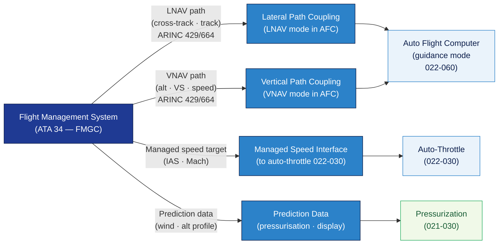

# ATLAS 020-029 · 02.022 — Auto Flight · 022-070 FMS Auto-Flight Interfaces

> **Programme-controlled interface extension** — Section `022-070` (ATA SNS 22-70-00) is a Q+ATLANTIDE programme extension defining the interface architecture between the Flight Management System (FMS/ATA 34) and the Auto Flight system, covering data buses, message formats, and coupling strategies.

## 1. Purpose

Defines the **FMS to auto-flight interface architecture** for the *Auto Flight* subsystem (ATA 22-70-00) within the Q+ATLANTIDE programme. Covers the data bus interfaces, message content, and coupling protocols that allow the FMS to provide lateral and vertical path commands, speed targets, and altitude constraints to the auto-flight computer for LNAV, VNAV, and managed speed mode operation.

## 2. Scope

- Covers the *FMS Auto-Flight Interfaces* section (`022-070`, ATA SNS 22-70-00) of subsection `022` *Auto Flight* as a **programme-controlled interface extension**.
- Inherits Q-Division authority and ORB support from the parent row in [`../../README.md` §3](../../README.md#3-architecture-table)[^archtable].
- Concepts in scope:
  - **Data bus architecture** — ARINC 429[^arinc429] or AFDX/ARINC 664[^arinc664] data buses between FMS and AFC; bus redundancy; label definitions.
  - **Lateral path interface** — FMS lateral path (LNAV) output to AFC: cross-track error, desired track, next waypoint bearing; AFC lateral-mode coupling.
  - **Vertical path interface** — FMS vertical path (VNAV) output: target altitude, vertical speed target, speed constraint; altitude capture and level-off coupling.
  - **Managed speed interface** — FMS-computed speed targets (CLB speed, CRZ Mach, DES speed) passed to AFC auto-throttle; speed mode managed vs. selected.
  - **Prediction data interface** — FMS altitude predictions for pressurisation controller (cross-reference 021-030) and crew display; wind data for guidance law corrections.
  - **Mode coupling protocol** — handshake between FMS and AFC for LNAV/VNAV mode engagement; conflict resolution when FMS path is unavailable.
- Out of scope: FMS internal navigation computation (ATA 34); autopilot servo hardware (022-010); FMS database management.

## 3. Diagram — FMS to Auto-Flight Interface Architecture

FMS lateral path, vertical path, and managed speed targets pass to the AFC via data buses; AFC couples them to guidance mode commands for autopilot and auto-throttle.

## 4. Footprint

| Metric | Value |
|---|---|
| Architecture | `ATLAS` — Aircraft Top Level Architecture Schema/System (controlled term) |
| Master range | `000–099` |
| Code range | `020-029` |
| Section | `02` — Sistemas Core de Aeronave |
| Subsection | `022` — Auto Flight |
| Local section code | `022-070` — FMS Auto-Flight Interfaces |
| ATA chapter | 22 |
| ATA SNS | 22-70-00 |
| Section type | Programme-controlled interface extension |
| Primary Q-Division | Q-AIR[^qdiv] |
| Support Q-Divisions | Q-DATAGOV, Q-HPC, Q-MECHANICS, Q-GROUND, Q-INDUSTRY |
| ORB support | ORB-PMO, ORB-LEG |
| Governance class | `baseline`[^gov] |
| Folder path | `Q+ATLANTIDE/000-099_ATLAS/020-029_Sistemas-Core-de-Aeronave/022_Auto-Flight/` |
| Document | `022-070-FMS-Auto-Flight-Interfaces.md` (this file) |
| Parent subsection | [`README.md`](./README.md) · [`022-000-General.md`](./022-000-General.md) |
| Parent architecture | [`../../README.md`](../../README.md) |
| Parent baseline | [`organization/Q+ATLANTIDE.md`](../../../../organization/Q+ATLANTIDE.md) |

## 5. References & Citations

[^baseline]: **Q+ATLANTIDE controlled baseline (v1.0.0)** — [`organization/Q+ATLANTIDE.md`](../../../../organization/Q+ATLANTIDE.md).

[^archtable]: **ATLAS §3 Architecture Table** — [`../../README.md` §3](../../README.md#3-architecture-table).

[^qdiv]: **Q-Division authority** — See [`organization/Q+ATLANTIDE.md` §4](../../../../organization/Q+ATLANTIDE.md#4-notes).

[^gov]: **Governance class** — `baseline` denotes documents under controlled change management.

[^cs25]: **EASA CS-25** — CS 25.1329 and AMC 25.1329 §6 (FMS/auto-flight coupling, managed mode engagement conditions, and speed target handover).

[^arinc429]: **ARINC 429 — Digital Information Transfer System (DITS)** — Standard data bus used for FMS-to-AFC lateral/vertical path and speed-target messages; label definitions and transmission rates.

[^arinc664]: **ARINC 664 Part 7 — AFDX (Avionics Full-Duplex Switched Ethernet)** — High-speed avionics data network used in modern aircraft for FMS-AFC interface where higher bandwidth is required.

[^ata2200]: **ATA iSpec 2200** — Section 22-70 naming and data-module scope for FMS auto-flight interface subsystems.

### Applicable standards

- EASA CS-25 / AMC 25.1329[^cs25]
- ARINC 429[^arinc429]
- ARINC 664 Part 7[^arinc664]
- ATA iSpec 2200[^ata2200]
