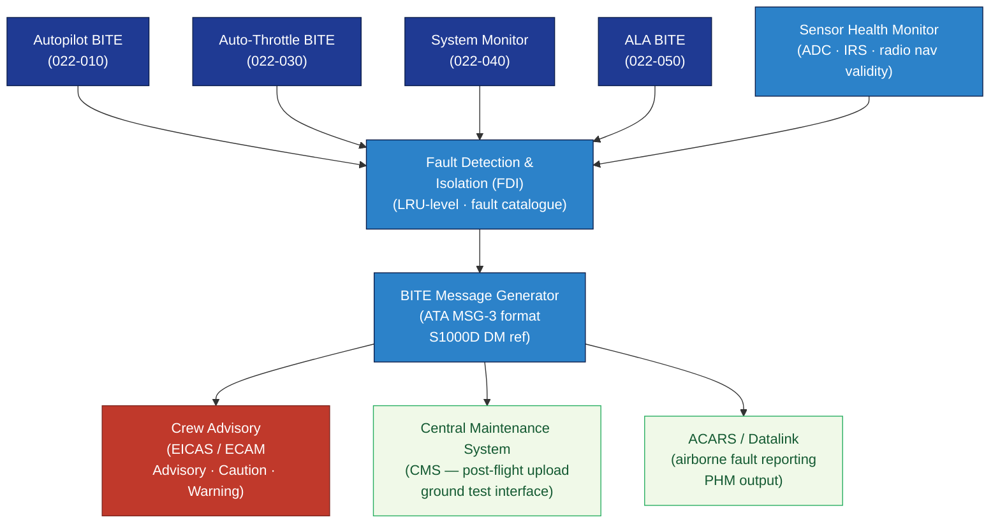

# ATLAS 020-029 · 02.022 — Auto Flight · 022-080 Auto-Flight Monitoring, Diagnostics and Control Interfaces

> **Programme-controlled diagnostics extension** — Section `022-080` (ATA SNS 22-80-00) is a Q+ATLANTIDE programme extension providing the centralised auto-flight BITE diagnostics, fault detection and isolation, post-flight maintenance message generation, and cross-system control interface layer for all Auto Flight sections.

## 1. Purpose

Defines the **auto-flight monitoring, BITE diagnostics, and cross-system control interface architecture** (ATA 22-80-00) for the *Auto Flight* subsystem within the Q+ATLANTIDE programme. Consolidates sensor acquisition health monitoring, fault detection and isolation (FDI) to LRU level, BITE message generation, crew advisory logic, and the interface bus architecture connecting auto-flight sections (022-010 through 022-070) to the central maintenance system (CMS) and ACARS/datalink reporting.

## 2. Scope

- Covers the *Auto-Flight Monitoring, Diagnostics and Control Interfaces* section (`022-080`, ATA SNS 22-80-00) of subsection `022` *Auto Flight* as a **programme-controlled diagnostics extension**.
- Inherits Q-Division authority and ORB support from the parent row in [`../../README.md` §3](../../README.md#3-architecture-table)[^archtable].
- Concepts in scope:
  - **BITE architecture** — Built-In Test Equipment (BITE) architecture for all AFC LRUs; power-up self-test, continuous background test, and fault isolation to LRU/module level.
  - **Sensor acquisition health** — monitoring of navigation, air data, and flight control input validity; cross-comparison with redundant sources; failure flagging and source deselection.
  - **Fault detection and isolation (FDI)** — real-time FDI algorithms across autopilot, auto-throttle, flight director, and monitoring channels; fault code catalogue per ATA MSG-3[^msg3].
  - **Maintenance message generation** — BITE maintenance messages in S1000D data module format[^s1000d] for each LRU fault; post-flight upload to CMS.
  - **Crew advisory escalation** — escalation of BITE fault states to EICAS/ECAM advisory, caution, and warning messages per AMC 25.1322[^cs25].
  - **Ground control interface** — ground test command interface for AFC BITE tests; interactive maintenance computer (IMC) access.
  - **ACARS/datalink integration** — airborne AFC BITE and performance fault reporting via ACARS[^acars]; PHM (prognostic health management) data output.
- Out of scope: S1000D CSDB document-level mapping and traceability (022-090); physical AFC hardware architecture (022-010).

## 3. Diagram — Auto-Flight Monitoring, Diagnostics and Control Interface Architecture

BITE and FDI from all AFC sections feed fault messages to CMS and crew advisory; sensor health monitoring feeds mode logic; ACARS enables airborne fault reporting.

## 4. Footprint

| Metric | Value |
|---|---|
| Architecture | `ATLAS` — Aircraft Top Level Architecture Schema/System (controlled term) |
| Master range | `000–099` |
| Code range | `020-029` |
| Section | `02` — Sistemas Core de Aeronave |
| Subsection | `022` — Auto Flight |
| Local section code | `022-080` — Auto-Flight Monitoring, Diagnostics and Control Interfaces |
| ATA chapter | 22 |
| ATA SNS | 22-80-00 |
| Section type | Programme-controlled diagnostics extension |
| Primary Q-Division | Q-AIR[^qdiv] |
| Support Q-Divisions | Q-DATAGOV, Q-HPC, Q-MECHANICS, Q-GROUND, Q-INDUSTRY |
| ORB support | ORB-PMO, ORB-LEG |
| Governance class | `baseline`[^gov] |
| Folder path | `Q+ATLANTIDE/000-099_ATLAS/020-029_Sistemas-Core-de-Aeronave/022_Auto-Flight/` |
| Document | `022-080-Auto-Flight-Monitoring-Diagnostics-and-Control-Interfaces.md` (this file) |
| Parent subsection | [`README.md`](./README.md) · [`022-000-General.md`](./022-000-General.md) |
| Parent architecture | [`../../README.md`](../../README.md) |
| Parent baseline | [`organization/Q+ATLANTIDE.md`](../../../../organization/Q+ATLANTIDE.md) |

## 5. References & Citations

[^baseline]: **Q+ATLANTIDE controlled baseline (v1.0.0)** — [`organization/Q+ATLANTIDE.md`](../../../../organization/Q+ATLANTIDE.md).

[^archtable]: **ATLAS §3 Architecture Table** — [`../../README.md` §3](../../README.md#3-architecture-table).

[^qdiv]: **Q-Division authority** — See [`organization/Q+ATLANTIDE.md` §4](../../../../organization/Q+ATLANTIDE.md#4-notes).

[^gov]: **Governance class** — `baseline` denotes documents under controlled change management.

[^cs25]: **EASA CS-25** — AMC 25.1322 (flight crew alerting, advisory hierarchy) and AMC 25.1329 §13 (maintenance provisions for auto-flight systems).

[^msg3]: **ATA MSG-3 — Operator/Manufacturer Scheduled Maintenance Development** — Defines fault isolation logic, LRU-level BITE message structure, and maintenance task classification for auto-flight diagnostics.

[^s1000d]: **S1000D Issue 6.0** — Data Module Code structure and CSDB linkage for fault-maintenance messages generated by the AFC BITE system.

[^acars]: **ARINC 618/620 — ACARS Message Structure** — Standards for airborne fault reporting and PHM data via ACARS.

### Applicable standards

- EASA CS-25 / AMC 25.1322, 25.1329[^cs25]
- ATA MSG-3[^msg3]
- S1000D Issue 6.0[^s1000d]
- ARINC 618/620 — ACARS[^acars]
