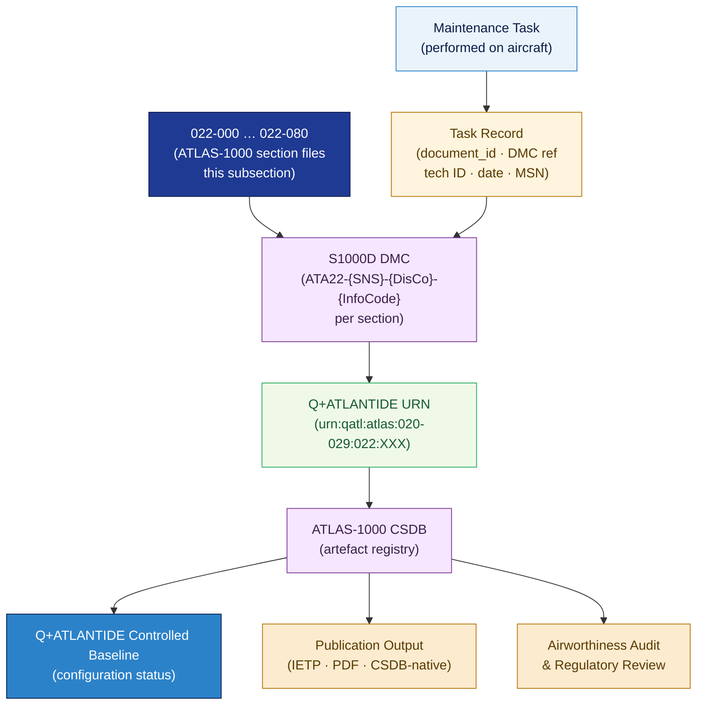

# ATLAS 020-029 · 02.022 — Auto Flight · 022-090 S1000D CSDB Mapping and Traceability

> **Programme-controlled publication and traceability extension** — Section `022-090` (ATA SNS 22-90-00) defines the S1000D Data Module Code (DMC) mapping, CSDB population rules, and end-to-end traceability architecture for all ATA 22 / subsection 022 data modules.

## 1. Purpose

Defines the **S1000D CSDB mapping rules, Data Module Code (DMC) construction conventions, and lifecycle traceability architecture** for all data modules produced under subsection `022` *Auto Flight* within the Q+ATLANTIDE programme. Establishes the authoritative link between every ATLAS-1000 document in sections `022-000` through `022-080` and its corresponding S1000D DMC, CSDB entry, and Q+ATLANTIDE URN, enabling full reverse traceability from any maintenance task record to the controlled baseline.

## 2. Scope

- Covers the *S1000D CSDB Mapping and Traceability* section (`022-090`, ATA SNS 22-90-00) of subsection `022` *Auto Flight* as a **programme-controlled publication and traceability extension**.
- Inherits Q-Division authority and ORB support from the parent row in [`../../README.md` §3](../../README.md#3-architecture-table)[^archtable].
- Concepts in scope:
  - **DMC construction** — the S1000D Data Module Code structure applied to ATA 22 data modules: `{ModelIdentCode}-ATA22-{SNS}-{DisCo}-{InfoCode}-{InfoCodeVariant}-{ItemLocation}` mapping to the local 022-XXX codes.
  - **CSDB population rules** — rules for creating, naming, and versioning CSDB entries for each section file in this subsection; applicability coding; language/variant conventions.
  - **Q+ATLANTIDE URN scheme** — `urn:qatl:atlas:020-029:022:{section-code}` construction for each ATLAS-1000 document; cross-link to CSDB DMC.
  - **Section-to-DMC mapping table** — controlled mapping of every `022-XXX-Title.md` document to its canonical DMC, Q+ATLANTIDE URN, and CSDB status.
  - **Lifecycle traceability chain** — directed link from maintenance event → task record → ATLAS-1000 data module → CSDB entry → Q+ATLANTIDE URN → controlled baseline.
  - **Publication output types** — IETP, print PDF, and CSDB-native outputs; publishing pipeline configuration for ATA 22 data modules.
- Out of scope: AFC BITE message content (022-080); physical auto-flight hardware (022-010 through 022-050).

## 3. Diagram — S1000D CSDB Traceability Chain for ATA 22

Each `022-XXX` document maps to a DMC and Q+ATLANTIDE URN; maintenance tasks reference the DMC; the traceability chain links physical events back to the controlled baseline.

## 4. Section-to-DMC Mapping

| Local Code | ATA SNS | Document | DMC Suffix | Q+ATLANTIDE URN |
|---|---|---|---|---|
| 022-000 | 22-00-00 | `022-000-General.md` | `ATA22-000-00A-040A-A` | `urn:qatl:atlas:020-029:022:000` |
| 022-010 | 22-10-00 | `022-010-Autopilot.md` | `ATA22-010-00A-040A-A` | `urn:qatl:atlas:020-029:022:010` |
| 022-020 | 22-20-00 | `022-020-Speed-Attitude-Correction.md` | `ATA22-020-00A-040A-A` | `urn:qatl:atlas:020-029:022:020` |
| 022-030 | 22-30-00 | `022-030-Auto-Throttle-Auto-Thrust.md` | `ATA22-030-00A-040A-A` | `urn:qatl:atlas:020-029:022:030` |
| 022-040 | 22-40-00 | `022-040-System-Monitoring.md` | `ATA22-040-00A-040A-A` | `urn:qatl:atlas:020-029:022:040` |
| 022-050 | 22-50-00 | `022-050-Aerodynamic-Load-Alleviation.md` | `ATA22-050-00A-040A-A` | `urn:qatl:atlas:020-029:022:050` |
| 022-060 | 22-60-00 | `022-060-Flight-Director-and-Guidance-Modes.md` | `ATA22-060-00A-040A-A` | `urn:qatl:atlas:020-029:022:060` |
| 022-070 | 22-70-00 | `022-070-FMS-Auto-Flight-Interfaces.md` | `ATA22-070-00A-040A-A` | `urn:qatl:atlas:020-029:022:070` |
| 022-080 | 22-80-00 | `022-080-Auto-Flight-Monitoring-Diagnostics-and-Control-Interfaces.md` | `ATA22-080-00A-040A-A` | `urn:qatl:atlas:020-029:022:080` |
| 022-090 | 22-90-00 | `022-090-S1000D-CSDB-Mapping-and-Traceability.md` | `ATA22-090-00A-040A-A` | `urn:qatl:atlas:020-029:022:090` |

## 5. Footprint

| Metric | Value |
|---|---|
| Architecture | `ATLAS` — Aircraft Top Level Architecture Schema/System (controlled term) |
| Master range | `000–099` |
| Code range | `020-029` |
| Section | `02` — Sistemas Core de Aeronave |
| Subsection | `022` — Auto Flight |
| Local section code | `022-090` — S1000D CSDB Mapping and Traceability |
| ATA chapter | 22 |
| ATA SNS | 22-90-00 |
| Section type | Programme-controlled publication and traceability extension |
| Primary Q-Division | Q-AIR[^qdiv] |
| Support Q-Divisions | Q-DATAGOV, Q-HPC, Q-MECHANICS, Q-GROUND, Q-INDUSTRY |
| ORB support | ORB-PMO, ORB-LEG |
| Governance class | `baseline`[^gov] |
| Folder path | `Q+ATLANTIDE/000-099_ATLAS/020-029_Sistemas-Core-de-Aeronave/022_Auto-Flight/` |
| Document | `022-090-S1000D-CSDB-Mapping-and-Traceability.md` (this file) |
| Parent subsection | [`README.md`](./README.md) · [`022-000-General.md`](./022-000-General.md) |
| Parent architecture | [`../../README.md`](../../README.md) |
| Parent baseline | [`organization/Q+ATLANTIDE.md`](../../../../organization/Q+ATLANTIDE.md) |

## 6. References & Citations

[^baseline]: **Q+ATLANTIDE controlled baseline (v1.0.0)** — [`organization/Q+ATLANTIDE.md`](../../../../organization/Q+ATLANTIDE.md). Defines the controlled taxonomy and the ATLAS-1000 register subpart.

[^archtable]: **ATLAS §3 Architecture Table** — [`../../README.md` §3](../../README.md#3-architecture-table).

[^qdiv]: **Q-Division authority** — See [`organization/Q+ATLANTIDE.md` §4](../../../../organization/Q+ATLANTIDE.md#4-notes).

[^gov]: **Governance class** — `baseline` denotes documents under controlled change management.

[^s1000d]: **S1000D Issue 6.0** — DMC structure, CSDB population rules, applicability coding, language conventions, and lifecycle record requirements for all Q+ATLANTIDE artefacts.

[^ata2200]: **ATA iSpec 2200** — ATA chapter/SNS numbering conventions and mapping between ATA section codes and S1000D SNS identifiers for ATA 22.

[^iso15459]: **ISO 15459 — Unique Identification** — UID standard extended to Q+ATLANTIDE URN construction for CSDB cross-link traceability.

### Applicable standards

- S1000D Issue 6.0[^s1000d]
- ATA iSpec 2200[^ata2200]
- ISO 15459[^iso15459]
