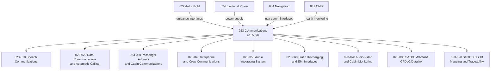

# ATLAS 020-029 · 02.023 · 023-000 — General

## 1. Purpose

Provide the general architectural definition for *Communications* (ATA 23) within ATLAS subsection `023`. This section establishes the scope boundary, system family, Q-Division authority, and top-level structural context for all communications-related sections `023-010` through `023-090`.

## 2. Scope

- Defines the communications system family within the ATLAS-1000 register, aligned to ATA SNS `23-00-00 General`.
- Covers the architectural authority of `primary_q_division: Q-DATAGOV` with support from Q-AIR, Q-HPC, Q-GROUND, Q-MECHANICS, and Q-SPACE.
- Applies to all aircraft-level communications functions including speech, data, passenger address, interphone, audio integration, electromagnetic compatibility, cabin monitoring, and datalink interfaces.
- Does not replace certified ATA/S1000D task-specific maintenance, troubleshooting, operational, avionics software, or cybersecurity data modules.

**Scope boundary:** This node covers aircraft communications architecture, speech communications, data communications, passenger address, interphone, audio integration, static discharge interfaces, cabin monitoring interfaces, SATCOM, ACARS, CPDLC and communications traceability. It does not replace certified ATA/S1000D task-specific maintenance, troubleshooting, operational, avionics software or cybersecurity data modules.

**Safety boundary:** Communications are safety-relevant and operationally critical. Any artefact derived from this node requires correct aircraft effectivity, radio/data-link authority boundaries, electromagnetic compatibility, cybersecurity review, failure-mode handling, crew-alerting interfaces, maintenance sign-off evidence and lifecycle traceability.

## 3. System Architecture

## 4. Footprint

| Metric | Value |
|---|---|
| Architecture | `ATLAS` — Aircraft Top Level Architecture Schema/System |
| Master range | `000–099` |
| Code range | `020-029` |
| Section | `02` — Sistemas Core de Aeronave |
| Subsection | `023` — Communications |
| Local section code | `023-000` |
| ATA SNS | `23-00-00` |
| Primary Q-Division | Q-DATAGOV |
| Support Q-Divisions | Q-AIR, Q-HPC, Q-GROUND, Q-MECHANICS, Q-SPACE |
| Governance class | `baseline` |
| Folder path | `Q+ATLANTIDE/000-099_ATLAS/020-029_Sistemas-Core-de-Aeronave/023_Communications/` |
| Document | `023-000-General.md` |
| Parent subsection | [`README.md`](./README.md) |
| Parent section | [`../README.md`](../README.md) |
| Parent baseline | [`organization/Q+ATLANTIDE.md`](../../../../organization/Q+ATLANTIDE.md) |

## 5. References

- ATA iSpec 2200 — Chapter 23, Communications
- Q+ATLANTIDE controlled baseline [`organization/Q+ATLANTIDE.md`](../../../../organization/Q+ATLANTIDE.md)
- ATLAS section index [`../README.md`](../README.md)
- Subsection index [`./README.md`](./README.md)
- Section `022-000` General — Auto-Flight [`../022_Auto-Flight/022-000-General.md`](../022_Auto-Flight/022-000-General.md)
- Section `024` — Electrical Power [`../024_Electrical-Power/README.md`](../024_Electrical-Power/README.md)
