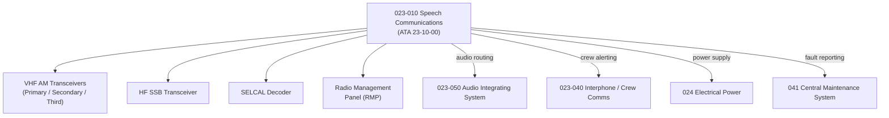

# ATLAS 020-029 · 02.023 · 023-010 — Speech Communications

## 1. Purpose

Define the architecture boundary for *Speech Communications* (ATA 23-10-00) within ATLAS subsection `023`. This section covers VHF, HF, and UHF radio systems, their transceiver architecture, frequency management, squelch and selective calling (SELCAL), and interfaces to the Audio Integrating System (AIS).

## 2. Scope

- Aligned to ATA SNS `23-10-00 Speech Communications`.
- Covers VHF AM transceivers (primary, secondary, third), HF SSB transceiver, UHF military band (where applicable), SELCAL decoder, push-to-talk (PTT) switching, and radio management panel (RMP) interfaces.
- Interfaces: Audio Integrating System (`023-050`), interphone (`023-040`), avionics power busses (`024`), antenna systems, and CMC/CMS (`041`).
- Does not define physical installation, connector specifications, or LRU maintenance task data (see certified ATA/S1000D AMM chapters).

## 3. System Architecture

## 4. Footprint

| Metric | Value |
|---|---|
| Architecture | `ATLAS` — Aircraft Top Level Architecture Schema/System |
| Master range | `000–099` |
| Code range | `020-029` |
| Section | `02` — Sistemas Core de Aeronave |
| Subsection | `023` — Communications |
| Local section code | `023-010` |
| ATA SNS | `23-10-00` |
| Primary Q-Division | Q-DATAGOV |
| Support Q-Divisions | Q-AIR, Q-HPC, Q-GROUND, Q-MECHANICS, Q-SPACE |
| Governance class | `baseline` |
| Folder path | `Q+ATLANTIDE/000-099_ATLAS/020-029_Sistemas-Core-de-Aeronave/023_Communications/` |
| Document | `023-010-Speech-Communications.md` |
| Parent subsection | [`README.md`](./README.md) |

## 5. References

- ATA iSpec 2200 — Chapter 23-10, Speech Communications
- Q+ATLANTIDE controlled baseline [`organization/Q+ATLANTIDE.md`](../../../../organization/Q+ATLANTIDE.md)
- Subsection index [`./README.md`](./README.md)
- `023-000` General [`./023-000-General.md`](./023-000-General.md)
- `023-050` Audio Integrating System [`./023-050-Audio-Integrating-System.md`](./023-050-Audio-Integrating-System.md)
- `024` Electrical Power [`../024_Electrical-Power/README.md`](../024_Electrical-Power/README.md)
