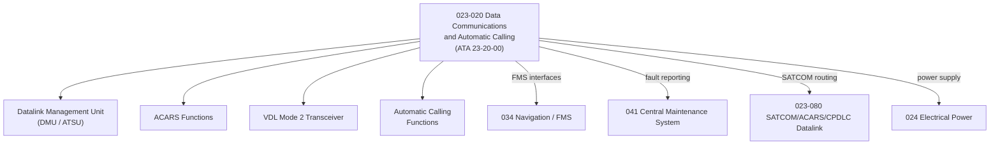

# ATLAS 020-029 · 02.023 · 023-020 — Data Communications and Automatic Calling

## 1. Purpose

Define the architecture boundary for *Data Communications and Automatic Calling* (ATA 23-20-00) within ATLAS subsection `023`. This section covers ACARS, VDL Mode 2, automatic aircraft identification, datalink management unit (DMU), and associated ARINC 429/664 bus interfaces.

## 2. Scope

- Aligned to ATA SNS `23-20-00 Data Communications and Automatic Calling`.
- Covers the Datalink Management Unit (DMU/ATSU), Aircraft Communications Addressing and Reporting System (ACARS), VHF Datalink (VDL Mode 2), and automatic calling functions.
- Interfaces: Flight Management System (FMS/ATA 34), CMC/CMS (`041`), SATCOM unit (`023-080`), avionics data busses (ARINC 429, AFDX), and electrical power (`024`).
- Does not define cybersecurity data modules, CPDLC-specific ATC procedures, or SATCOM datalink routing (see `023-080`).

## 3. System Architecture

## 4. Footprint

| Metric | Value |
|---|---|
| Architecture | `ATLAS` — Aircraft Top Level Architecture Schema/System |
| Master range | `000–099` |
| Code range | `020-029` |
| Section | `02` — Sistemas Core de Aeronave |
| Subsection | `023` — Communications |
| Local section code | `023-020` |
| ATA SNS | `23-20-00` |
| Primary Q-Division | Q-DATAGOV |
| Support Q-Divisions | Q-AIR, Q-HPC, Q-GROUND, Q-MECHANICS, Q-SPACE |
| Governance class | `baseline` |
| Folder path | `Q+ATLANTIDE/000-099_ATLAS/020-029_Sistemas-Core-de-Aeronave/023_Communications/` |
| Document | `023-020-Data-Communications-and-Automatic-Calling.md` |
| Parent subsection | [`README.md`](./README.md) |

## 5. References

- ATA iSpec 2200 — Chapter 23-20, Data Communications and Automatic Calling
- Q+ATLANTIDE controlled baseline [`organization/Q+ATLANTIDE.md`](../../../../organization/Q+ATLANTIDE.md)
- Subsection index [`./README.md`](./README.md)
- `023-000` General [`./023-000-General.md`](./023-000-General.md)
- `023-080` SATCOM/ACARS/CPDLC/Datalink [`./023-080-SATCOM-ACARS-CPDLC-and-Datalink-Interfaces.md`](./023-080-SATCOM-ACARS-CPDLC-and-Datalink-Interfaces.md)
- `034` Navigation [`../034_Navigation/README.md`](../034_Navigation/README.md)
