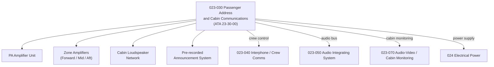

# ATLAS 020-029 · 02.023 · 023-030 — Passenger Address and Cabin Communications

## 1. Purpose

Define the architecture boundary for *Passenger Address and Cabin Communications* (ATA 23-30-00) within ATLAS subsection `023`. This section covers the Passenger Address and Entertainment (PA) amplifier system, cabin zone loudspeaker distribution, pre-recorded announcement management, and interfaces to the Cabin Management System (CMS).

## 2. Scope

- Aligned to ATA SNS `23-30-00 Passenger Address and Cabin Communications`.
- Covers PA amplifier units, zone amplifiers, cabin loudspeaker networks, pre-recorded announcement system, boarding music, attendant handset PA activation, and CMS integration.
- Interfaces: Cabin interphone (`023-040`), audio integration system (`023-050`), cabin monitoring (`023-070`), flight deck crew alerting (CAP), and electrical power (`024`).
- Does not cover in-flight entertainment (IFE) content distribution or individual passenger seat units.

## 3. System Architecture

## 4. Footprint

| Metric | Value |
|---|---|
| Architecture | `ATLAS` — Aircraft Top Level Architecture Schema/System |
| Master range | `000–099` |
| Code range | `020-029` |
| Section | `02` — Sistemas Core de Aeronave |
| Subsection | `023` — Communications |
| Local section code | `023-030` |
| ATA SNS | `23-30-00` |
| Primary Q-Division | Q-DATAGOV |
| Support Q-Divisions | Q-AIR, Q-HPC, Q-GROUND, Q-MECHANICS, Q-SPACE |
| Governance class | `baseline` |
| Folder path | `Q+ATLANTIDE/000-099_ATLAS/020-029_Sistemas-Core-de-Aeronave/023_Communications/` |
| Document | `023-030-Passenger-Address-and-Cabin-Communications.md` |
| Parent subsection | [`README.md`](./README.md) |

## 5. References

- ATA iSpec 2200 — Chapter 23-30, Passenger Address and Cabin Communications
- Q+ATLANTIDE controlled baseline [`organization/Q+ATLANTIDE.md`](../../../../organization/Q+ATLANTIDE.md)
- Subsection index [`./README.md`](./README.md)
- `023-040` Interphone and Crew Communications [`./023-040-Interphone-and-Crew-Communications.md`](./023-040-Interphone-and-Crew-Communications.md)
- `023-050` Audio Integrating System [`./023-050-Audio-Integrating-System.md`](./023-050-Audio-Integrating-System.md)
- `023-070` Audio-Video and Cabin Monitoring [`./023-070-Audio-Video-and-Cabin-Monitoring-Interfaces.md`](./023-070-Audio-Video-and-Cabin-Monitoring-Interfaces.md)
