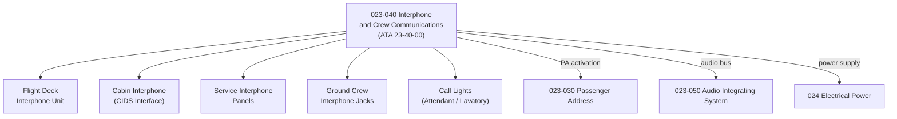

# ATLAS 020-029 · 02.023 · 023-040 — Interphone and Crew Communications

## 1. Purpose

Define the architecture boundary for *Interphone and Crew Communications* (ATA 23-40-00) within ATLAS subsection `023`. This section covers flight-deck-to-cabin crew interphone, service interphone, ground crew interphone jacks, and associated handset and call-light systems.

## 2. Scope

- Aligned to ATA SNS `23-40-00 Interphone and Crew Communications`.
- Covers the Passenger Service/Cabin Interphone System (CIDS interface), flight-deck interphone, service interphone panels, ground crew interphone jacks, call lights (attendant call and lavatory call), and hand-microphone/handset interfaces.
- Interfaces: PA system (`023-030`), audio integrating system (`023-050`), electrical power (`024`), and cabin management system.
- Does not cover public address content, IFE systems, or satellite-based crew communications.

## 3. System Architecture

## 4. Footprint

| Metric | Value |
|---|---|
| Architecture | `ATLAS` — Aircraft Top Level Architecture Schema/System |
| Master range | `000–099` |
| Code range | `020-029` |
| Section | `02` — Sistemas Core de Aeronave |
| Subsection | `023` — Communications |
| Local section code | `023-040` |
| ATA SNS | `23-40-00` |
| Primary Q-Division | Q-DATAGOV |
| Support Q-Divisions | Q-AIR, Q-HPC, Q-GROUND, Q-MECHANICS, Q-SPACE |
| Governance class | `baseline` |
| Folder path | `Q+ATLANTIDE/000-099_ATLAS/020-029_Sistemas-Core-de-Aeronave/023_Communications/` |
| Document | `023-040-Interphone-and-Crew-Communications.md` |
| Parent subsection | [`README.md`](./README.md) |

## 5. References

- ATA iSpec 2200 — Chapter 23-40, Interphone and Crew Communications
- Q+ATLANTIDE controlled baseline [`organization/Q+ATLANTIDE.md`](../../../../organization/Q+ATLANTIDE.md)
- Subsection index [`./README.md`](./README.md)
- `023-030` Passenger Address [`./023-030-Passenger-Address-and-Cabin-Communications.md`](./023-030-Passenger-Address-and-Cabin-Communications.md)
- `023-050` Audio Integrating System [`./023-050-Audio-Integrating-System.md`](./023-050-Audio-Integrating-System.md)
