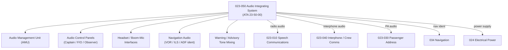

# ATLAS 020-029 · 02.023 · 023-050 — Audio Integrating System

## 1. Purpose

Define the architecture boundary for the *Audio Integrating System* (ATA 23-50-00) within ATLAS subsection `023`. This section covers the Audio Management Unit (AMU), crew audio control panels (ACP), headset and boom-microphone interfaces, and the centralized audio bus that integrates speech radio, navigation audio, warning tones, and interphone signals.

## 2. Scope

- Aligned to ATA SNS `23-50-00 Audio Integrating System`.
- Covers Audio Management Unit (AMU), Audio Control Panels (ACP) for flight deck stations, boom-microphone / headset interfaces, hot-microphone circuits, navigation audio (VOR/ILS/ADF ident), warning/advisory tone mixing, and passenger address audio feed.
- Interfaces: Speech radios (`023-010`), interphone (`023-040`), PA system (`023-030`), navigation (`034`), and electrical power (`024`).
- Does not cover signal processing algorithms, software certification, or passive attenuator design data (see certified S1000D AMM/CMM data modules).

## 3. System Architecture

## 4. Footprint

| Metric | Value |
|---|---|
| Architecture | `ATLAS` — Aircraft Top Level Architecture Schema/System |
| Master range | `000–099` |
| Code range | `020-029` |
| Section | `02` — Sistemas Core de Aeronave |
| Subsection | `023` — Communications |
| Local section code | `023-050` |
| ATA SNS | `23-50-00` |
| Primary Q-Division | Q-DATAGOV |
| Support Q-Divisions | Q-AIR, Q-HPC, Q-GROUND, Q-MECHANICS, Q-SPACE |
| Governance class | `baseline` |
| Folder path | `Q+ATLANTIDE/000-099_ATLAS/020-029_Sistemas-Core-de-Aeronave/023_Communications/` |
| Document | `023-050-Audio-Integrating-System.md` |
| Parent subsection | [`README.md`](./README.md) |

## 5. References

- ATA iSpec 2200 — Chapter 23-50, Audio Integrating System
- Q+ATLANTIDE controlled baseline [`organization/Q+ATLANTIDE.md`](../../../../organization/Q+ATLANTIDE.md)
- Subsection index [`./README.md`](./README.md)
- `023-010` Speech Communications [`./023-010-Speech-Communications.md`](./023-010-Speech-Communications.md)
- `023-040` Interphone and Crew Communications [`./023-040-Interphone-and-Crew-Communications.md`](./023-040-Interphone-and-Crew-Communications.md)
- `034` Navigation [`../034_Navigation/README.md`](../034_Navigation/README.md)
