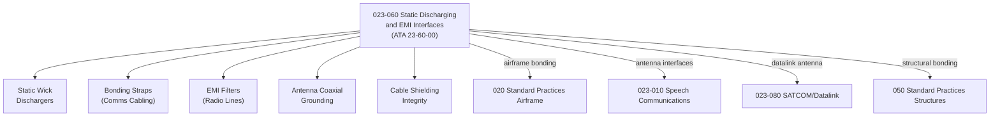

# ATLAS 020-029 · 02.023 · 023-060 — Static Discharging and EMI Interfaces

## 1. Purpose

Define the architecture boundary for *Static Discharging and EMI Interfaces* (ATA 23-60-00) within ATLAS subsection `023`. This section covers static discharger systems, electromagnetic interference (EMI) filtering, shielding requirements for communications cabling, and EMC compliance boundaries relevant to communications architecture.

## 2. Scope

- Aligned to ATA SNS `23-60-00 Static Discharging`.
- Covers static wick dischargers, bonding strap network relevant to communications cabling, EMI filters on radio line inputs/outputs, antenna coaxial grounding, and shielding integrity requirements.
- Interfaces: Airframe bonding and grounding practices (`020`), antenna systems for speech (`023-010`) and datalink (`023-080`), and structural bonding (`050`).
- Does not define lightning protection zone (LPZ) analysis, high-intensity radiated fields (HIRF) certification data, or EWIS bundle routing specifications.

## 3. System Architecture

## 4. Footprint

| Metric | Value |
|---|---|
| Architecture | `ATLAS` — Aircraft Top Level Architecture Schema/System |
| Master range | `000–099` |
| Code range | `020-029` |
| Section | `02` — Sistemas Core de Aeronave |
| Subsection | `023` — Communications |
| Local section code | `023-060` |
| ATA SNS | `23-60-00` |
| Primary Q-Division | Q-DATAGOV |
| Support Q-Divisions | Q-AIR, Q-HPC, Q-GROUND, Q-MECHANICS, Q-SPACE |
| Governance class | `baseline` |
| Folder path | `Q+ATLANTIDE/000-099_ATLAS/020-029_Sistemas-Core-de-Aeronave/023_Communications/` |
| Document | `023-060-Static-Discharging-and-EMI-Interfaces.md` |
| Parent subsection | [`README.md`](./README.md) |

## 5. References

- ATA iSpec 2200 — Chapter 23-60, Static Discharging
- Q+ATLANTIDE controlled baseline [`organization/Q+ATLANTIDE.md`](../../../../organization/Q+ATLANTIDE.md)
- Subsection index [`./README.md`](./README.md)
- `020` Standard Practices Airframe [`../020_Standard-Practices-Airframe/README.md`](../020_Standard-Practices-Airframe/README.md)
- `023-010` Speech Communications [`./023-010-Speech-Communications.md`](./023-010-Speech-Communications.md)
- `023-080` SATCOM/ACARS/CPDLC/Datalink [`./023-080-SATCOM-ACARS-CPDLC-and-Datalink-Interfaces.md`](./023-080-SATCOM-ACARS-CPDLC-and-Datalink-Interfaces.md)
