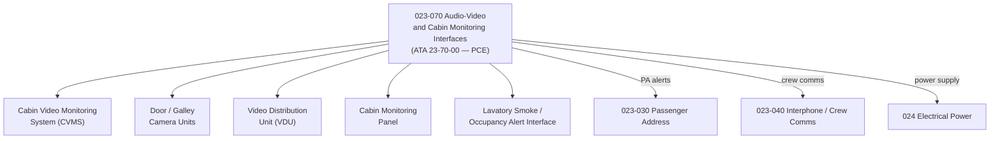

# ATLAS 020-029 · 02.023 · 023-070 — Audio-Video and Cabin Monitoring Interfaces

## 1. Purpose

Define the architecture boundary for *Audio-Video and Cabin Monitoring Interfaces* (ATA 23-70-00) within ATLAS subsection `023`. This section covers the Cabin Video Monitoring System (CVMS), door area cameras, lavatory smoke detector audio-visual alerts, and the video distribution interface to the Cabin Management System (CMS).

> **Programme-controlled extension.** This section covers monitoring and video interfaces activated under programme authority. Architecture boundary and Q-Division assignments require formal programme review before population of detailed design data modules.

## 2. Scope

- Aligned to ATA SNS `23-70-00` (programme-controlled extension of baseline ATA 23 scope).
- Covers Cabin Video Monitoring System (CVMS), door-area and galley camera units, forward/aft camera feeds, video distribution units (VDU), cabin monitoring panel, and lavatory smoke/occupancy alert interfaces.
- Interfaces: PA system (`023-030`), cabin interphone (`023-040`), electrical power (`024`), and Cabin Management System (CMS).
- Does not cover in-flight entertainment video content, CCTV cybersecurity data modules, or seat-back display units.

## 3. System Architecture

## 4. Footprint

| Metric | Value |
|---|---|
| Architecture | `ATLAS` — Aircraft Top Level Architecture Schema/System |
| Master range | `000–099` |
| Code range | `020-029` |
| Section | `02` — Sistemas Core de Aeronave |
| Subsection | `023` — Communications |
| Local section code | `023-070` |
| ATA SNS | `23-70-00` |
| Status | `programme-controlled-extension` |
| Primary Q-Division | Q-DATAGOV |
| Support Q-Divisions | Q-AIR, Q-HPC, Q-GROUND, Q-MECHANICS, Q-SPACE |
| Governance class | `baseline` |
| Folder path | `Q+ATLANTIDE/000-099_ATLAS/020-029_Sistemas-Core-de-Aeronave/023_Communications/` |
| Document | `023-070-Audio-Video-and-Cabin-Monitoring-Interfaces.md` |
| Parent subsection | [`README.md`](./README.md) |

## 5. References

- ATA iSpec 2200 — Chapter 23-70, Audio-Video Monitoring
- Q+ATLANTIDE controlled baseline [`organization/Q+ATLANTIDE.md`](../../../../organization/Q+ATLANTIDE.md)
- Subsection index [`./README.md`](./README.md)
- `023-030` Passenger Address [`./023-030-Passenger-Address-and-Cabin-Communications.md`](./023-030-Passenger-Address-and-Cabin-Communications.md)
- `023-040` Interphone [`./023-040-Interphone-and-Crew-Communications.md`](./023-040-Interphone-and-Crew-Communications.md)
