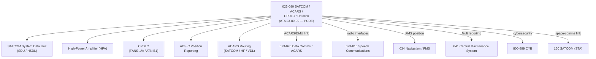

# ATLAS 020-029 · 02.023 · 023-080 — SATCOM, ACARS, CPDLC and Datalink Interfaces

## 1. Purpose

Define the architecture boundary for *SATCOM, ACARS, CPDLC and Datalink Interfaces* (ATA 23-80-00) within ATLAS subsection `023`. This section covers satellite communications (SATCOM), ACARS routing via SATCOM/HF/VDL, Controller–Pilot Data Link Communications (CPDLC), ADS-C position reporting, and integration with the ATSU/DMU (`023-020`).

> **Programme-controlled datalink extension.** Advanced datalink functions covered here require programme authority, cybersecurity review, and ATC-link authority boundary confirmation before population of detailed architecture data modules.

## 2. Scope

- Aligned to ATA SNS `23-80-00` (programme-controlled datalink extension).
- Covers SATCOM High-Power Amplifier (HPA), Low-Noise Amplifier (LNA), SATCOM system unit (SDU/HSDL), ACARS routing via SATCOM/HF/VHF, CPDLC via FANS-1/A and ATN B1, ADS-C, and integration with ATSU (`023-020`).
- Interfaces: Speech communications (`023-010`), data communications/ACARS (`023-020`), navigation/FMS (`034`), CMC (`041`), cybersecurity domains (`800-899_CYB`), and STA space communications (`150_SATCOM`, `152_Redes-Espaciales`).
- Does not define SATCOM service provider agreements, ATC data-link procedure specifications, or cybersecurity countermeasure data (see CYB band).

## 3. System Architecture

## 4. Footprint

| Metric | Value |
|---|---|
| Architecture | `ATLAS` — Aircraft Top Level Architecture Schema/System |
| Master range | `000–099` |
| Code range | `020-029` |
| Section | `02` — Sistemas Core de Aeronave |
| Subsection | `023` — Communications |
| Local section code | `023-080` |
| ATA SNS | `23-80-00` |
| Status | `programme-controlled-datalink-extension` |
| Primary Q-Division | Q-DATAGOV |
| Support Q-Divisions | Q-AIR, Q-HPC, Q-GROUND, Q-MECHANICS, Q-SPACE |
| Governance class | `baseline` |
| Folder path | `Q+ATLANTIDE/000-099_ATLAS/020-029_Sistemas-Core-de-Aeronave/023_Communications/` |
| Document | `023-080-SATCOM-ACARS-CPDLC-and-Datalink-Interfaces.md` |
| Parent subsection | [`README.md`](./README.md) |

## 5. References

- ATA iSpec 2200 — Chapter 23, Communications (datalink functions)
- Q+ATLANTIDE controlled baseline [`organization/Q+ATLANTIDE.md`](../../../../organization/Q+ATLANTIDE.md)
- Subsection index [`./README.md`](./README.md)
- `023-020` Data Communications [`./023-020-Data-Communications-and-Automatic-Calling.md`](./023-020-Data-Communications-and-Automatic-Calling.md)
- `034` Navigation / FMS [`../034_Navigation/README.md`](../034_Navigation/README.md)
- STA `150_SATCOM` [`../../../../100-199_STA/150-159_Comunicaciones-Espaciales/150_SATCOM/README.md`](../../../../100-199_STA/150-159_Comunicaciones-Espaciales/150_SATCOM/README.md)
- CYB band `800-899` [`../../../../800-899_CYB/README.md`](../../../../800-899_CYB/README.md)
