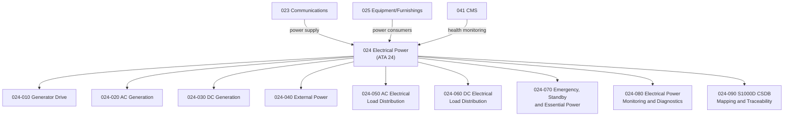

# ATLAS 020-029 · 02.024 · 024-000 — General

## 1. Purpose

Provide the general architectural definition for *Electrical Power* (ATA 24) within ATLAS subsection `024`. This section establishes the scope boundary, system family, Q-Division authority, and top-level structural context for all electrical power sections `024-010` through `024-090`.

## 2. Scope

- Defines the electrical power system family within the ATLAS-1000 register, aligned to ATA SNS `24-00-00 General`.
- Covers the architectural authority of `primary_q_division: Q-MECHANICS` with support from Q-AIR, Q-DATAGOV, Q-GREENTECH, Q-GROUND, and Q-INDUSTRY.
- Applies to all aircraft-level electrical power functions including generator drive, AC/DC generation, external power, electrical load distribution, emergency and standby power, monitoring and diagnostics interfaces.
- Does not replace certified ATA/S1000D task-specific maintenance, troubleshooting, operational, or software assurance data modules.

**Scope boundary:** This node covers aircraft electrical power architecture, generator drive, AC/DC generation, external power, load distribution, emergency and essential power, monitoring and diagnostics, and publication traceability. It does not replace certified ATA/S1000D task-specific maintenance, troubleshooting, operational, or avionics software data modules.

**Safety boundary:** Electrical power is safety-critical. Any artefact derived from this node requires correct aircraft effectivity, load shed logic, bus-tie authority boundaries, failure detection, essential bus switching, maintenance sign-off evidence and lifecycle traceability.

## 3. System Architecture

## 4. Footprint

| Metric | Value |
|---|---|
| Architecture | `ATLAS` — Aircraft Top Level Architecture Schema/System |
| Master range | `000–099` |
| Code range | `020-029` |
| Section | `02` — Sistemas Core de Aeronave |
| Subsection | `024` — Electrical Power |
| Local section code | `024-000` |
| ATA SNS | `24-00-00` |
| Primary Q-Division | Q-MECHANICS |
| Support Q-Divisions | Q-AIR, Q-DATAGOV, Q-GREENTECH, Q-GROUND, Q-INDUSTRY |
| Governance class | `baseline` |
| Folder path | `Q+ATLANTIDE/000-099_ATLAS/020-029_Sistemas-Core-de-Aeronave/024_Electrical-Power/` |
| Document | `024-000-General.md` |
| Parent subsection | [`README.md`](./README.md) |
| Parent section | [`../README.md`](../README.md) |
| Parent baseline | [`organization/Q+ATLANTIDE.md`](../../../../organization/Q+ATLANTIDE.md) |

## 5. References

- ATA iSpec 2200 — Chapter 24, Electrical Power
- Q+ATLANTIDE controlled baseline [`organization/Q+ATLANTIDE.md`](../../../../organization/Q+ATLANTIDE.md)
- ATLAS section index [`../README.md`](../README.md)
- Subsection index [`./README.md`](./README.md)
- Section `023-000` General — Communications [`../023_Communications/023-000-General.md`](../023_Communications/023-000-General.md)
- Section `025` — Equipment/Furnishings [`../025_Equipment-Furnishings/README.md`](../025_Equipment-Furnishings/README.md)
