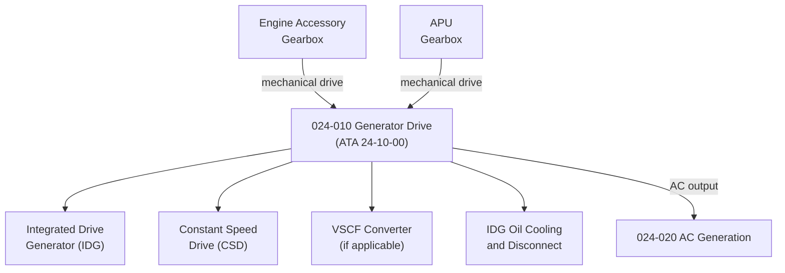

# ATLAS 020-029 · 02.024 · 024-010 — Generator Drive

## 1. Purpose

Define the architecture boundary for *Generator Drive* (ATA 24-10-00) within ATLAS subsection `024`. This section covers the mechanical and electrical interface between the aircraft's powerplant (engines and APU) and the main electrical generators, including Constant Speed Drive (CSD) or Integrated Drive Generator (IDG) units.

## 2. Scope

- Aligned to ATA SNS `24-10-00 Generator Drive`.
- Covers Integrated Drive Generator (IDG) units, Constant Speed Drive (CSD) units, Variable Speed Constant Frequency (VSCF) converters, and their mechanical coupling interfaces to engine accessory gearboxes.
- Includes oil cooling, disconnect, and reconnect functions associated with IDG/CSD units.
- Interfaces: engine/APU accessory gearbox, AC generation system (`024-020`), and FADEC/engine control data.
- Does not cover main engine or APU design, propulsion control logic, or powerplant certification data modules.

## 3. System Architecture

## 4. Footprint

| Metric | Value |
|---|---|
| Architecture | `ATLAS` — Aircraft Top Level Architecture Schema/System |
| Master range | `000–099` |
| Code range | `020-029` |
| Section | `02` — Sistemas Core de Aeronave |
| Subsection | `024` — Electrical Power |
| Local section code | `024-010` |
| ATA SNS | `24-10-00` |
| Primary Q-Division | Q-MECHANICS |
| Support Q-Divisions | Q-AIR, Q-DATAGOV, Q-GREENTECH, Q-GROUND, Q-INDUSTRY |
| Governance class | `baseline` |
| Folder path | `Q+ATLANTIDE/000-099_ATLAS/020-029_Sistemas-Core-de-Aeronave/024_Electrical-Power/` |
| Document | `024-010-Generator-Drive.md` |
| Parent subsection | [`README.md`](./README.md) |

## 5. References

- ATA iSpec 2200 — Chapter 24-10, Generator Drive
- Q+ATLANTIDE controlled baseline [`organization/Q+ATLANTIDE.md`](../../../../organization/Q+ATLANTIDE.md)
- Subsection index [`./README.md`](./README.md)
- `024-000` General [`./024-000-General.md`](./024-000-General.md)
- `024-020` AC Generation [`./024-020-AC-Generation.md`](./024-020-AC-Generation.md)
