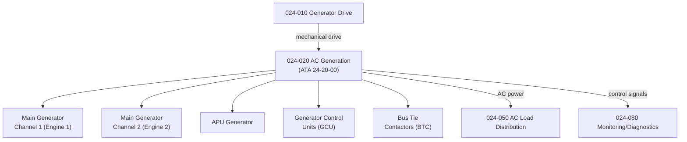

# ATLAS 020-029 · 02.024 · 024-020 — AC Generation

## 1. Purpose

Define the architecture boundary for *AC Generation* (ATA 24-20-00) within ATLAS subsection `024`. This section covers aircraft AC power generation, including main generator output, APU generator, frequency regulation, voltage regulation, and generator control units (GCU).

## 2. Scope

- Aligned to ATA SNS `24-20-00 AC Generation`.
- Covers main AC generators (engine-driven), APU generator, Generator Control Units (GCU), Bus Tie Contactors (BTC), and Solid State Power Controllers (SSPC) for AC channels.
- Includes generator voltage and frequency regulation, parallel operation logic, and load sharing between channels.
- Interfaces: generator drive (`024-010`), AC distribution busses (`024-050`), and aircraft/APU electrical bus control.
- Does not cover DC generation or battery systems (see `024-030`), or external power interface (see `024-040`).

## 3. System Architecture

## 4. Footprint

| Metric | Value |
|---|---|
| Architecture | `ATLAS` — Aircraft Top Level Architecture Schema/System |
| Master range | `000–099` |
| Code range | `020-029` |
| Section | `02` — Sistemas Core de Aeronave |
| Subsection | `024` — Electrical Power |
| Local section code | `024-020` |
| ATA SNS | `24-20-00` |
| Primary Q-Division | Q-MECHANICS |
| Support Q-Divisions | Q-AIR, Q-DATAGOV, Q-GREENTECH, Q-GROUND, Q-INDUSTRY |
| Governance class | `baseline` |
| Folder path | `Q+ATLANTIDE/000-099_ATLAS/020-029_Sistemas-Core-de-Aeronave/024_Electrical-Power/` |
| Document | `024-020-AC-Generation.md` |
| Parent subsection | [`README.md`](./README.md) |

## 5. References

- ATA iSpec 2200 — Chapter 24-20, AC Generation
- Q+ATLANTIDE controlled baseline [`organization/Q+ATLANTIDE.md`](../../../../organization/Q+ATLANTIDE.md)
- Subsection index [`./README.md`](./README.md)
- `024-010` Generator Drive [`./024-010-Generator-Drive.md`](./024-010-Generator-Drive.md)
- `024-050` AC Electrical Load Distribution [`./024-050-AC-Electrical-Load-Distribution.md`](./024-050-AC-Electrical-Load-Distribution.md)
