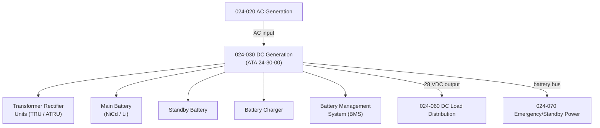

# ATLAS 020-029 · 02.024 · 024-030 — DC Generation

## 1. Purpose

Define the architecture boundary for *DC Generation* (ATA 24-30-00) within ATLAS subsection `024`. This section covers DC power generation and battery systems, including transformer rectifier units (TRU), battery chargers, main and standby batteries, and the DC bus architecture.

## 2. Scope

- Aligned to ATA SNS `24-30-00 DC Generation`.
- Covers Transformer Rectifier Units (TRU), Auto Transformer Rectifier Units (ATRU), main aircraft batteries (nickel-cadmium or lithium), battery chargers, and Battery Management Systems (BMS).
- Includes DC bus voltage regulation, battery state-of-charge monitoring, and hot-battery-bus control.
- Interfaces: AC generation (`024-020`), DC distribution busses (`024-060`), and emergency/standby power (`024-070`).
- Does not cover AC generation or external AC power (see `024-020` and `024-040`).

## 3. System Architecture

## 4. Footprint

| Metric | Value |
|---|---|
| Architecture | `ATLAS` — Aircraft Top Level Architecture Schema/System |
| Master range | `000–099` |
| Code range | `020-029` |
| Section | `02` — Sistemas Core de Aeronave |
| Subsection | `024` — Electrical Power |
| Local section code | `024-030` |
| ATA SNS | `24-30-00` |
| Primary Q-Division | Q-MECHANICS |
| Support Q-Divisions | Q-AIR, Q-DATAGOV, Q-GREENTECH, Q-GROUND, Q-INDUSTRY |
| Governance class | `baseline` |
| Folder path | `Q+ATLANTIDE/000-099_ATLAS/020-029_Sistemas-Core-de-Aeronave/024_Electrical-Power/` |
| Document | `024-030-DC-Generation.md` |
| Parent subsection | [`README.md`](./README.md) |

## 5. References

- ATA iSpec 2200 — Chapter 24-30, DC Generation
- Q+ATLANTIDE controlled baseline [`organization/Q+ATLANTIDE.md`](../../../../organization/Q+ATLANTIDE.md)
- Subsection index [`./README.md`](./README.md)
- `024-020` AC Generation [`./024-020-AC-Generation.md`](./024-020-AC-Generation.md)
- `024-060` DC Electrical Load Distribution [`./024-060-DC-Electrical-Load-Distribution.md`](./024-060-DC-Electrical-Load-Distribution.md)
- `024-070` Emergency, Standby and Essential Power [`./024-070-Emergency-Standby-and-Essential-Power.md`](./024-070-Emergency-Standby-and-Essential-Power.md)
