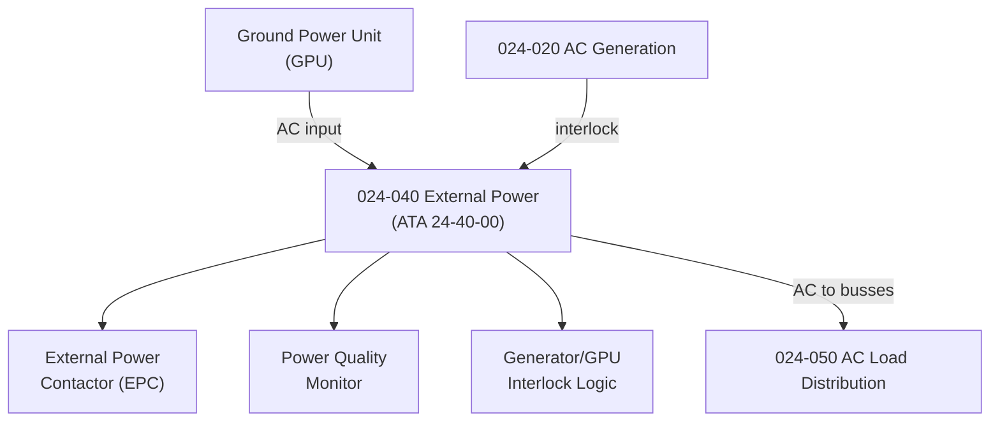

# ATLAS 020-029 · 02.024 · 024-040 — External Power

## 1. Purpose

Define the architecture boundary for *External Power* (ATA 24-40-00) within ATLAS subsection `024`. This section covers the Ground Power Unit (GPU) interface, external AC power receptacle, External Power Contactor (EPC), power quality monitoring, and the control logic for accepting or rejecting ground power.

## 2. Scope

- Aligned to ATA SNS `24-40-00 External Power`.
- Covers Ground Power Unit (GPU) AC receptacle connector(s), External Power Contactor (EPC), power quality monitoring (frequency, voltage, phase sequence), and interlock logic preventing parallel operation with onboard generators.
- Includes pre-conditioning air interface signals where electrically interlinked.
- Interfaces: AC generation (`024-020`), AC distribution (`024-050`), and ground support equipment (GSE) electrical interface.
- Does not cover GPU design, ground power cable standards, or GSE certification — those belong to ground operations and infrastructure domains.

## 3. System Architecture

## 4. Footprint

| Metric | Value |
|---|---|
| Architecture | `ATLAS` — Aircraft Top Level Architecture Schema/System |
| Master range | `000–099` |
| Code range | `020-029` |
| Section | `02` — Sistemas Core de Aeronave |
| Subsection | `024` — Electrical Power |
| Local section code | `024-040` |
| ATA SNS | `24-40-00` |
| Primary Q-Division | Q-MECHANICS |
| Support Q-Divisions | Q-AIR, Q-DATAGOV, Q-GREENTECH, Q-GROUND, Q-INDUSTRY |
| Governance class | `baseline` |
| Folder path | `Q+ATLANTIDE/000-099_ATLAS/020-029_Sistemas-Core-de-Aeronave/024_Electrical-Power/` |
| Document | `024-040-External-Power.md` |
| Parent subsection | [`README.md`](./README.md) |

## 5. References

- ATA iSpec 2200 — Chapter 24-40, External Power
- Q+ATLANTIDE controlled baseline [`organization/Q+ATLANTIDE.md`](../../../../organization/Q+ATLANTIDE.md)
- Subsection index [`./README.md`](./README.md)
- `024-020` AC Generation [`./024-020-AC-Generation.md`](./024-020-AC-Generation.md)
- `024-050` AC Electrical Load Distribution [`./024-050-AC-Electrical-Load-Distribution.md`](./024-050-AC-Electrical-Load-Distribution.md)
- ATLAS section `010` Ground Handling [`../010_Ground-Handling/README.md`](../010_Ground-Handling/README.md)
