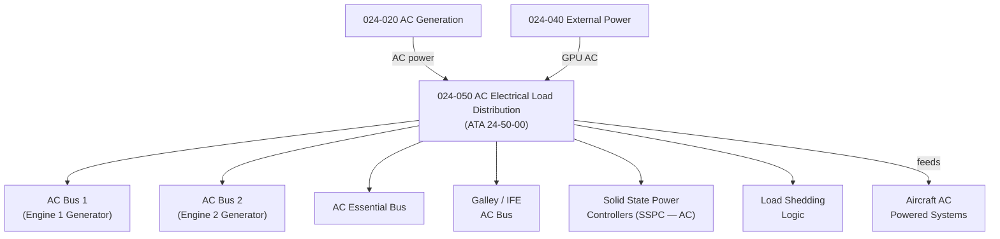

# ATLAS 020-029 · 02.024 · 024-050 — AC Electrical Load Distribution

## 1. Purpose

Define the architecture boundary for *AC Electrical Load Distribution* (ATA 24-50-00) within ATLAS subsection `024`. This section covers the AC bus architecture, including main AC busses, transfer busses, galley busses, and Solid State Power Controllers (SSPC) for AC load management.

## 2. Scope

- Aligned to ATA SNS `24-50-00 AC Electrical Load Distribution`.
- Covers main AC busses (AC BUS 1, AC BUS 2, AC ESS BUS), transfer busses, galley and IFE AC feed busses, Solid State Power Controllers (SSPC), and circuit breakers for AC distribution panels.
- Includes load shedding logic, bus transfer on generator loss, and AC bus tie control.
- Interfaces: AC generation (`024-020`), external power (`024-040`), DC generation (`024-030`), and all AC-powered systems.
- Does not cover DC bus distribution (see `024-060`) or the specific load equipment connected to AC busses.

## 3. System Architecture

## 4. Footprint

| Metric | Value |
|---|---|
| Architecture | `ATLAS` — Aircraft Top Level Architecture Schema/System |
| Master range | `000–099` |
| Code range | `020-029` |
| Section | `02` — Sistemas Core de Aeronave |
| Subsection | `024` — Electrical Power |
| Local section code | `024-050` |
| ATA SNS | `24-50-00` |
| Primary Q-Division | Q-MECHANICS |
| Support Q-Divisions | Q-AIR, Q-DATAGOV, Q-GREENTECH, Q-GROUND, Q-INDUSTRY |
| Governance class | `baseline` |
| Folder path | `Q+ATLANTIDE/000-099_ATLAS/020-029_Sistemas-Core-de-Aeronave/024_Electrical-Power/` |
| Document | `024-050-AC-Electrical-Load-Distribution.md` |
| Parent subsection | [`README.md`](./README.md) |

## 5. References

- ATA iSpec 2200 — Chapter 24-50, AC Electrical Load Distribution
- Q+ATLANTIDE controlled baseline [`organization/Q+ATLANTIDE.md`](../../../../organization/Q+ATLANTIDE.md)
- Subsection index [`./README.md`](./README.md)
- `024-020` AC Generation [`./024-020-AC-Generation.md`](./024-020-AC-Generation.md)
- `024-060` DC Electrical Load Distribution [`./024-060-DC-Electrical-Load-Distribution.md`](./024-060-DC-Electrical-Load-Distribution.md)
- `024-070` Emergency, Standby and Essential Power [`./024-070-Emergency-Standby-and-Essential-Power.md`](./024-070-Emergency-Standby-and-Essential-Power.md)
