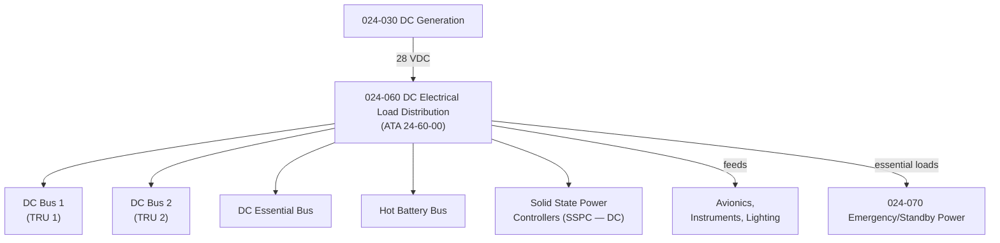

# ATLAS 020-029 · 02.024 · 024-060 — DC Electrical Load Distribution

## 1. Purpose

Define the architecture boundary for *DC Electrical Load Distribution* (ATA 24-60-00) within ATLAS subsection `024`. This section covers the DC bus architecture, including main DC busses, DC essential bus, hot battery bus, Solid State Power Controllers (SSPC) for DC loads, and the DC load management and protection logic.

## 2. Scope

- Aligned to ATA SNS `24-60-00 DC Electrical Load Distribution`.
- Covers main DC busses (DC BUS 1, DC BUS 2), DC Essential Bus, Hot Battery Bus, SSPC for DC panels, and current sensing/protection devices.
- Includes DC load shedding, cross-tie bus functionality, and distribution panel topology.
- Interfaces: DC generation/TRU (`024-030`), batteries (`024-030`), emergency power (`024-070`), and all DC-powered systems (avionics, instruments, lighting).
- Does not cover AC distribution (see `024-050`) or individual equipment connected to DC busses.

## 3. System Architecture

## 4. Footprint

| Metric | Value |
|---|---|
| Architecture | `ATLAS` — Aircraft Top Level Architecture Schema/System |
| Master range | `000–099` |
| Code range | `020-029` |
| Section | `02` — Sistemas Core de Aeronave |
| Subsection | `024` — Electrical Power |
| Local section code | `024-060` |
| ATA SNS | `24-60-00` |
| Primary Q-Division | Q-MECHANICS |
| Support Q-Divisions | Q-AIR, Q-DATAGOV, Q-GREENTECH, Q-GROUND, Q-INDUSTRY |
| Governance class | `baseline` |
| Folder path | `Q+ATLANTIDE/000-099_ATLAS/020-029_Sistemas-Core-de-Aeronave/024_Electrical-Power/` |
| Document | `024-060-DC-Electrical-Load-Distribution.md` |
| Parent subsection | [`README.md`](./README.md) |

## 5. References

- ATA iSpec 2200 — Chapter 24-60, DC Electrical Load Distribution
- Q+ATLANTIDE controlled baseline [`organization/Q+ATLANTIDE.md`](../../../../organization/Q+ATLANTIDE.md)
- Subsection index [`./README.md`](./README.md)
- `024-030` DC Generation [`./024-030-DC-Generation.md`](./024-030-DC-Generation.md)
- `024-050` AC Electrical Load Distribution [`./024-050-AC-Electrical-Load-Distribution.md`](./024-050-AC-Electrical-Load-Distribution.md)
- `024-070` Emergency, Standby and Essential Power [`./024-070-Emergency-Standby-and-Essential-Power.md`](./024-070-Emergency-Standby-and-Essential-Power.md)
