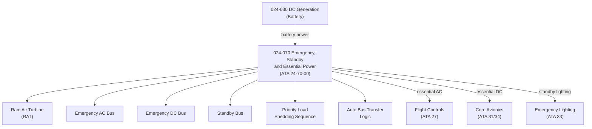

# ATLAS 020-029 · 02.024 · 024-070 — Emergency, Standby and Essential Power

## 1. Purpose

Define the architecture boundary for *Emergency, Standby and Essential Power* (ATA 24-70-00) within ATLAS subsection `024`. This section covers the aircraft's last-resort power architecture, including Ram Air Turbine (RAT), emergency bus, standby bus, essential bus topology under dual-generator failure, and the automatic or manual switching logic to sustain flight-critical and safety-critical systems.

## 2. Scope

- Aligned to ATA SNS `24-70-00 Emergency/Standby Power`.
- Covers Ram Air Turbine (RAT) deployment and electrical output, emergency AC and DC busses, standby bus, main battery as emergency source, essential bus load roster (flight controls, core avionics, critical lighting), and automatic bus transfer logic.
- Includes emergency power automatic actuation, manual override, cockpit annunciation, and the priority sequencing of load shedding to sustain minimum essential systems.
- Interfaces: DC generation/battery (`024-030`), DC distribution (`024-060`), flight controls (ATA 27), core avionics (ATA 31/34), and emergency lighting (ATA 33).
- Does not replace individual system emergency power certification data modules — those belong to the respective ATA chapter owners.

**Safety boundary:** Emergency and standby power is flight-safety critical. Any artefact derived from this section requires explicit system effectivity, load priority analysis, failure mode effects analysis (FMEA), RAT deployment certification, battery capacity substantiation, sign-off evidence and lifecycle traceability.

## 3. System Architecture

## 4. Footprint

| Metric | Value |
|---|---|
| Architecture | `ATLAS` — Aircraft Top Level Architecture Schema/System |
| Master range | `000–099` |
| Code range | `020-029` |
| Section | `02` — Sistemas Core de Aeronave |
| Subsection | `024` — Electrical Power |
| Local section code | `024-070` |
| ATA SNS | `24-70-00` |
| Primary Q-Division | Q-MECHANICS |
| Support Q-Divisions | Q-AIR, Q-DATAGOV, Q-GREENTECH, Q-GROUND, Q-INDUSTRY |
| Governance class | `baseline` |
| Folder path | `Q+ATLANTIDE/000-099_ATLAS/020-029_Sistemas-Core-de-Aeronave/024_Electrical-Power/` |
| Document | `024-070-Emergency-Standby-and-Essential-Power.md` |
| Parent subsection | [`README.md`](./README.md) |

## 5. References

- ATA iSpec 2200 — Chapter 24-70, Emergency/Standby Power
- Q+ATLANTIDE controlled baseline [`organization/Q+ATLANTIDE.md`](../../../../organization/Q+ATLANTIDE.md)
- Subsection index [`./README.md`](./README.md)
- `024-030` DC Generation [`./024-030-DC-Generation.md`](./024-030-DC-Generation.md)
- `024-060` DC Electrical Load Distribution [`./024-060-DC-Electrical-Load-Distribution.md`](./024-060-DC-Electrical-Load-Distribution.md)
- `024-080` Electrical Power Monitoring, Diagnostics and Control Interfaces [`./024-080-Electrical-Power-Monitoring-Diagnostics-and-Control-Interfaces.md`](./024-080-Electrical-Power-Monitoring-Diagnostics-and-Control-Interfaces.md)
