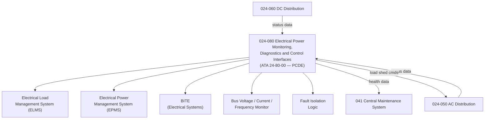

# ATLAS 020-029 · 02.024 · 024-080 — Electrical Power Monitoring, Diagnostics and Control Interfaces

## 1. Purpose

Define the architecture boundary for *Electrical Power Monitoring, Diagnostics and Control Interfaces* (ATA 24-80-00) within ATLAS subsection `024`. This section covers the Electrical Load Management System (ELMS), Electrical Power Management System (EPMS), Built-In Test Equipment (BITE) for electrical power, bus voltage/current monitoring, and the control interface to the Central Maintenance System (CMS).

> **Programme-controlled diagnostics extension.** This section covers monitoring, health management, and advanced diagnostics interfaces activated under programme authority. Architecture boundary and Q-Division assignments require formal programme review before population of detailed design data modules.

## 2. Scope

- Aligned to ATA SNS `24-80-00 Electrical Power Monitoring and Diagnostics` (programme-controlled extension of baseline ATA 24 scope).
- Covers Electrical Load Management System (ELMS), Electrical Power Management System (EPMS), bus voltage/current/frequency monitoring, BITE, fault isolation logic, ARINC 429/664 data bus interfaces for electrical system status, and CMS health data output.
- Includes automated load shedding commands, EPMS trend data, and prognostics interfaces.
- Does not cover core bus architecture or physical distribution design (see `024-050`, `024-060`), nor CMS architecture (see ATA 41).

## 3. System Architecture

## 4. Footprint

| Metric | Value |
|---|---|
| Architecture | `ATLAS` — Aircraft Top Level Architecture Schema/System |
| Master range | `000–099` |
| Code range | `020-029` |
| Section | `02` — Sistemas Core de Aeronave |
| Subsection | `024` — Electrical Power |
| Local section code | `024-080` |
| ATA SNS | `24-80-00` |
| Status | `programme-controlled-diagnostics-extension` |
| Primary Q-Division | Q-MECHANICS |
| Support Q-Divisions | Q-AIR, Q-DATAGOV, Q-GREENTECH, Q-GROUND, Q-INDUSTRY |
| Governance class | `baseline` |
| Folder path | `Q+ATLANTIDE/000-099_ATLAS/020-029_Sistemas-Core-de-Aeronave/024_Electrical-Power/` |
| Document | `024-080-Electrical-Power-Monitoring-Diagnostics-and-Control-Interfaces.md` |
| Parent subsection | [`README.md`](./README.md) |

## 5. References

- ATA iSpec 2200 — Chapter 24-80, Electrical Power Monitoring
- Q+ATLANTIDE controlled baseline [`organization/Q+ATLANTIDE.md`](../../../../organization/Q+ATLANTIDE.md)
- Subsection index [`./README.md`](./README.md)
- `024-050` AC Electrical Load Distribution [`./024-050-AC-Electrical-Load-Distribution.md`](./024-050-AC-Electrical-Load-Distribution.md)
- `024-060` DC Electrical Load Distribution [`./024-060-DC-Electrical-Load-Distribution.md`](./024-060-DC-Electrical-Load-Distribution.md)
- ATA 41 — Central Maintenance System (CMS)
