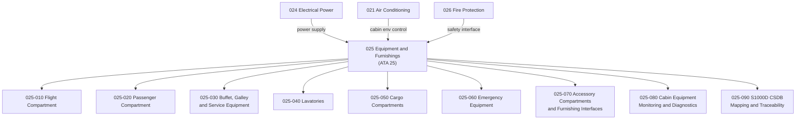

# ATLAS 020-029 · 02.025 · 025-000 — General

## 1. Purpose

Provide the general architectural definition for *Equipment and Furnishings* (ATA 25) within ATLAS subsection `025`. This section establishes the scope boundary, system family, Q-Division authority, and top-level structural context for all equipment and furnishings sections `025-010` through `025-090`.

## 2. Scope

- Defines the equipment and furnishings system family within the ATLAS-1000 register, aligned to ATA SNS `25-00-00 General`.
- Covers the architectural authority of `primary_q_division: Q-AIR` with support from Q-MECHANICS, Q-DATAGOV, Q-GREENTECH, Q-GROUND, and Q-INDUSTRY.
- Applies to all aircraft equipment and furnishings functions including flight compartment equipment, passenger cabin furnishings, galley and service equipment, lavatories, cargo compartment liners and fittings, emergency equipment, and accessory compartments.
- Does not replace certified ATA/S1000D task-specific maintenance, operational, or safety-of-flight data modules for cabin crew equipment or emergency systems.

**Scope boundary:** This node covers aircraft equipment and furnishings architecture, compartment definitions, cabin layouts, galley/lavatory systems, emergency equipment interfaces, cargo compartment fittings, monitoring and diagnostics, and publication traceability. It does not replace certified ATA/S1000D task-specific maintenance, operational, or emergency procedures data modules.

**Safety boundary:** Equipment and furnishings include flight-critical emergency equipment (life vests, oxygen, evacuation slides). Any artefact derived from this node affecting emergency equipment requires correct aircraft effectivity, regulatory compliance evidence (CS-25/FAR 25), maintenance sign-off evidence, and lifecycle traceability.

## 3. System Architecture

## 4. Footprint

| Metric | Value |
|---|---|
| Architecture | `ATLAS` — Aircraft Top Level Architecture Schema/System |
| Master range | `000–099` |
| Code range | `020-029` |
| Section | `02` — Sistemas Core de Aeronave |
| Subsection | `025` — Equipment and Furnishings |
| Local section code | `025-000` |
| ATA SNS | `25-00-00` |
| Primary Q-Division | Q-AIR |
| Support Q-Divisions | Q-MECHANICS, Q-DATAGOV, Q-GREENTECH, Q-GROUND, Q-INDUSTRY |
| Governance class | `baseline` |
| Folder path | `Q+ATLANTIDE/000-099_ATLAS/020-029_Sistemas-Core-de-Aeronave/025_Equipment-and-Furnishings/` |
| Document | `025-000-General.md` |
| Parent subsection | [`README.md`](./README.md) |
| Parent section | [`../README.md`](../README.md) |
| Parent baseline | [`organization/Q+ATLANTIDE.md`](../../../../organization/Q+ATLANTIDE.md) |

## 5. References

- ATA iSpec 2200 — Chapter 25, Equipment / Furnishings
- Q+ATLANTIDE controlled baseline [`organization/Q+ATLANTIDE.md`](../../../../organization/Q+ATLANTIDE.md)
- ATLAS section index [`../README.md`](../README.md)
- Subsection index [`./README.md`](./README.md)
- Section `024-000` General — Electrical Power [`../024_Electrical-Power/024-000-General.md`](../024_Electrical-Power/024-000-General.md)
- Section `026` — Fire Protection [`../026_Fire-Protection/README.md`](../026_Fire-Protection/README.md)
