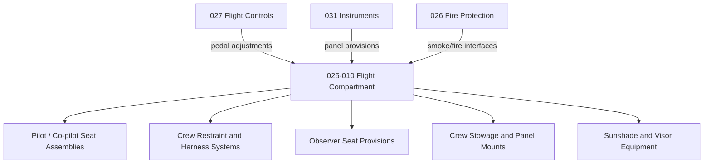

# ATLAS 020-029 · 02.025 · 025-010 — Flight Compartment

## 1. Purpose

Define the equipment and furnishings architecture for the *Flight Compartment* (ATA 25-10-00) within ATLAS subsection `025`. This section covers pilot and co-pilot seat assemblies, flight deck panel equipment, crew restraint systems, and flight compartment furnishings integrated under `primary_q_division: Q-AIR`.

## 2. Scope

- Covers flight deck seat assemblies, headrest and harness systems, rudder pedal adjustments, and crew comfort fittings.
- Includes flight compartment door and observer seat provisions, sunshade equipment, and crew stowage provisions.
- Addresses crew oxygen mask stowage, portable equipment mounts, and flight compartment lighting provisions as they interface with equipment and furnishings.
- Does not replace certified task-specific maintenance data modules for seat adjustment mechanisms, harness certification, or avionics panel equipment (refer to ATA 31, 34).

**Scope boundary:** Flight compartment equipment and furnishings — seats, restraints, sunshades, observer provisions, crew stowage interfaces. Excludes certified avionics (ATA 31/34), primary flight controls (ATA 27), and fire/smoke detection systems (ATA 26).

**Safety boundary:** Flight compartment seat and harness systems are flight-safety critical. Any artefact affecting restraint system certification, load path data, or emergency egress requires CS-25/FAR 25 Subpart D compliance evidence and maintenance sign-off traceability.

## 3. System Architecture

## 4. Footprint

| Metric | Value |
|---|---|
| Architecture | `ATLAS` — Aircraft Top Level Architecture Schema/System |
| Master range | `000–099` |
| Code range | `020-029` |
| Section | `02` — Sistemas Core de Aeronave |
| Subsection | `025` — Equipment and Furnishings |
| Local section code | `025-010` |
| ATA SNS | `25-10-00` |
| Primary Q-Division | Q-AIR |
| Support Q-Divisions | Q-MECHANICS, Q-DATAGOV, Q-GREENTECH, Q-GROUND, Q-INDUSTRY |
| Governance class | `baseline` |
| Folder path | `Q+ATLANTIDE/000-099_ATLAS/020-029_Sistemas-Core-de-Aeronave/025_Equipment-and-Furnishings/` |
| Document | `025-010-Flight-Compartment.md` |
| Parent subsection | [`README.md`](./README.md) |
| Parent section | [`../README.md`](../README.md) |
| Parent baseline | [`organization/Q+ATLANTIDE.md`](../../../../organization/Q+ATLANTIDE.md) |

## 5. References

- ATA iSpec 2200 — Chapter 25-10, Flight Compartment Equipment
- Q+ATLANTIDE controlled baseline [`organization/Q+ATLANTIDE.md`](../../../../organization/Q+ATLANTIDE.md)
- Subsection index [`./README.md`](./README.md)
- `025-000` General [`./025-000-General.md`](./025-000-General.md)
- `025-060` Emergency Equipment [`./025-060-Emergency-Equipment.md`](./025-060-Emergency-Equipment.md)
