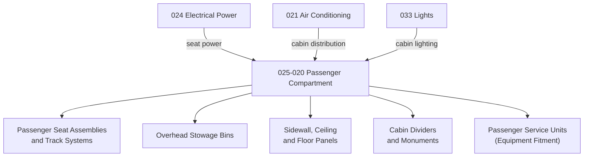

# ATLAS 020-029 · 02.025 · 025-020 — Passenger Compartment

## 1. Purpose

Define the equipment and furnishings architecture for the *Passenger Compartment* (ATA 25-20-00) within ATLAS subsection `025`. This section covers passenger seat assemblies, overhead bins, side wall and ceiling panels, cabin dividers, in-seat power provisions, and passenger service units (PSUs) as they relate to furnishings and equipment fitment.

## 2. Scope

- Covers passenger seat assemblies including seat tracks, leg rests, armrests, tray tables, and recline mechanisms.
- Includes overhead stowage bin structures and latching systems, cabin partition and divider panels, and monument-to-structure interfaces.
- Addresses cabin sidewall liners, ceiling panels, floor panels, carpet, and aesthetic trim fitment.
- Addresses passenger service unit (PSU) cassettes as equipment items — for PSU avionics interfaces refer to ATA 33 (Lights) and ATA 35 (Oxygen).
- Does not replace certified maintenance data for seat structural certification, track fitting loads, or emergency egress aisle compliance.

**Scope boundary:** Passenger compartment furnishings — seats, overhead bins, liners, panels, PSU fitment. Excludes in-flight entertainment (ATA 23/44), lighting circuits (ATA 33), oxygen systems (ATA 35), and structural floor beam data (ATA 53).

**Safety boundary:** Passenger seat tracks, fittings, and emergency aisle clearances are flight-safety critical. Artefacts affecting seat certification loads, track pull-out strength, or CS-25.785 compliance require structural evidence and maintenance sign-off traceability.

## 3. System Architecture

## 4. Footprint

| Metric | Value |
|---|---|
| Architecture | `ATLAS` — Aircraft Top Level Architecture Schema/System |
| Master range | `000–099` |
| Code range | `020-029` |
| Section | `02` — Sistemas Core de Aeronave |
| Subsection | `025` — Equipment and Furnishings |
| Local section code | `025-020` |
| ATA SNS | `25-20-00` |
| Primary Q-Division | Q-AIR |
| Support Q-Divisions | Q-MECHANICS, Q-DATAGOV, Q-GREENTECH, Q-GROUND, Q-INDUSTRY |
| Governance class | `baseline` |
| Folder path | `Q+ATLANTIDE/000-099_ATLAS/020-029_Sistemas-Core-de-Aeronave/025_Equipment-and-Furnishings/` |
| Document | `025-020-Passenger-Compartment.md` |
| Parent subsection | [`README.md`](./README.md) |
| Parent section | [`../README.md`](../README.md) |
| Parent baseline | [`organization/Q+ATLANTIDE.md`](../../../../organization/Q+ATLANTIDE.md) |

## 5. References

- ATA iSpec 2200 — Chapter 25-20, Passenger Compartment
- Q+ATLANTIDE controlled baseline [`organization/Q+ATLANTIDE.md`](../../../../organization/Q+ATLANTIDE.md)
- Subsection index [`./README.md`](./README.md)
- `025-000` General [`./025-000-General.md`](./025-000-General.md)
- `025-060` Emergency Equipment [`./025-060-Emergency-Equipment.md`](./025-060-Emergency-Equipment.md)
