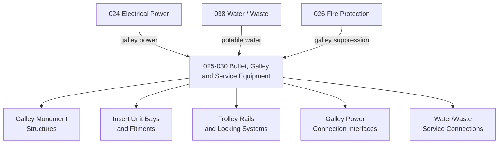

# ATLAS 020-029 · 02.025 · 025-030 — Buffet, Galley and Service Equipment

## 1. Purpose

Define the equipment and furnishings architecture for *Buffet, Galley and Service Equipment* (ATA 25-30-00) within ATLAS subsection `025`. This section covers galley insert units, trolley systems, water heaters, ovens, coffeemakers, chiller units, and cabin service equipment fitment interfaces.

## 2. Scope

- Covers galley monument structures, insert unit (ATLAS unit) fitments, trolley guide rails, and locking mechanisms.
- Includes water and waste service connections to galley inserts and equipment interfaces with the aircraft potable water system (ATA 38).
- Addresses galley power connection interfaces (115 V AC / 28 V DC) as equipment fitment items — for power distribution refer to ATA 24.
- Covers in-flight catering trolley (IFE cart) stowage provisions, oven and chiller module mounting, and drain provisions.
- Does not replace certified maintenance data for galley insert qualification, food safety standards, or water system hygiene procedures.

**Scope boundary:** Galley and buffet equipment fitment, monument structures, insert bay definitions, trolley provisions, and service connections. Excludes potable water plumbing (ATA 38), waste water (ATA 38), electrical circuits (ATA 24), and fire suppression (ATA 26).

**Safety boundary:** Galley fire risk (oven, heating elements) and galley securing under emergency landing loads (CS-25.561) are safety-relevant. Artefacts affecting galley structural attachment, insert locking, or fire suppression interfaces require compliance evidence and maintenance sign-off traceability.

## 3. System Architecture

## 4. Footprint

| Metric | Value |
|---|---|
| Architecture | `ATLAS` — Aircraft Top Level Architecture Schema/System |
| Master range | `000–099` |
| Code range | `020-029` |
| Section | `02` — Sistemas Core de Aeronave |
| Subsection | `025` — Equipment and Furnishings |
| Local section code | `025-030` |
| ATA SNS | `25-30-00` |
| Primary Q-Division | Q-AIR |
| Support Q-Divisions | Q-MECHANICS, Q-DATAGOV, Q-GREENTECH, Q-GROUND, Q-INDUSTRY |
| Governance class | `baseline` |
| Folder path | `Q+ATLANTIDE/000-099_ATLAS/020-029_Sistemas-Core-de-Aeronave/025_Equipment-and-Furnishings/` |
| Document | `025-030-Buffet-Galley-and-Service-Equipment.md` |
| Parent subsection | [`README.md`](./README.md) |
| Parent section | [`../README.md`](../README.md) |
| Parent baseline | [`organization/Q+ATLANTIDE.md`](../../../../organization/Q+ATLANTIDE.md) |

## 5. References

- ATA iSpec 2200 — Chapter 25-30, Buffet / Galley
- Q+ATLANTIDE controlled baseline [`organization/Q+ATLANTIDE.md`](../../../../organization/Q+ATLANTIDE.md)
- Subsection index [`./README.md`](./README.md)
- `025-000` General [`./025-000-General.md`](./025-000-General.md)
- `025-040` Lavatories [`./025-040-Lavatories.md`](./025-040-Lavatories.md)
