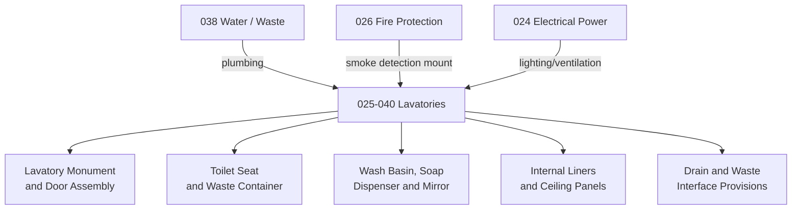

# ATLAS 020-029 · 02.025 · 025-040 — Lavatories

## 1. Purpose

Define the equipment and furnishings architecture for *Lavatories* (ATA 25-40-00) within ATLAS subsection `025`. This section covers lavatory monument structures, toilet assemblies, wash basin and mirror units, waste container systems, and lavatory internal furnishing fitments.

## 2. Scope

- Covers lavatory monument structures, door assemblies, internal liners, and ceiling panels as equipment and furnishings items.
- Includes toilet seat and cover assemblies, waste container unit fitment, and drain interfaces to the water/waste system (ATA 38).
- Addresses wash basin, soap dispenser, and hand-dryer fitments, along with lavatory lighting and ventilation interfaces as furnishings items.
- Covers lavatory smoke detector mount provisions as equipment fitment — for smoke detector systems refer to ATA 26.
- Does not replace certified maintenance data for waste system chemical procedures, plumbing pressure tests, or smoke detector calibration.

**Scope boundary:** Lavatory furnishings and fitment — monuments, toilet assemblies, basins, waste containers, internal panels. Excludes water plumbing (ATA 38), electrical circuits (ATA 24), smoke detection systems (ATA 26), and accessibility compliance documentation (airworthiness directives).

**Safety boundary:** Lavatory smoke detection mounting and waste container retention under emergency landing loads are safety-relevant. Artefacts affecting smoke detector fitment, waste container locking, or door egress interfaces require compliance evidence and maintenance sign-off traceability.

## 3. System Architecture

## 4. Footprint

| Metric | Value |
|---|---|
| Architecture | `ATLAS` — Aircraft Top Level Architecture Schema/System |
| Master range | `000–099` |
| Code range | `020-029` |
| Section | `02` — Sistemas Core de Aeronave |
| Subsection | `025` — Equipment and Furnishings |
| Local section code | `025-040` |
| ATA SNS | `25-40-00` |
| Primary Q-Division | Q-AIR |
| Support Q-Divisions | Q-MECHANICS, Q-DATAGOV, Q-GREENTECH, Q-GROUND, Q-INDUSTRY |
| Governance class | `baseline` |
| Folder path | `Q+ATLANTIDE/000-099_ATLAS/020-029_Sistemas-Core-de-Aeronave/025_Equipment-and-Furnishings/` |
| Document | `025-040-Lavatories.md` |
| Parent subsection | [`README.md`](./README.md) |
| Parent section | [`../README.md`](../README.md) |
| Parent baseline | [`organization/Q+ATLANTIDE.md`](../../../../organization/Q+ATLANTIDE.md) |

## 5. References

- ATA iSpec 2200 — Chapter 25-40, Lavatories
- Q+ATLANTIDE controlled baseline [`organization/Q+ATLANTIDE.md`](../../../../organization/Q+ATLANTIDE.md)
- Subsection index [`./README.md`](./README.md)
- `025-000` General [`./025-000-General.md`](./025-000-General.md)
- `025-030` Buffet, Galley and Service Equipment [`./025-030-Buffet-Galley-and-Service-Equipment.md`](./025-030-Buffet-Galley-and-Service-Equipment.md)
