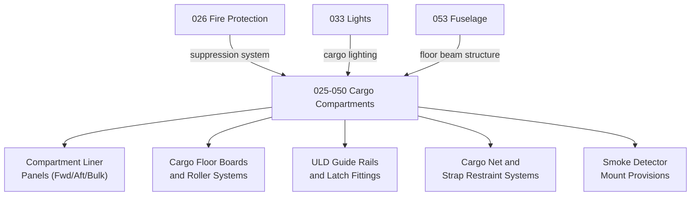

# ATLAS 020-029 · 02.025 · 025-050 — Cargo Compartments

## 1. Purpose

Define the equipment and furnishings architecture for *Cargo Compartments* (ATA 25-50-00) within ATLAS subsection `025`. This section covers cargo compartment liner panels, cargo net systems, cargo restraint rail fittings, floor board assemblies, and bulk cargo compartment furnishings and fitments.

## 2. Scope

- Covers belly cargo compartment liner panels (forward, aft, and bulk), cargo floor board assemblies, cargo roller/ball mat systems, and ULD (Unit Load Device) guide rail fittings.
- Includes cargo net and strap restraint fitments, cargo lock and latch mechanisms, and cargo loading and unloading provisions as equipment items.
- Addresses cargo compartment lighting bracket and conduit provisions as furnishings items — for lighting circuits refer to ATA 33.
- Covers cargo smoke detector mounting provisions as equipment fitment — for smoke detection and fire suppression systems refer to ATA 26.
- Does not replace certified maintenance data for cargo restraint load calculations, ULD compatibility, or cargo compartment pressure integrity testing.

**Scope boundary:** Cargo compartment liners, floor boards, restraint fittings, ULD rails, and related furnishings. Excludes structural floor beams (ATA 53), fire suppression systems (ATA 26), lighting circuits (ATA 33), and cargo handling ground equipment.

**Safety boundary:** Cargo restraint systems and fire suppression interfaces in cargo compartments are flight-safety critical. Artefacts affecting cargo net load certification, ULD restraint compliance (CS-25.853), or smoke detection mounting require compliance evidence and maintenance sign-off traceability.

## 3. System Architecture

## 4. Footprint

| Metric | Value |
|---|---|
| Architecture | `ATLAS` — Aircraft Top Level Architecture Schema/System |
| Master range | `000–099` |
| Code range | `020-029` |
| Section | `02` — Sistemas Core de Aeronave |
| Subsection | `025` — Equipment and Furnishings |
| Local section code | `025-050` |
| ATA SNS | `25-50-00` |
| Primary Q-Division | Q-AIR |
| Support Q-Divisions | Q-MECHANICS, Q-DATAGOV, Q-GREENTECH, Q-GROUND, Q-INDUSTRY |
| Governance class | `baseline` |
| Folder path | `Q+ATLANTIDE/000-099_ATLAS/020-029_Sistemas-Core-de-Aeronave/025_Equipment-and-Furnishings/` |
| Document | `025-050-Cargo-Compartments.md` |
| Parent subsection | [`README.md`](./README.md) |
| Parent section | [`../README.md`](../README.md) |
| Parent baseline | [`organization/Q+ATLANTIDE.md`](../../../../organization/Q+ATLANTIDE.md) |

## 5. References

- ATA iSpec 2200 — Chapter 25-50, Cargo Compartments
- Q+ATLANTIDE controlled baseline [`organization/Q+ATLANTIDE.md`](../../../../organization/Q+ATLANTIDE.md)
- Subsection index [`./README.md`](./README.md)
- `025-000` General [`./025-000-General.md`](./025-000-General.md)
- `025-060` Emergency Equipment [`./025-060-Emergency-Equipment.md`](./025-060-Emergency-Equipment.md)
