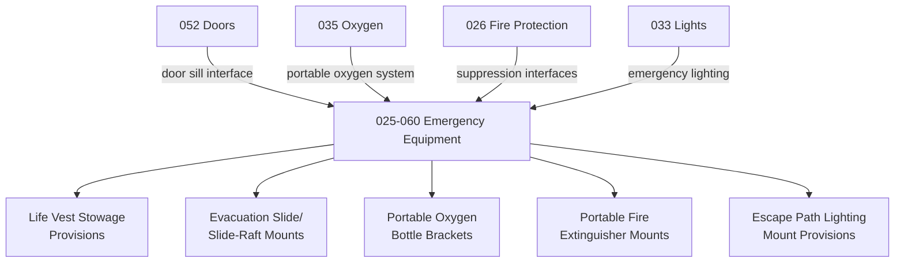

# ATLAS 020-029 · 02.025 · 025-060 — Emergency Equipment

## 1. Purpose

Define the equipment and furnishings architecture for *Emergency Equipment* (ATA 25-60-00) within ATLAS subsection `025`. This section covers passenger life vest stowage provisions, evacuation slide and door-mounted slide-raft units, emergency exit markers and lighting provisions, portable fire extinguisher mounts, and emergency equipment location fitment within the cabin.

## 2. Scope

- Covers life vest stowage containers (under-seat, overhead, and crew station provisions) and their structural attachment interfaces.
- Includes evacuation slide and slide-raft pack mounting frames, inflation system interfaces, and door sill fitting provisions — for door mechanism refer to ATA 52.
- Addresses portable oxygen bottle bracket mounts and smoke hood stowage provisions as equipment items — for oxygen systems refer to ATA 35.
- Covers portable fire extinguisher bracket and halon/CO₂ bottle mount provisions — for fire detection and suppression systems refer to ATA 26.
- Includes emergency exit sign and floor proximity escape path lighting mount provisions as equipment fitment — for lighting circuits refer to ATA 33.
- Does not replace certified maintenance data for emergency equipment inspection procedures, inflation test records, or repack authorisation documentation.

**Scope boundary:** Emergency equipment fitment — life vest stowages, slide pack mounts, oxygen bottle brackets, extinguisher brackets, escape path lighting mounts. Excludes door mechanisms (ATA 52), fire detection and suppression (ATA 26), oxygen systems (ATA 35), and lighting circuits (ATA 33).

**Safety boundary:** All emergency equipment in this section is flight-safety critical and subject to mandatory airworthiness requirements (CS-25.1415, CS-25.812, EASA Part-M). Any artefact affecting life vest stowage accessibility, slide pack attachment loads, or escape path lighting compliance requires regulatory compliance evidence, dedicated inspection intervals, and maintenance sign-off traceability.

## 3. System Architecture

## 4. Footprint

| Metric | Value |
|---|---|
| Architecture | `ATLAS` — Aircraft Top Level Architecture Schema/System |
| Master range | `000–099` |
| Code range | `020-029` |
| Section | `02` — Sistemas Core de Aeronave |
| Subsection | `025` — Equipment and Furnishings |
| Local section code | `025-060` |
| ATA SNS | `25-60-00` |
| Primary Q-Division | Q-AIR |
| Support Q-Divisions | Q-MECHANICS, Q-DATAGOV, Q-GREENTECH, Q-GROUND, Q-INDUSTRY |
| Governance class | `baseline` |
| Folder path | `Q+ATLANTIDE/000-099_ATLAS/020-029_Sistemas-Core-de-Aeronave/025_Equipment-and-Furnishings/` |
| Document | `025-060-Emergency-Equipment.md` |
| Parent subsection | [`README.md`](./README.md) |
| Parent section | [`../README.md`](../README.md) |
| Parent baseline | [`organization/Q+ATLANTIDE.md`](../../../../organization/Q+ATLANTIDE.md) |

## 5. References

- ATA iSpec 2200 — Chapter 25-60, Emergency Equipment
- CS-25.1415 — Ditching Equipment
- CS-25.812 — Emergency Lighting
- Q+ATLANTIDE controlled baseline [`organization/Q+ATLANTIDE.md`](../../../../organization/Q+ATLANTIDE.md)
- Subsection index [`./README.md`](./README.md)
- `025-000` General [`./025-000-General.md`](./025-000-General.md)
- `025-010` Flight Compartment [`./025-010-Flight-Compartment.md`](./025-010-Flight-Compartment.md)
- `025-020` Passenger Compartment [`./025-020-Passenger-Compartment.md`](./025-020-Passenger-Compartment.md)
