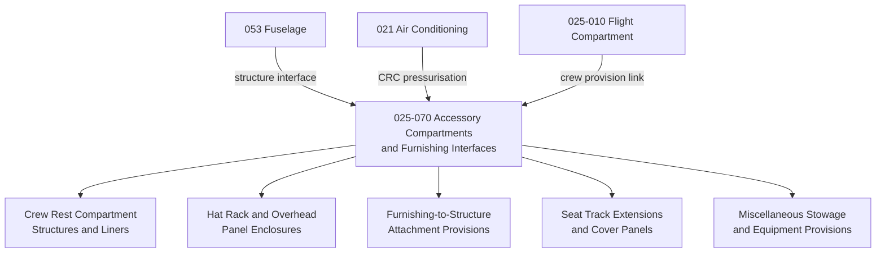

# ATLAS 020-029 · 02.025 · 025-070 — Accessory Compartments and Furnishing Interfaces

## 1. Purpose

Define the equipment and furnishings architecture for *Accessory Compartments and Furnishing Interfaces* (ATA 25-70-00) within ATLAS subsection `025`. This section covers miscellaneous accessory compartments (crew rest modules, hat racks, overhead panel enclosures), cabin cross-section furnishing attachment interfaces, and the structural fitment provisions that connect cabin monuments and furnishing elements to the aircraft primary structure.

## 2. Scope

- Covers crew rest compartment (CRC) and attendant rest compartment (ARC) structures, liners, and fitments where defined as cabin furnishings — for structural attachment to airframe refer to ATA 53.
- Includes hat-rack and overhead panel enclosure structures, cabin trim fitment brackets, and cabin cross-section wall-to-floor furnishing transition provisions.
- Addresses seat track extension and cover panels, cabin step provisions, and seat row spacing fixtures as furnishing interface items.
- Covers baggage and equipment stowage provisions not otherwise allocated to ATA 25-010 through 25-060.
- Does not replace certified maintenance data for crew rest certification, structural fatigue analysis, or pressure bulkhead fitment data.

**Scope boundary:** Accessory compartment structures and furnishing-to-structure interface fitments. Excludes primary structure (ATA 53), crew rest pressurisation interfaces (ATA 21), and avionics bay provisions (ATA 31/34).

**Safety boundary:** Crew rest module structural attachment and pressure-differential boundary fitment are safety-relevant. Artefacts affecting CRC/ARC structural loads or pressurisation seal integrity require compliance evidence and maintenance sign-off traceability.

## 3. System Architecture

## 4. Footprint

| Metric | Value |
|---|---|
| Architecture | `ATLAS` — Aircraft Top Level Architecture Schema/System |
| Master range | `000–099` |
| Code range | `020-029` |
| Section | `02` — Sistemas Core de Aeronave |
| Subsection | `025` — Equipment and Furnishings |
| Local section code | `025-070` |
| ATA SNS | `25-70-00` |
| Primary Q-Division | Q-AIR |
| Support Q-Divisions | Q-MECHANICS, Q-DATAGOV, Q-GREENTECH, Q-GROUND, Q-INDUSTRY |
| Governance class | `baseline` |
| Folder path | `Q+ATLANTIDE/000-099_ATLAS/020-029_Sistemas-Core-de-Aeronave/025_Equipment-and-Furnishings/` |
| Document | `025-070-Accessory-Compartments-and-Furnishing-Interfaces.md` |
| Parent subsection | [`README.md`](./README.md) |
| Parent section | [`../README.md`](../README.md) |
| Parent baseline | [`organization/Q+ATLANTIDE.md`](../../../../organization/Q+ATLANTIDE.md) |

## 5. References

- ATA iSpec 2200 — Chapter 25-70, Accessory Compartments
- Q+ATLANTIDE controlled baseline [`organization/Q+ATLANTIDE.md`](../../../../organization/Q+ATLANTIDE.md)
- Subsection index [`./README.md`](./README.md)
- `025-000` General [`./025-000-General.md`](./025-000-General.md)
- `025-080` Cabin Equipment Monitoring, Diagnostics and Control Interfaces [`./025-080-Cabin-Equipment-Monitoring-Diagnostics-and-Control-Interfaces.md`](./025-080-Cabin-Equipment-Monitoring-Diagnostics-and-Control-Interfaces.md)
