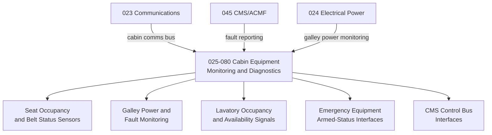

# ATLAS 020-029 · 02.025 · 025-080 — Cabin Equipment Monitoring, Diagnostics and Control Interfaces

## 1. Purpose

Define the programme-controlled extension for *Cabin Equipment Monitoring, Diagnostics and Control Interfaces* (ATA 25-80-00) within ATLAS subsection `025`. This section covers the interfaces between cabin equipment fitment status monitoring systems, health monitoring buses, and cabin management system (CMS) control interfaces as they relate to equipment and furnishings.

> **Programme-controlled extension.** This section covers interfaces between ATA 25 cabin equipment and the monitoring, diagnostics, and control systems. Scope and content are controlled by Q-AIR in coordination with Q-DATAGOV and require programme authorisation before populating detailed interface data.

## 2. Scope

- Defines the cabin equipment fitment monitoring interface: seat occupancy sensors, galley power monitoring, lavatory occupancy/availability signals, and life vest stowage tamper detection.
- Covers cabin management system (CMS) control bus interfaces for PSU call buttons, reading light control, seat belt sign control, and no-smoking sign control as equipment and furnishings interface items — for CMS avionics refer to ATA 23/44.
- Addresses galley and lavatory fault reporting interfaces to the central maintenance system (CMS/ACMF) — for aircraft health monitoring refer to ATA 45.
- Covers monitoring of emergency equipment fitment status (slide armed indicators, life vest stowage sensors) as programme-controlled fitment monitoring items.
- Does not contain detailed avionics or software assurance data — those are managed under ATA 23, 44, and 45.

**Scope boundary:** Cabin equipment monitoring and control interface definitions for ATA 25 equipment. Excludes avionics bus architecture (ATA 23/44), aircraft health monitoring system (ATA 45), and electrical circuit design (ATA 24).

**Safety boundary:** Emergency equipment armed-status monitoring interfaces are flight-safety critical. Artefacts affecting slide-armed indication, life vest stowage monitoring, or escape path lighting control require compliance evidence, failure mode analysis, and maintenance sign-off traceability.

## 3. System Architecture

## 4. Footprint

| Metric | Value |
|---|---|
| Architecture | `ATLAS` — Aircraft Top Level Architecture Schema/System |
| Master range | `000–099` |
| Code range | `020-029` |
| Section | `02` — Sistemas Core de Aeronave |
| Subsection | `025` — Equipment and Furnishings |
| Local section code | `025-080` |
| ATA SNS | `25-80-00` |
| Status | `programme-controlled-extension` |
| Primary Q-Division | Q-AIR |
| Support Q-Divisions | Q-MECHANICS, Q-DATAGOV, Q-GREENTECH, Q-GROUND, Q-INDUSTRY |
| Governance class | `baseline` |
| Folder path | `Q+ATLANTIDE/000-099_ATLAS/020-029_Sistemas-Core-de-Aeronave/025_Equipment-and-Furnishings/` |
| Document | `025-080-Cabin-Equipment-Monitoring-Diagnostics-and-Control-Interfaces.md` |
| Parent subsection | [`README.md`](./README.md) |
| Parent section | [`../README.md`](../README.md) |
| Parent baseline | [`organization/Q+ATLANTIDE.md`](../../../../organization/Q+ATLANTIDE.md) |

## 5. References

- ATA iSpec 2200 — Chapter 25, Equipment / Furnishings (monitoring and control interfaces)
- ATA iSpec 2200 — Chapter 45, Central Maintenance System
- Q+ATLANTIDE controlled baseline [`organization/Q+ATLANTIDE.md`](../../../../organization/Q+ATLANTIDE.md)
- Subsection index [`./README.md`](./README.md)
- `025-000` General [`./025-000-General.md`](./025-000-General.md)
- `025-090` S1000D CSDB Mapping and Traceability [`./025-090-S1000D-CSDB-Mapping-and-Traceability.md`](./025-090-S1000D-CSDB-Mapping-and-Traceability.md)
