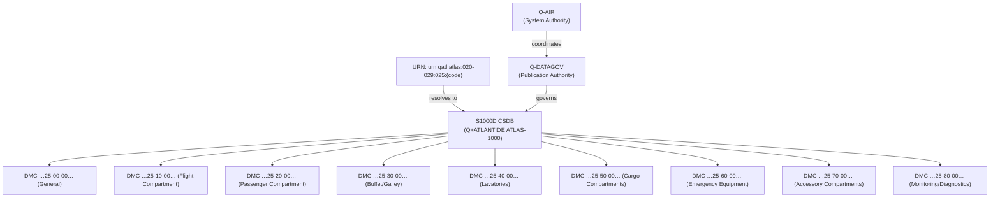

# ATLAS 020-029 · 02.025 · 025-090 — S1000D CSDB Mapping and Traceability

## 1. Purpose

Provide the complete S1000D CSDB Data Module Code (DMC) mapping for all sections within ATLAS subsection `025` — *Equipment and Furnishings*, and define the Q+ATLANTIDE URN scheme for this subsection. This section enables bidirectional traceability between the ATLAS taxonomy and the S1000D-compliant Common Source Database (CSDB).

> **Programme-controlled publication and traceability extension.** This section is managed by Q-AIR in coordination with Q-DATAGOV and requires programme publication authority before CSDB records are issued.

## 2. Scope

- Provides the full ATA SNS-to-DMC mapping table for sections `025-000` through `025-080`.
- Defines the Q+ATLANTIDE URN scheme: `urn:qatl:atlas:020-029:025:{section-code}`.
- Establishes information type codes (IMC) and applicable information sets (Info Code) for each section.
- Does not contain narrative technical content — section files `025-000` through `025-080` carry the substantive architecture content.

## 3. CSDB Mapping Table

| Section | ATA SNS | DMC (example schema) | IMC | Info Code | Q+ATLANTIDE URN |
|---|---|---|---|---|---|
| 025-000 | 25-00-00 | DMC-QATL-A-25-00-00-00A-018A-A | 018 | General | `urn:qatl:atlas:020-029:025:000` |
| 025-010 | 25-10-00 | DMC-QATL-A-25-10-00-00A-018A-A | 018 | General | `urn:qatl:atlas:020-029:025:010` |
| 025-020 | 25-20-00 | DMC-QATL-A-25-20-00-00A-018A-A | 018 | General | `urn:qatl:atlas:020-029:025:020` |
| 025-030 | 25-30-00 | DMC-QATL-A-25-30-00-00A-018A-A | 018 | General | `urn:qatl:atlas:020-029:025:030` |
| 025-040 | 25-40-00 | DMC-QATL-A-25-40-00-00A-018A-A | 018 | General | `urn:qatl:atlas:020-029:025:040` |
| 025-050 | 25-50-00 | DMC-QATL-A-25-50-00-00A-018A-A | 018 | General | `urn:qatl:atlas:020-029:025:050` |
| 025-060 | 25-60-00 | DMC-QATL-A-25-60-00-00A-018A-A | 018 | General | `urn:qatl:atlas:020-029:025:060` |
| 025-070 | 25-70-00 | DMC-QATL-A-25-70-00-00A-018A-A | 018 | General | `urn:qatl:atlas:020-029:025:070` |
| 025-080 | 25-80-00 | DMC-QATL-A-25-80-00-00A-018A-A | 018 | General (PCE) | `urn:qatl:atlas:020-029:025:080` |

**URN scheme:** `urn:qatl:atlas:020-029:025:{section-code}`

**DMC schema note:** `DMC-QATL-A-{ATA-chapter}-{subsystem}-{subject}-{unit}-{DM-code}-{variant}-{applicability}` — schema instance codes are illustrative; final codes require CSDB configuration authority sign-off.

## 3. Traceability Architecture

## 4. Footprint

| Metric | Value |
|---|---|
| Architecture | `ATLAS` — Aircraft Top Level Architecture Schema/System |
| Master range | `000–099` |
| Code range | `020-029` |
| Section | `02` — Sistemas Core de Aeronave |
| Subsection | `025` — Equipment and Furnishings |
| Local section code | `025-090` |
| ATA SNS | `25-90-00` |
| Status | `programme-controlled-publication-and-traceability-extension` |
| Primary Q-Division | Q-AIR |
| Support Q-Divisions | Q-MECHANICS, Q-DATAGOV, Q-GREENTECH, Q-GROUND, Q-INDUSTRY |
| Governance class | `baseline` |
| URN base | `urn:qatl:atlas:020-029:025:` |
| Folder path | `Q+ATLANTIDE/000-099_ATLAS/020-029_Sistemas-Core-de-Aeronave/025_Equipment-and-Furnishings/` |
| Document | `025-090-S1000D-CSDB-Mapping-and-Traceability.md` |
| Parent subsection | [`README.md`](./README.md) |
| Parent baseline | [`organization/Q+ATLANTIDE.md`](../../../../organization/Q+ATLANTIDE.md) |

## 5. References

- S1000D Issue 5.0 — Data Module Code structure and CSDB configuration management
- ATA iSpec 2200 — Chapter 25, Equipment / Furnishings
- Q+ATLANTIDE controlled baseline [`organization/Q+ATLANTIDE.md`](../../../../organization/Q+ATLANTIDE.md)
- Subsection index [`./README.md`](./README.md)
- `025-000` General [`./025-000-General.md`](./025-000-General.md)
- `024-090` S1000D CSDB Mapping (024) [`../024_Electrical-Power/024-090-S1000D-CSDB-Mapping-and-Traceability.md`](../024_Electrical-Power/024-090-S1000D-CSDB-Mapping-and-Traceability.md)
