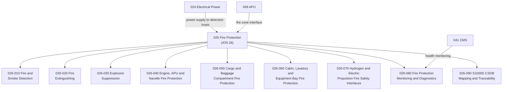

# ATLAS 020-029 · 02.026 · 026-000 — General

## 1. Purpose

Provide the general architectural definition for *Fire Protection* (ATA 26) within ATLAS subsection `026`. This section establishes the scope boundary, system family, Q-Division authority, and top-level structural context for all fire protection sections `026-010` through `026-090`.

## 2. Scope

- Defines the fire protection system family within the ATLAS-1000 register, aligned to ATA SNS `26-00-00 General`.
- Covers the architectural authority of `primary_q_division: Q-AIR` with support from Q-MECHANICS, Q-DATAGOV, Q-GREENTECH, Q-GROUND, and Q-INDUSTRY.
- Applies to all aircraft-level fire protection functions including fire and smoke detection, extinguishing, explosion suppression, engine/APU/nacelle fire protection, cargo compartment fire protection, cabin/lavatory protection, hydrogen and electric propulsion fire safety, monitoring and diagnostics, and publication traceability.
- Does not replace certified ATA/S1000D task-specific maintenance, troubleshooting, operational, or software assurance data modules.

**Scope boundary:** This node covers aircraft fire protection architecture across all zones (engine bays, APU, nacelles, cargo, cabin, lavatories, equipment bays) and emerging propulsion fire safety interfaces. It does not replace certified ATA/S1000D task-specific maintenance, troubleshooting, or operational data modules.

**Safety boundary:** Fire protection is safety-critical. Any artefact derived from this node requires correct aircraft effectivity, fire zone definitions, extinguishing agent quantities, detector serviceability, fire handle interlocks, maintenance sign-off evidence and lifecycle traceability.

## 3. System Architecture

## 4. Footprint

| Metric | Value |
|---|---|
| Architecture | `ATLAS` — Aircraft Top Level Architecture Schema/System |
| Master range | `000–099` |
| Code range | `020-029` |
| Section | `02` — Sistemas Core de Aeronave |
| Subsection | `026` — Fire Protection |
| Local section code | `026-000` |
| ATA SNS | `26-00-00` |
| Primary Q-Division | Q-AIR |
| Support Q-Divisions | Q-MECHANICS, Q-DATAGOV, Q-GREENTECH, Q-GROUND, Q-INDUSTRY |
| Governance class | `baseline` |
| Folder path | `Q+ATLANTIDE/000-099_ATLAS/020-029_Sistemas-Core-de-Aeronave/026_Fire-Protection/` |
| Document | `026-000-General.md` |
| Parent subsection | [`README.md`](./README.md) |
| Parent section | [`../README.md`](../README.md) |
| Parent baseline | [`organization/Q+ATLANTIDE.md`](../../../../organization/Q+ATLANTIDE.md) |

## 5. References

- ATA iSpec 2200 — Chapter 26, Fire Protection
- Q+ATLANTIDE controlled baseline [`organization/Q+ATLANTIDE.md`](../../../../organization/Q+ATLANTIDE.md)
- ATLAS section index [`../README.md`](../README.md)
- Subsection index [`./README.md`](./README.md)
- Section `024-000` General — Electrical Power [`../024_Electrical-Power/024-000-General.md`](../024_Electrical-Power/024-000-General.md)
- Section `025-000` General — Equipment and Furnishings [`../025_Equipment-and-Furnishings/025-000-General.md`](../025_Equipment-and-Furnishings/025-000-General.md)
