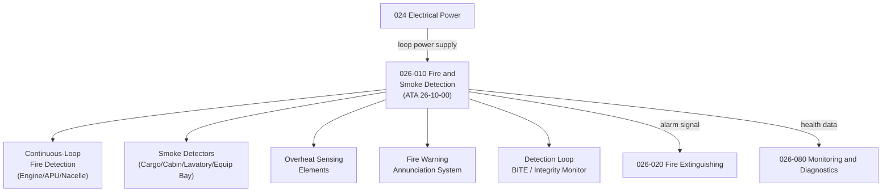

# ATLAS 020-029 · 02.026 · 026-010 — Fire and Smoke Detection

## 1. Purpose

Define the architecture boundary for *Fire and Smoke Detection* (ATA 26-10-00) within ATLAS subsection `026`. This section covers fire detection loops, smoke detectors, overheat detection, fire warning systems, and detector monitoring across all aircraft fire zones.

## 2. Scope

- Aligned to ATA SNS `26-10-00 Fire Detection`.
- Covers continuous-loop fire detection systems (engine bays, APU bay, nacelles), photoelectric and ionisation smoke detectors (cargo, cabin, lavatories, equipment bays), overheat sensing elements, fire warning annunciation, detector serviceable status indication, and fire zone monitoring architecture.
- Includes BITE for detection loop continuity and detector integrity monitoring.
- Does not cover extinguishing systems (see `026-020`), cabin/lavatory specifics (see `026-060`), or engine-zone specialised protection (see `026-040`).

**Safety boundary:** Detection systems are safety-critical. Detector continuity, zone definitions, alarm thresholds, and maintenance serviceability checks must be preserved with full lifecycle evidence.

## 3. System Architecture

## 4. Footprint

| Metric | Value |
|---|---|
| Architecture | `ATLAS` — Aircraft Top Level Architecture Schema/System |
| Master range | `000–099` |
| Code range | `020-029` |
| Section | `02` — Sistemas Core de Aeronave |
| Subsection | `026` — Fire Protection |
| Local section code | `026-010` |
| ATA SNS | `26-10-00` |
| Primary Q-Division | Q-AIR |
| Support Q-Divisions | Q-MECHANICS, Q-DATAGOV, Q-GREENTECH, Q-GROUND, Q-INDUSTRY |
| Governance class | `baseline` |
| Folder path | `Q+ATLANTIDE/000-099_ATLAS/020-029_Sistemas-Core-de-Aeronave/026_Fire-Protection/` |
| Document | `026-010-Fire-and-Smoke-Detection.md` |
| Parent subsection | [`README.md`](./README.md) |

## 5. References

- ATA iSpec 2200 — Chapter 26-10, Fire Detection
- Q+ATLANTIDE controlled baseline [`organization/Q+ATLANTIDE.md`](../../../../organization/Q+ATLANTIDE.md)
- Subsection index [`./README.md`](./README.md)
- `026-000` General [`./026-000-General.md`](./026-000-General.md)
- `026-020` Fire Extinguishing [`./026-020-Fire-Extinguishing.md`](./026-020-Fire-Extinguishing.md)
- `026-080` Fire Protection Monitoring, Diagnostics and Control Interfaces [`./026-080-Fire-Protection-Monitoring-Diagnostics-and-Control-Interfaces.md`](./026-080-Fire-Protection-Monitoring-Diagnostics-and-Control-Interfaces.md)
