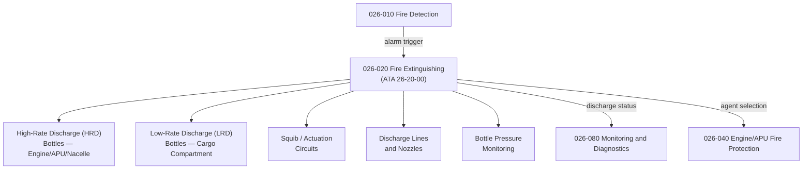

# ATLAS 020-029 · 02.026 · 026-020 — Fire Extinguishing

## 1. Purpose

Define the architecture boundary for *Fire Extinguishing* (ATA 26-20-00) within ATLAS subsection `026`. This section covers extinguishing agents, discharge bottles, distribution lines, squib circuits, and actuation logic for all aircraft fire extinguishing zones.

## 2. Scope

- Aligned to ATA SNS `26-20-00 Fire Extinguishing`.
- Covers halon/HFC extinguishing agents (or approved alternatives), high-rate discharge (HRD) and low-rate discharge (LRD) bottles, discharge lines to engine bays, APU bay, and nacelles, squib circuits, fire handle actuation logic, and bottle pressure monitoring.
- Includes cargo compartment extinguishing system discharge architecture (high-concentration and metered discharge modes).
- Does not cover lavatory extinguishing (see `026-060`), explosion suppression (see `026-030`), or hydrogen/electric propulsion extinguishing specifics (see `026-070`).

**Safety boundary:** Extinguishing system integrity is safety-critical. Bottle pressure, squib serviceability, discharge line integrity, and maintenance sign-off evidence are required with full lifecycle traceability.

## 3. System Architecture

## 4. Footprint

| Metric | Value |
|---|---|
| Architecture | `ATLAS` — Aircraft Top Level Architecture Schema/System |
| Master range | `000–099` |
| Code range | `020-029` |
| Section | `02` — Sistemas Core de Aeronave |
| Subsection | `026` — Fire Protection |
| Local section code | `026-020` |
| ATA SNS | `26-20-00` |
| Primary Q-Division | Q-AIR |
| Support Q-Divisions | Q-MECHANICS, Q-DATAGOV, Q-GREENTECH, Q-GROUND, Q-INDUSTRY |
| Governance class | `baseline` |
| Folder path | `Q+ATLANTIDE/000-099_ATLAS/020-029_Sistemas-Core-de-Aeronave/026_Fire-Protection/` |
| Document | `026-020-Fire-Extinguishing.md` |
| Parent subsection | [`README.md`](./README.md) |

## 5. References

- ATA iSpec 2200 — Chapter 26-20, Fire Extinguishing
- Q+ATLANTIDE controlled baseline [`organization/Q+ATLANTIDE.md`](../../../../organization/Q+ATLANTIDE.md)
- Subsection index [`./README.md`](./README.md)
- `026-010` Fire and Smoke Detection [`./026-010-Fire-and-Smoke-Detection.md`](./026-010-Fire-and-Smoke-Detection.md)
- `026-030` Explosion Suppression [`./026-030-Explosion-Suppression.md`](./026-030-Explosion-Suppression.md)
- `026-040` Engine, APU and Nacelle Fire Protection [`./026-040-Engine-APU-and-Nacelle-Fire-Protection.md`](./026-040-Engine-APU-and-Nacelle-Fire-Protection.md)
